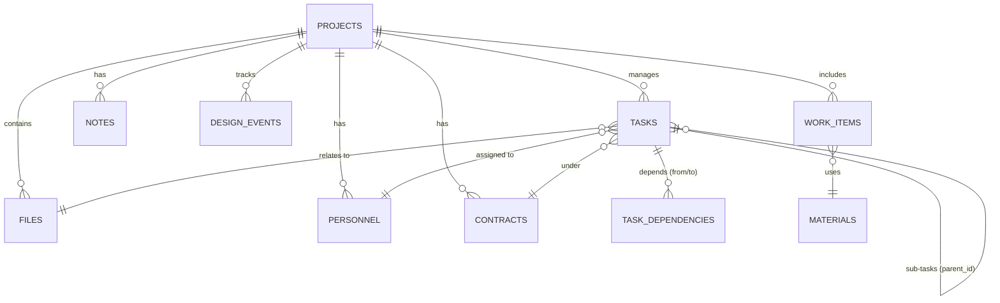

# 📊 BÁO CÁO CẤU TRÚC DATABASE (Dành cho dự án)

Dự án sử dụng **SQLite** làm cơ sở dữ liệu chính (định dạng file `.pmp`), được quản lý thông qua thư viện `rusqlite` trong Rust (Tauri). Hệ thống hỗ trợ Local-first với cơ chế Event Sourcing.

## 📐 Sơ đồ Quan hệ (ER Diagram)

## 📋 Danh sách các Bảng chính

### 1. Bảng `projects` (Trọng tâm)
Lưu trữ thông tin cơ bản về dự án.
| Cột | Kiểu dữ liệu | Mô tả |
|-----|--------------|-------|
| id | INTEGER (PK) | ID tự tăng |
| name | TEXT | Tên dự án |
| root_path | TEXT | Đường dẫn thư mục gốc |
| status | TEXT | Trạng thái (active, archived...) |

### 2. Bảng `files` (Dữ liệu tệp tin)
Quản lý các file tệp tin liên quan đến dự án.
| Cột | Kiểu dữ liệu | Mô tả |
|-----|--------------|-------|
| project_id | INTEGER (FK) | Liên kết tới `projects` |
| path | TEXT | Đường dẫn file |
| metadata_json | TEXT | Dữ liệu mở rộng (JSON) |

### 3. Bảng `tasks` (Quản lý công việc)
Hệ thống task đa cấp, liên kết nhiều thực thể.
| Cột | Kiểu dữ liệu | Mô tả |
|-----|--------------|-------|
| project_id | INTEGER (FK) | Liên kết dự án |
| parent_id | INTEGER (FK) | Task cha (đệ quy) |
| assignee_id | INTEGER (FK) | Người thực hiện (liên kết `personnel`) |
| status | TEXT | todo, in_progress, completed |
| progress | REAL | Tiến độ (0-100%) |

### 4. Bảng `design_events` (Đồng bộ bản đồ)
Lưu trữ các sự kiện thiết kế trên bản đồ (Local-first sync engine).
| Cột | Kiểu dữ liệu | Mô tả |
|-----|--------------|-------|
| event_id | TEXT (PK) | UUID sự kiện |
| event_type | TEXT | Loại (Create, Update, Delete) |
| payload_json | TEXT | Dữ liệu thực thể (Vị trí, thuộc tính) |

### 5. Khối Quản lý Vật tư (`materials` & `work_items`)
| Bảng | Chức năng |
|------|-----------|
| `materials` | Danh mục vật tư, đơn giá gốc, chủng loại. |
| `work_items` | Khối lượng thực tế trên bản đồ (liên kết `feature_id` và `material_id`). |

## 🔗 Các mối liên kết quan trọng (Foreign Keys)
- **Xóa dự án (Cascade)**: Khi một dự án bị xóa, tất cả Files, Tasks, Personnel, Contracts, và Events liên quan sẽ tự động bị xóa theo (`ON DELETE CASCADE`).
- **Phụ thuộc Task**: Bảng `task_dependencies` cho phép thiết lập các mối quan hệ phức tạp (Ví dụ: Task A phải xong mới làm Task B).
- **Phân tách thực thể Map**: `work_items` liên kết với các đối tượng hình học trên bản đồ thông qua chuỗi `feature_id`.

---
*Tài liệu được tạo tự động bởi Antigravity quy trình /review.*
