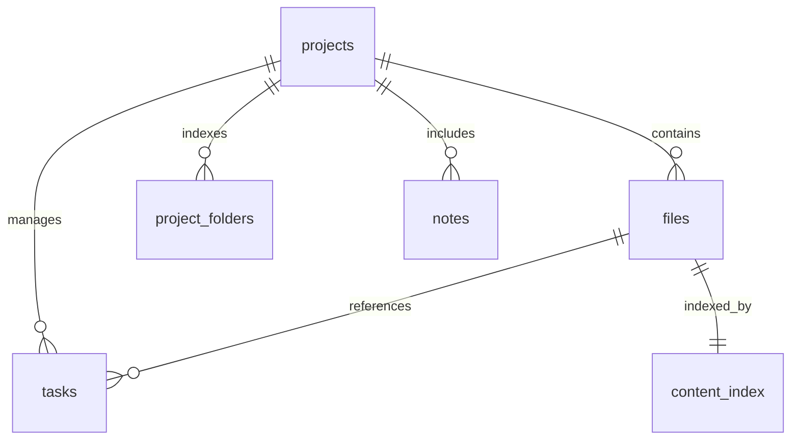

# 📊 Tài liệu Tổng hợp Database & Metadata (.pmp)

> [!NOTE]
> Tài liệu này hệ thống hóa toàn bộ cấu trúc dữ liệu của định dạng file `.pmp` (SQLite) được sử dụng trong hệ thống quản lý tệp tin.

---

## 🎨 Brand Identity (Anthropic Style)
Tài liệu sử dụng hệ màu chuẩn của Anthropic để phân loại thông tin:
- <span style="color:#d97757">**Cam (Orange)**</span>: Điểm nhấn chính và Cảnh báo quan trọng.
- <span style="color:#6a9bcc">**Xanh dương (Blue)**</span>: Thông tin bổ trợ và Link.
- <span style="color:#788c5d">**Xanh lá (Green)**</span>: Trạng thái thành công và Metadata.

---

## 🏗️ Kiến trúc Cơ sở dữ liệu (ER Diagram)



---

## 📋 Chi tiết các Bảng dữ liệu

### 1. Bảng `projects` (Dữ liệu dự án)
Lưu trữ thông tin định danh và hợp đồng của dự án.

| Trường dữ liệu | Kiểu dữ liệu | Mô tả |
| :--- | :--- | :--- |
| `id` | INTEGER | PRIMARY KEY, AUTOINCREMENT |
| `name` | TEXT | Tên dự án (Bắt buộc) |
| `contract_number` | TEXT | Số hợp đồng (Metadata mở rộng) |
| `investor` | TEXT | Chủ đầu tư |
| `contractor` | TEXT | Nhà thầu |
| `signed_date` | TIMESTAMP | Ngày ký kết |
| `duration` | TEXT | Thời gian thực hiện |
| `end_date` | TIMESTAMP | Ngày kết thúc dự kiến |
| `created_at` | TIMESTAMP | Thời gian khởi tạo file |

> [!TIP]
> Bảng này thường chỉ có **1 record** duy nhất cho mỗi file `.pmp` vì mỗi file đại diện cho một dự án.

### 2. Bảng `files` (Danh mục tệp tin & Metadata)
Bảng quan trọng nhất, lưu trữ chỉ mục và metadata linh hoạt trang `metadata_json`.

| Trường dữ liệu | Kiểu dữ liệu | Mô tả |
| :--- | :--- | :--- |
| `id` | INTEGER | PRIMARY KEY |
| `path` | TEXT | Đường dẫn tuyệt đối (UNIQUE) |
| `path_noaccent` | TEXT | Đường dẫn không dấu (Search optimization) |
| `filename` | TEXT | Tên file |
| `extension` | TEXT | Định dạng file (pdf, docx, dwg...) |
| `size` | INTEGER | Dung lượng (Bytes) |
| `metadata_json` | TEXT | **JSON linh hoạt** chứa metadata chi tiết |

### 3. Bảng `tasks` (Quản lý công việc)
Lưu trữ trạng thái và metadata của các task trong dự án.

| Trường dữ liệu | Kiểu dữ liệu | Mô tả |
| :--- | :--- | :--- |
| `id` | INTEGER | PRIMARY KEY |
| `name` | TEXT | Tên công việc |
| `status` | TEXT | Trạng thái (Pending, Done...) |
| `metadata_json` | TEXT | **JSON mở rộng** chứa các field tùy chỉnh |

---

## 🧬 Cấu trúc Metadata JSON
Trường `metadata_json` trong bảng `files` lưu trữ các dữ liệu đặc thù tùy theo loại tệp:

```json
{
  "analysis": {
    "summary": "Tóm tắt nội dung tài liệu...",
    "keywords": ["kỹ thuật", "thi công", "lâm đồng"],
    "risk_level": "Low"
  },
  "custom_fields": {
    "version": "1.0",
    "reviewer": "Admin"
  },
  "system_info": {
    "encoding": "utf-8",
    "last_access": "2024-04-05"
  }
}
```

---

## 🔍 Hướng dẫn Truy vấn nhanh

### Lấy toàn bộ metadata của một tệp cụ thể:
```sql
SELECT filename, metadata_json 
FROM files 
WHERE filename LIKE '%Bản vẽ%';
```

### Thống kê dung lượng theo định dạng:
```sql
SELECT extension, SUM(size) / 1024 / 1024 as size_mb 
FROM files 
GROUP BY extension;
```

---

## 🛠️ Quy tắc Bảo trì & Migration
- **Không dấu**: Luôn cập nhật `filename_noaccent` khi đổi tên file để đảm bảo tìm kiếm tiếng Việt chính xác.
- **Tính tương thích**: Sử dụng khối `try-catch` RAW SQL khi migrate thêm cột mới (như `contract_number`) để tránh lỗi trên các bản build cũ.

---
*Tài liệu được tạo bởi Antigravity Orchestrator - 2026*
