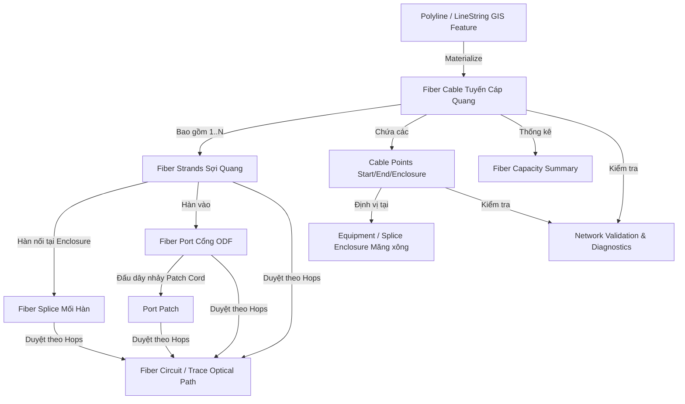

# TỔNG HỢP CHI TIẾT TÍNH NĂNG LINE/POLYLINE, FIBER VÀ TUYẾN CÁP QUANG

> **Dự án**: RUST (Bando Graph Viewer / Network Management)  
> **Ngày tổng hợp**: 26/07/2026  
> **Thư mục lưu trữ**: `docs/FIBER_POLYLINE_CABLE_FEATURE_DOC.md`

---

## 1. TỔNG QUAN HỆ THỐNG (SYSTEM OVERVIEW)

Hệ thống quản lý đối tượng **Line/Polyline** và **Tuyến Cáp Quang (Fiber Cable Network)** trong ứng dụng là một module lõi kết hợp giữa **GIS (Geographic Information System)** và **FTTH/Telecom Network Inventory Management**.

Module này cho phép:
1. Vẽ, chỉnh sửa và chuẩn hóa các đường đứt đoạn, đường đôi, Polyline GIS trên bản đồ.
2. Tự động chuyển đổi (**Materialize**) các đối tượng hình học Polyline thành dữ liệu **Tuyến cáp quang** chuẩn hạ tầng mạng viễn thông.
3. Quản lý chi tiết tới cấp độ **Sợi cáp quang (Fiber Strand)**, **Điểm cáp (Cable Start / Cable End / Splice Enclosure)**, **Mối hàn (Splice)**, **Cổng đấu nối ODF (Port Termination/Patching)** và **Mạch/Kênh truyền quang (Fiber Circuit)**.
4. Truy vết đường truyền cáp quang (**Optical Circuit Tracing**) từ điểm A đến điểm Z.
5. Kiểm tra chẩn đoán hình học Polyline, tự động phát hiện và vá lỗi gãy Polyline, lặp đỉnh (duplicate vertices), trùng tọa độ.

---

## 2. CÁC TÍNH NĂNG CHÍNH & MỐI QUAN HỆ GIỮA CÁC TÍNH NĂNG

### 2.1. Quản lý Hình Học Line / Polyline GIS
- **Vẽ và Chỉnh sửa Polyline**: Người dùng vẽ các đường Polyline đại diện cho tuyến cáp quang, tuyến đường ống cáp, đường điện áp trên bản đồ GIS.
- **Phân loại Polyline**: Phân loại theo `PolylineType` (`PowerLine`, `SignalLine`, `TrenchLine`). Tuyến cáp quang thuộc nhóm `SignalLine`.
- **Gắn thông số hiển thị**: Cấu hình màu sắc (`color`), độ rộng đường nét (`size` / `weight` / `stroke`), kiểu nét đứt (`dashArray`), độ trong suốt.

### 2.2. Vật Thể Hóa Polyline Thành Tuyến Cáp Quang (Polyline Materialization)
- **Tự động quét tọa độ & giao điểm**: Module `fiberPolylineMaterializer.ts` phân tích các đối tượng `PolylineFeature` / `LineString`.
- **Tạo Điểm Cáp (Cable Points)**: Tự động xác định điểm đầu (`cable_start`), điểm cuối (`cable_end`) và các măng xông/hộp nối (`splice_enclosure`) tại các đỉnh (vertex) hoặc giao điểm giữa các tuyến cáp.
- **Tự động gắn Metadata**: Cập nhật thuộc tính `metadata.infrastructure.type = 'SignalLine'`, `metadata.fiber.role = 'cable'`, liên kết `from_feature_id` và `to_feature_id`.
- **Khởi tạo Bản ghi Tuyến Cáp**: Tự động phát ra sự kiện CQRS `FiberCableUpserted` và `FiberCablePointsMaterialized` để lưu thông tin cáp vào bảng SQLite `fiber_cables`.

### 2.3. Quản Lý Kho Cáp Quang & Sợi Quang (Fiber Inventory & Strand Management)
- **Cấu hình Dung lượng Cáp**: Khởi tạo số dung lượng sợi cáp quang (Core count: 4, 8, 12, 24, 48, 96, 144, 288 sợi...) và loại cáp (`cable_type`: ADSS, GYFTY, FIG8, SingleMode, MultiMode...).
- **Định danh & Mã màu Sợi (Color Coding)**: Mỗi sợi quang được gán mã số (`strand_no`) và màu tiêu chuẩn viễn thông (Dương, Cam, Lục, Nâu, Xám, Trắng, Đỏ, Đen, Vàng, Tím, Hồng, Xanh Phấn...).
- **Quản lý Trạng thái Sợi**:
  - `available`: Khả dụng / Trống.
  - `reserved`: Đã giữ chỗ / Dự phòng.
  - `active`: Đang hoạt động / Có tín hiệu.
  - `damaged`: Lỗi / Suy hao nặng / Đứt sợi.

### 2.4. Hàn Nối Sợi Cáp Quang & Măng Xông (Splice Enclosure & Splicing Diagram)
- **Quản lý Măng Xông Hàn (Splice Enclosure / Closure)**: Các thiết bị nằm tại điểm nối hoặc ngã 3/ngã 4 các tuyến cáp.
- **Sơ đồ Hàn Nối Chi Tiết (Fiber Splice Diagram)**: Giao diện Modal trực quan hiển thị mối hàn giữa Sợi A (hướng `start` hoặc `end`) của Cáp 1 với Sợi B (hướng `start` hoặc `end`) của Cáp 2.
- **Đo lường Suy hao Mối Hàn**: Ghi nhận suy hao dB (`loss_db`) tại từng mối hàn (ví dụ: 0.02 dB, 0.05 dB).

### 2.5. Đấu Nối Cổng ODF & Đầu Cuối (Port Termination & Patching)
- **Quản lý Cổng ODF / Cổng Thiết Bị (`fiber_ports`)**: Mỗi thiết bị/tủ ODF có danh sách cổng (`port_label`, `port_kind`, `direction`: `input`, `output`, `bidirectional`).
- **Hàn/Bấm Đầu Cáp vào Cổng (`fiber_port_terminations`)**: Đấu nối sợi cáp quang vào cổng ODF tương ứng.
- **Nhảy Cáp Quang (`fiber_port_patches`)**: Đấu nối dây nhảy (patch cord) giữa 2 cổng ODF khác nhau hoặc giữa ODF và thiết bị chuyển mạch/SW/Converter, hỗ trợ theo dõi suy hao nhảy cáp (`loss_db`).

### 2.6. Quản Lý & Dò Vết Kênh Truyền Quang (Fiber Circuit & Optical Tracing)
- **Tạo Mạch Quang (Fiber Circuit)**: Định nghĩa kênh truyền quang giữa Điểm A (`a_feature_id`) và Điểm Z (`z_feature_id`).
- **Dò Vết Kênh Truyền (`traceFiberCircuit`)**: Thuật toán quét topology duyệt qua chuỗi các Hops (`fiber_circuit_hops`): đi qua các Sợi quang (`strand_id`), các Cổng ODF (`port_id`), các Mối hàn (`fiber_splices`) và Dây nhảy (`fiber_port_patches`).
- **Tính toán Tổng Suy Hao & Trạng Thái**: Trả về đường đi chi tiết trên bản đồ, tổng suy hao toàn tuyến và trạng thái liên tục của kênh truyền.

### 2.7. Kiểm Tra Topo & Thống Kê Dung Lượng
- **Thống kê Dung lượng (`FiberCapacitySummary`)**: Thống kê tổng số sợi, số sợi đang dùng, số sợi khả dụng, số sợi lỗi của từng tuyến cáp.
- **Chẩn đoán Mạng (`FiberValidationDiagnostic`)**: Phát hiện các sự cố hạ tầng: cáp mồ côi (chưa nối điểm đầu/cuối), măng xông rỗng, sợi đứt không có kết nối, hoặc mạch bị hẫng.

### 2.8. Chẩn Đoán & Tự Động Sửa Lỗi Polyline Geometry
- **Phát hiện lỗi Polyline**: Module `polylineFix.ts`, `polylineDiagnostic.ts`, `polylineCompleteFix.ts`.
- **Các lỗi tự xử lý**:
  - Polyline bị mất độ rộng nét (`size` / `weight` / `stroke` bị mặc định về 2px thay vì 30px do chuẩn hóa metadata).
  - Polyline bị gãy, có các điểm trùng nhau liên tiếp (duplicate coordinates).
  - Tự động cưỡng chế re-render VectorLayer và đồng bộ trạng thái state khi thay đổi thuộc tính tuyến cáp.

---

### SƠ ĐỒ MỐI QUAN HỆ GIỮA CÁC TÍNH NĂNG (FEATURE ARCHITECTURE & DATA FLOW)



---

## 3. TRẢI NGHIỆM GIAO DIỆN NGUỜI DÙNG (UI/UX DESIGN & WORKFLOWS)

### 3.1. Các Bảng Điều Khiển Chính (UI Panels & Modals)

1. **`FiberInspector.tsx` (Bảng điều khiển chi tiết tuyến cáp)**:
   - Nằm ở Sidebar phải (Right Palette Panel).
   - Có 5 Tab điều hướng:
     - **Inventory**: Xem danh sách tuyến cáp, tạo cáp mới, vật thể hóa từ Polyline legacy.
     - **Strands**: Danh sách sợi cáp quang, bộ lọc theo màu/trạng thái/từ khóa, đổi trạng thái sợi (Available / Reserved / Active / Damaged).
     - **Equipment**: Danh sách măng xông, tủ ODF, thiết bị mạng liên kết với tuyến cáp.
     - **Circuits**: Danh sách mạch quang chạy qua tuyến cáp, nút bấm kích hoạt Dò vết (Trace).
     - **Diagnostics**: Xem danh sách các cảnh báo lỗi hạ tầng mạng liên quan tới cáp.

2. **`FiberSpliceDiagramModal.tsx` (Modal Sơ Đồ Hàn Nối Quang)**:
   - Giao diện đồ họa Canvas / SVG tương tác cao.
   - Hiển thị trực quan măng xông hàn nối, cáp vào (Cable In) bên trái, cáp ra (Cable Out) bên phải.
   - Cho phép Kéo - Thả (Drag & Drop) hoặc Click nối sợi quang A vào sợi quang B.
   - Hiển thị màu chuẩn sợi quang, trạng thái mối hàn, nhập chỉ số suy hao dB.

3. **`FiberCapacityPanel.tsx` (Bảng Thống Kê Dung Lượng)**:
   - Hiển thị tiến trình dạng Thanh Progress Bar tỷ lệ phần trăm sử dụng cáp (đã dùng / còn trống / bị hỏng).
   - Danh sách các tuyến cáp phân theo từng loại cáp (ADSS 24F, SingleMode 48F...).

4. **`FiberCircuitPanel.tsx` (Bảng Quản Lý & Truy Vết Kênh Truyền)**:
   - Danh sách các kênh quang (Mạch A-Z).
   - Nút **"Trace Circuit"**: Kích hoạt highlighting tuyến đường quang trên bản đồ GIS, tô sáng các đoạn cáp và điểm nhảy cáp mà mạch đó đi qua.

### 3.2. Mã Màu & Trạng Thái Thị Giác (Color Badges)
- **Available (Khả dụng)**: Khung viền xanh lá nhạt (`border-emerald-500/25 bg-emerald-500/10 text-emerald-300`).
- **Reserved (Giữ chỗ)**: Khung viền vàng nhạt (`border-amber-500/25 bg-amber-500/10 text-amber-300`).
- **Active (Đang chạy)**: Khung viền xanh lam nhạt (`border-cyan-500/25 bg-cyan-500/10 text-cyan-300`).
- **Damaged (Hỏng/Lỗi)**: Khung viền đỏ nhạt (`border-red-500/25 bg-red-500/10 text-red-300`).

---

## 4. DANH SÁCH FILE CODE LIÊN QUAN (CODEBASE REFERENCES)

### 4.1. Frontend TypeScript Modules

| Đường dẫn File | Chức năng chính |
| :--- | :--- |
| [`src/modules/contract/types.ts`](file:///d:/Code%20Antinigaty/RUST/src/modules/contract/types.ts) | Định nghĩa tất cả TypeScript Interface/Enum cho Polyline (`PolylineType`, `PolylineFeature`, `Segment`), Fiber (`FiberCable`, `FiberStrand`, `FiberCablePoint`, `FiberPort`, `FiberSplice`, `FiberCircuit`, `FiberCapacitySummary`). |
| [`src/modules/design/features/map/network/fiberPolylineMaterializer.ts`](file:///d:/Code%20Antinigaty/RUST/src/modules/design/features/map/network/fiberPolylineMaterializer.ts) | Logic core vật thể hóa Polyline thành Fiber Cable: Quét tọa độ, sinh event `FiberCableUpserted`, `FiberCablePointsMaterialized`, gán `start_point`, `end_point`, `splice_enclosure`. |
| [`src/modules/design/features/map/network/fiberService.ts`](file:///d:/Code%20Antinigaty/RUST/src/modules/design/features/map/network/fiberService.ts) | Bridge giao tiếp IPC Tauri & Event Queue: `upsertFiberCable`, `materializeFiberFromPolylines`, `getFiberInventory`, `getFiberCablePoints`, `traceFiberCircuit`. |
| [`src/modules/design/features/map/network/fiberUiModel.ts`](file:///d:/Code%20Antinigaty/RUST/src/modules/design/features/map/network/fiberUiModel.ts) | Map dữ liệu backend thành UI Model: `buildCableRows`, `buildLegacyFiberCableCandidates`, `filterFiberStrands`, `getSpliceChainForStrand`, `groupFiberDiagnostics`. |
| [`src/modules/design/features/map/network/fiberValidation.ts`](file:///d:/Code%20Antinigaty/RUST/src/modules/design/features/map/network/fiberValidation.ts) | Validation mạng cáp quang, phát hiện nút rỗng, sợi không kết nối. |
| [`src/modules/design/features/map/network/fiberGeometryValidation.ts`](file:///d:/Code%20Antinigaty/RUST/src/modules/design/features/map/network/fiberGeometryValidation.ts) | Validation tọa độ hình học Polyline, kiểm tra giao điểm, độ dài tối thiểu. |
| [`src/modules/design/features/map/network/fiberGraphService.ts`](file:///d:/Code%20Antinigaty/RUST/src/modules/design/features/map/network/fiberGraphService.ts) | Xây dựng đồ thị mạng cáp quang (Network Topology Graph), tìm đường đi ngắn nhất giữa các măng xông. |
| [`src/modules/design/features/map/network/fiberRouteDisplay.ts`](file:///d:/Code%20Antinigaty/RUST/src/modules/design/features/map/network/fiberRouteDisplay.ts) | Định dạng và style tuyến cáp quang khi render lên Map OpenLayers/Leaflet/Mapbox. |
| [`src/modules/design/features/map/Palette/FiberInspector.tsx`](file:///d:/Code%20Antinigaty/RUST/src/modules/design/features/map/Palette/FiberInspector.tsx) | Bảng Inspector quản lý toàn bộ kho cáp, danh sách sợi, thiết bị và chẩn đoán. |
| [`src/modules/design/features/map/Palette/FiberSpliceDiagramModal.tsx`](file:///d:/Code%20Antinigaty/RUST/src/modules/design/features/map/Palette/FiberSpliceDiagramModal.tsx) | Modal sơ đồ hàn nối cáp quang trực quan. |
| [`src/modules/design/features/map/Palette/FiberCapacityPanel.tsx`](file:///d:/Code%20Antinigaty/RUST/src/modules/design/features/map/Palette/FiberCapacityPanel.tsx) | Panel thống kê dung lượng cáp. |
| [`src/modules/design/features/map/Palette/FiberCircuitPanel.tsx`](file:///d:/Code%20Antinigaty/RUST/src/modules/design/features/map/Palette/FiberCircuitPanel.tsx) | Panel quản lý và trace mạch quang A-Z. |
| [`src/modules/tool/utils/polylineFix.ts`](file:///d:/Code%20Antinigaty/RUST/src/modules/tool/utils/polylineFix.ts) | Sửa lỗi độ rộng đường nét Polyline (Stroke/Size Fix), cưỡng chế re-render Vector Layer. |
| [`src/modules/tool/utils/polylineDiagnostic.ts`](file:///d:/Code%20Antinigaty/RUST/src/modules/tool/utils/polylineDiagnostic.ts) | Chẩn đoán lỗi hình học Polyline. |
| [`src/modules/tool/utils/polylineCompleteFix.ts`](file:///d:/Code%20Antinigaty/RUST/src/modules/tool/utils/polylineCompleteFix.ts) | Bộ công cụ tự động vá tất cả lỗi Polyline. |

### 4.2. Backend Rust / Tauri Modules

| Đường dẫn File | Chức năng chính |
| :--- | :--- |
| [`src-tauri/src/domain/implement/modules/v2/storage/schema.rs`](file:///d:/Code%20Antinigaty/RUST/src-tauri/src/domain/implement/modules/v2/storage/schema.rs) | Định nghĩa DDL SQLite cho 10+ bảng dữ liệu Fiber, Triggers kiểm tra tính toàn vẹn dữ liệu dự án. |
| [`src-tauri/src/domain/implement/commands/v2_bridge.rs`](file:///d:/Code%20Antinigaty/RUST/src-tauri/src/domain/implement/commands/v2_bridge.rs) | Xử lý các Tauri Command IPC cho Fiber: `get_fiber_inventory`, `get_fiber_cable_points`, `trace_fiber_circuit`, v.v. |
| [`src-tauri/src/lib.rs`](file:///d:/Code%20Antinigaty/RUST/src-tauri/src/lib.rs) | Đăng ký các Tauri command handler trong ứng dụng desktop. |

---

## 5. LƯU TRỮ DỮ LIỆU, METADATA & SCHEMA

### 5.1. SQLite Database Schema (Cấu Trúc Cơ Sở Dữ Liệu Lõi)

Dữ liệu mạng cáp quang được lưu trữ trực tiếp trong file SQLite của dự án (`default_project.pmp` / `sqlite.db`), thông qua phiên bản Schema V9 (`CURRENT_SCHEMA_VERSION = 9`).

#### 1. Bảng `features` (Đối tượng hình học GIS)
Mỗi Polyline hoặc Điểm cáp gốc là một bản ghi trong bảng `features`:
```sql
CREATE TABLE IF NOT EXISTS features (
    id TEXT PRIMARY KEY,
    project_id TEXT NOT NULL,
    layer_id TEXT NOT NULL,
    group_id TEXT,
    name TEXT NOT NULL,
    geom_type TEXT NOT NULL, -- 'LineString', 'Polyline', 'NetworkLink', 'Point'
    coordinates_json TEXT,  -- JSON mảng các tọa độ [[lon, lat], [lon, lat], ...]
    properties_json TEXT NOT NULL DEFAULT '{}',
    metadata_json TEXT NOT NULL DEFAULT '{}',
    bbox_json TEXT,
    is_visible INTEGER NOT NULL DEFAULT 1,
    note TEXT,
    created_at TEXT NOT NULL DEFAULT (strftime('%Y-%m-%dT%H:%M:%fZ', 'now')),
    updated_at TEXT NOT NULL DEFAULT (strftime('%Y-%m-%dT%H:%M:%fZ', 'now'))
);
```

#### 2. Bảng `fiber_cables` (Tuyến Cáp Quang)
Liên kết 1-1 với `features` thông qua `feature_id`:
```sql
CREATE TABLE IF NOT EXISTS fiber_cables (
    id TEXT PRIMARY KEY,
    project_id TEXT NOT NULL,
    feature_id TEXT NOT NULL UNIQUE,
    cable_type TEXT,                -- ví dụ: 'ADSS-24F', 'SingleMode'
    fiber_count INTEGER CHECK (fiber_count IS NULL OR fiber_count >= 0),
    owner TEXT,                     -- Đơn vị sở hữu (VTN, Viettel, FPT...)
    status TEXT NOT NULL DEFAULT 'planned', -- 'planned', 'active', 'retired', 'damaged'
    source TEXT NOT NULL DEFAULT 'manual',  -- 'manual', 'legacy', 'imported'
    created_at TEXT NOT NULL DEFAULT (strftime('%Y-%m-%dT%H:%M:%fZ', 'now')),
    updated_at TEXT NOT NULL DEFAULT (strftime('%Y-%m-%dT%H:%M:%fZ', 'now')),
    FOREIGN KEY(project_id) REFERENCES projects(id) ON DELETE CASCADE,
    FOREIGN KEY(feature_id, project_id) REFERENCES features(id, project_id) ON DELETE CASCADE,
    UNIQUE(id, project_id)
);
```

#### 3. Bảng `fiber_strands` (Sợi Cáp Quang)
Lưu chi tiết từng sợi quang thuộc tuyến cáp:
```sql
CREATE TABLE IF NOT EXISTS fiber_strands (
    id TEXT PRIMARY KEY,
    cable_id TEXT NOT NULL,
    strand_no INTEGER NOT NULL CHECK (strand_no > 0), -- Số thứ tự sợi (1..N)
    color TEXT,                                       -- Mã màu sợi quang
    status TEXT NOT NULL DEFAULT 'available' CHECK (status IN ('available', 'reserved', 'active', 'damaged')),
    created_at TEXT NOT NULL DEFAULT (strftime('%Y-%m-%dT%H:%M:%fZ', 'now')),
    updated_at TEXT NOT NULL DEFAULT (strftime('%Y-%m-%dT%H:%M:%fZ', 'now')),
    FOREIGN KEY(cable_id) REFERENCES fiber_cables(id) ON DELETE CASCADE,
    UNIQUE(cable_id, strand_no)
);
```

#### 4. Bảng `fiber_cable_points` (Điểm Đầu/Cuối & Măng Xông Cáp)
Đánh dấu các vị trí đỉnh/nút trên đường cáp:
```sql
CREATE TABLE IF NOT EXISTS fiber_cable_points (
    id TEXT PRIMARY KEY,
    project_id TEXT NOT NULL,
    cable_id TEXT NOT NULL,
    feature_id TEXT NOT NULL, -- Point Feature gốc trên bản đồ
    point_kind TEXT NOT NULL CHECK (point_kind IN ('cable_start', 'cable_end', 'splice_enclosure')),
    sequence_no INTEGER NOT NULL DEFAULT 0 CHECK (sequence_no >= 0),
    vertex_index INTEGER,    -- Chỉ số đỉnh trên Polyline
    created_at TEXT NOT NULL DEFAULT (strftime('%Y-%m-%dT%H:%M:%fZ', 'now')),
    updated_at TEXT NOT NULL DEFAULT (strftime('%Y-%m-%dT%H:%M:%fZ', 'now')),
    FOREIGN KEY(project_id) REFERENCES projects(id) ON DELETE CASCADE,
    FOREIGN KEY(cable_id, project_id) REFERENCES fiber_cables(id, project_id) ON DELETE CASCADE,
    FOREIGN KEY(feature_id, project_id) REFERENCES features(id, project_id) ON DELETE CASCADE,
    UNIQUE(cable_id, point_kind, sequence_no)
);
```

#### 5. Bảng `fiber_splices` (Mối Hàn Sợi Quang)
```sql
CREATE TABLE IF NOT EXISTS fiber_splices (
    id TEXT PRIMARY KEY,
    enclosure_feature_id TEXT NOT NULL,
    from_strand_id TEXT NOT NULL,
    to_strand_id TEXT NOT NULL,
    from_direction TEXT NOT NULL DEFAULT 'start' CHECK (from_direction IN ('start', 'end')),
    to_direction TEXT NOT NULL DEFAULT 'start' CHECK (to_direction IN ('start', 'end')),
    loss_db REAL CHECK (loss_db IS NULL OR loss_db >= 0),
    created_at TEXT NOT NULL DEFAULT (strftime('%Y-%m-%dT%H:%M:%fZ', 'now')),
    updated_at TEXT NOT NULL DEFAULT (strftime('%Y-%m-%dT%H:%M:%fZ', 'now')),
    FOREIGN KEY(enclosure_feature_id) REFERENCES features(id) ON DELETE CASCADE,
    FOREIGN KEY(from_strand_id) REFERENCES fiber_strands(id) ON DELETE CASCADE,
    FOREIGN KEY(to_strand_id) REFERENCES fiber_strands(id) ON DELETE CASCADE
);
```

#### 6. Bảng `fiber_ports`, `fiber_port_terminations`, `fiber_port_patches` (Cổng ODF, Hàn Cổng, Dây Nhảy)
```sql
CREATE TABLE IF NOT EXISTS fiber_ports (
    id TEXT PRIMARY KEY,
    feature_id TEXT NOT NULL,
    port_label TEXT NOT NULL,
    port_kind TEXT NOT NULL,
    direction TEXT NOT NULL DEFAULT 'bidirectional' CHECK (direction IN ('input', 'output', 'bidirectional')),
    status TEXT NOT NULL DEFAULT 'available' CHECK (status IN ('available', 'reserved', 'active', 'damaged')),
    created_at TEXT NOT NULL DEFAULT (strftime('%Y-%m-%dT%H:%M:%fZ', 'now')),
    updated_at TEXT NOT NULL DEFAULT (strftime('%Y-%m-%dT%H:%M:%fZ', 'now')),
    FOREIGN KEY(feature_id) REFERENCES features(id) ON DELETE CASCADE,
    UNIQUE(feature_id, port_label)
);

CREATE TABLE IF NOT EXISTS fiber_port_terminations (
    id TEXT PRIMARY KEY,
    port_id TEXT NOT NULL,
    strand_id TEXT NOT NULL,
    strand_direction TEXT NOT NULL DEFAULT 'start' CHECK (strand_direction IN ('start', 'end')),
    side TEXT NOT NULL DEFAULT 'left' CHECK (side IN ('left', 'right')),
    status TEXT NOT NULL DEFAULT 'active',
    created_at TEXT NOT NULL DEFAULT (strftime('%Y-%m-%dT%H:%M:%fZ', 'now')),
    updated_at TEXT NOT NULL DEFAULT (strftime('%Y-%m-%dT%H:%M:%fZ', 'now')),
    FOREIGN KEY(port_id) REFERENCES fiber_ports(id) ON DELETE CASCADE,
    FOREIGN KEY(strand_id) REFERENCES fiber_strands(id) ON DELETE CASCADE,
    UNIQUE(port_id),
    UNIQUE(strand_id, strand_direction)
);

CREATE TABLE IF NOT EXISTS fiber_port_patches (
    id TEXT PRIMARY KEY,
    from_port_id TEXT NOT NULL,
    to_port_id TEXT NOT NULL,
    status TEXT NOT NULL DEFAULT 'active',
    loss_db REAL CHECK (loss_db IS NULL OR loss_db >= 0),
    created_at TEXT NOT NULL DEFAULT (strftime('%Y-%m-%dT%H:%M:%fZ', 'now')),
    updated_at TEXT NOT NULL DEFAULT (strftime('%Y-%m-%dT%H:%M:%fZ', 'now')),
    FOREIGN KEY(from_port_id) REFERENCES fiber_ports(id) ON DELETE CASCADE,
    FOREIGN KEY(to_port_id) REFERENCES fiber_ports(id) ON DELETE CASCADE,
    CHECK(from_port_id <> to_port_id)
);
```

#### 7. Bảng `fiber_circuits` & `fiber_circuit_hops` (Mạch/Kênh Truyền Quang)
```sql
CREATE TABLE IF NOT EXISTS fiber_circuits (
    id TEXT PRIMARY KEY,
    project_id TEXT NOT NULL,
    name TEXT NOT NULL,
    service_type TEXT NOT NULL DEFAULT 'data',
    status TEXT NOT NULL DEFAULT 'planned' CHECK (status IN ('planned', 'active', 'suspended', 'down', 'retired')),
    a_feature_id TEXT NOT NULL,
    z_feature_id TEXT NOT NULL,
    created_at TEXT NOT NULL DEFAULT (strftime('%Y-%m-%dT%H:%M:%fZ', 'now')),
    updated_at TEXT NOT NULL DEFAULT (strftime('%Y-%m-%dT%H:%M:%fZ', 'now')),
    FOREIGN KEY(project_id) REFERENCES projects(id) ON DELETE CASCADE,
    FOREIGN KEY(a_feature_id, project_id) REFERENCES features(id, project_id) ON DELETE CASCADE,
    FOREIGN KEY(z_feature_id, project_id) REFERENCES features(id, project_id) ON DELETE CASCADE,
    UNIQUE(project_id, name)
);

CREATE TABLE IF NOT EXISTS fiber_circuit_hops (
    circuit_id TEXT NOT NULL,
    sequence_no INTEGER NOT NULL CHECK (sequence_no >= 0),
    strand_id TEXT,
    port_id TEXT,
    created_at TEXT NOT NULL DEFAULT (strftime('%Y-%m-%dT%H:%M:%fZ', 'now')),
    updated_at TEXT NOT NULL DEFAULT (strftime('%Y-%m-%dT%H:%M:%fZ', 'now')),
    PRIMARY KEY (circuit_id, sequence_no),
    FOREIGN KEY(circuit_id) REFERENCES fiber_circuits(id) ON DELETE CASCADE,
    FOREIGN KEY(strand_id) REFERENCES fiber_strands(id) ON DELETE SET NULL,
    FOREIGN KEY(port_id) REFERENCES fiber_ports(id) ON DELETE SET NULL,
    CHECK ((strand_id IS NOT NULL AND port_id IS NULL) OR (strand_id IS NULL AND port_id IS NOT NULL))
);
```

---

### 5.2. SQLite Triggers (Ràng Buộc & Toàn Vẹn Dữ Liệu)
Hệ thống sử dụng các SQLite Trigger để đảm bảo dữ liệu của `fiber_cables`, `fiber_cable_points`, `fiber_circuits` thuộc đúng `project_id` với các đối tượng `features` liên kết:

- `trg_fiber_cables_project_insert` / `update`: Kiểm tra `feature_id` truyền vào phải tồn tại trong cùng `project_id`.
- `trg_fiber_cable_points_project_insert` / `update`: Kiểm tra `cable_id` và `feature_id` phải khớp cùng `project_id`.
- `trg_fiber_circuits_project_insert` / `update`: Kiểm tra điểm A (`a_feature_id`) và điểm Z (`z_feature_id`) thuộc cùng `project_id`.

---

### 5.3. Cấu Trúc Metadata JSON trong `features.metadata`

Các đối tượng Polyline/Feature được làm giàu dữ liệu thông qua cấu trúc JSON lồng nhau trong `metadata_json`:

```json
{
  "gis": {
    "color": "#0088ff",
    "size": 6,
    "weight": 6,
    "stroke": 6
  },
  "infrastructure": {
    "type": "SignalLine",
    "cable_type": "ADSS-24F",
    "core_count": 24,
    "owner": "Viettel",
    "status": "active"
  },
  "network": {
    "from_feature_id": "feat-start-001",
    "to_feature_id": "feat-end-002",
    "from_endpoint": {
      "type": "feature",
      "id": "feat-start-001"
    },
    "to_endpoint": {
      "type": "feature",
      "id": "feat-end-002"
    },
    "direction_mode": "auto"
  },
  "fiber": {
    "role": "cable",
    "kind": "cable_endpoint",
    "point_kind": "cable_start",
    "cable_id": "cable-uuid-1234",
    "sequence_no": 0
  }
}
```

---

### 5.4. Kiến Trúc CQRS Event Sourcing (CQRS Event Payloads)

Mọi thay đổi dữ liệu mạng cáp quang được truyền tải và đồng bộ thông qua Event Log (Bảng `events`). Một số Event payload quan trọng:

1. **`FiberCableUpserted`**:
   ```json
   {
     "type": "FiberCableUpserted",
     "payload": {
       "id": "cable-uuid-1234",
       "project_id": "proj-001",
       "feature_id": "feat-polyline-001",
       "cable_type": "ADSS-24F",
       "fiber_count": 24,
       "owner": "VNPT",
       "status": "planned",
       "source": "manual"
     }
   }
   ```

2. **`FiberCablePointsMaterialized`**:
   ```json
   {
     "type": "FiberCablePointsMaterialized",
     "payload": {
       "id": "event-point-materialize-01",
       "project_id": "proj-001",
       "cable_id": "cable-uuid-1234",
       "points": [
         {
           "id": "pt-01",
           "feature_id": "feat-node-start",
           "point_kind": "cable_start",
           "sequence_no": 0,
           "vertex_index": 0
         },
         {
           "id": "pt-02",
           "feature_id": "feat-node-end",
           "point_kind": "cable_end",
           "sequence_no": 1,
           "vertex_index": 5
         }
       ]
     }
   }
   ```

3. **`FeatureUpdated`**:
   Cập nhật lại tên và `metadata_json` cho Polyline sau khi đã gắn thông tin Fiber Cable.

---

## 6. KẾT LUẬN & ĐÁNH GIÁ KIẾN TRÚC

Module **Line/Polyline - Fiber Network** được thiết kế bài bản theo mô hình **Domain-Driven Design (DDD)** và **Event-Sourcing CQRS**:
- **Tách biệt rõ ràng**: Hình học GIS (`features`) được phân tách sạch sẽ khỏi Logic mạng viễn thông (`fiber_cables`, `fiber_strands`, `fiber_splices`).
- **Độ tin cậy dữ liệu**: Đảm bảo toàn vẹn bằng Triggers SQLite ở tầng SQLite và Event Batch Handler ở tầng Rust.
- **Tối ưu hóa UI/UX**: Tích hợp các bảng điều khiển chuyên dụng cho kỹ sư viễn thông (Sơ đồ mối hàn SVG, Truy vết đường truyền A-Z, Thống kê dung lượng sợi).

---
*Tài liệu được tổng hợp tự động từ mã nguồn dự án RUST.*
