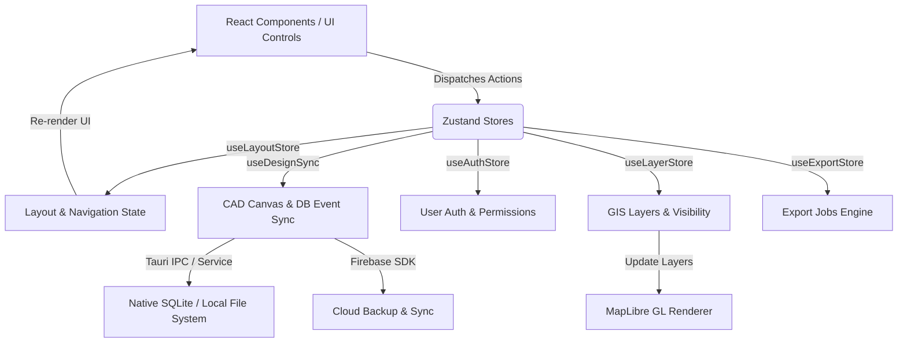

# BÁO CÁO CHI TIẾT BỐ CỤC CODE FRONTEND (FRONTEND CODE LAYOUT & ARCHITECTURE)
Dự án: **RUST CAD & GIS Network Product (V1.2.0)**

---

## 1. Tổng Quan Kiến Trúc Frontend (Architecture Overview)

Phần frontend của dự án được thiết kế theo mô hình **Modular Domain-Driven Component Architecture** kết hợp với **Tauri v2 Desktop Shell**. Giao diện ứng dụng là hệ thống CAD/GIS chuyên nghiệp, độ mật độ thông tin cao (high-density desktop UI) tối ưu hóa cho các thao tác thiết kế bản đồ, quản lý mạng cáp quang, đo đạc đất đai và thống kê khối lượng.

### Công Nghệ Cốt Lõi (Tech Stack)
- **Framework UI:** React 19.1 + TypeScript 5.8
- **Build Tool & Dev Server:** Vite 8.0 với các plugin: `@vitejs/plugin-react`, `vite-plugin-wasm`, `vite-plugin-top-level-await`
- **Styling System:** Tailwind CSS v4.2 + Vanilla CSS Tokens (`src/modules/design/index.css`)
- **Quản lý Trạng Thái (State Management):** Zustand 5.0 (Single-source reactive stores)
- **Công cụ Bản đồ & GIS (Map Engines):** MapLibre GL 5.1, Turf.js 7.3 (Phân tích không gian & SNAP polyline), Google Street View API
- **Sơ đồ Mạng Topology:** `@xyflow/react` 12.11 (React Flow)
- **Biên Tập & Nhập Liệu Chuyên Sâu:** Monaco Editor (`@monaco-editor/react`), TanStack Table 8.21, React Virtuoso 4.12
- **Tích hợp Hệ thống Native Desktop:** `@tauri-apps/api` 2.7, `@tauri-apps/plugin-dialog` 2.7
- **Đa Ngôn Ngữ & Xuất Báo Cáo:** `i18next`, `react-i18next`, ExcelJS, docx, html2canvas, JSZip

---

## 2. Cấu Trúc Thư Mục Tổng Thể (Directory Layout Tree)

Mã nguồn frontend tập trung toàn bộ trong thư mục `src/`, được chia rõ rệt thành 3 phân vùng chính: `core/`, `modules/`, và `shared/`.

```
src/
├── core/                        # Bản đồ & Engine gốc low-level
│   └── basemap/                 # Các provider nền bản đồ (MapLibre, Google Maps layer)
│
├── modules/                     # Các module chức năng theo từng Domain
│   ├── home/                    # Shell chính của ứng dụng & App Entrypoint
│   │   ├── main.tsx             # Điểm khởi chạy React (DOM Root, i18n initialization)
│   │   ├── App.tsx              # Shell chính điều hướng Tabs (Implement, Design, GIS Dashboard)
│   │   ├── AppBootstrap.tsx     # Khởi tạo trạng thái ban đầu
│   │   ├── AppLoader.tsx        # Màn hình chờ nạp dữ liệu
│   │   ├── AuthGuard.tsx        # Kiểm soát quyền truy cập & đăng nhập
│   │   └── GlobalModals.tsx     # Quản lý Modal toàn cục (Theme, Export, Delete Confirmation)
│   │
│   ├── design/                  # Module CAD Design Canvas & Hệ thống Giao diện (Design System)
│   │   ├── DesignApp.tsx        # Layout không gian CAD/GIS Workspace chính
│   │   ├── index.css            # Định nghĩa CSS Tokens, Tailwind v4 @theme, custom scrollbar
│   │   ├── components/
│   │   │   ├── ui/              # Các UI Primitives (Button, Ribbon, TitleBar, Toolbar, Modals...)
│   │   │   ├── core/            # Màn hình lõi CAD (CADCanvas, FeatureEditor, PropertyPanel...)
│   │   │   └── icons/           # Bộ biểu tượng ứng dụng
│   │   ├── features/
│   │   │   ├── map/             # MapLibre Fast Renderer, MapToolbar, Polyline Snap Markers
│   │   │   ├── print/           # Engine xuất bản in & định màu sắc giấy in
│   │   │   └── reports/         # Xuất báo cáo CAD & GIS
│   │   └── stores/              # ThemeStore và các Zustand store điều khiển canvas
│   │
│   ├── implement/               # Module Quản Lý Mạng Cáp & Thi Công Thực Địa (Network Topology)
│   │   ├── ImplementApp.tsx     # Màn hình làm việc chính của phần Thi công / Thi công mạng
│   │   ├── stores/              # Trọng tâm Store logic ứng dụng (useLayoutStore, useDesignSync...)
│   │   ├── features/
│   │   │   ├── admin/           # Phân quyền & Quản trị hệ thống
│   │   │   ├── analysis/        # Phân tích khoảng cách cáp quang, sự cố OTDR
│   │   │   ├── auth/            # Luồng xác thực tài khoản & Firebase/SQLite sync
│   │   │   ├── contract/        # Quản lý hợp đồng & hồ sơ PMP
│   │   │   ├── files/           # Quản lý tệp tin dự án & Virtual File Grid
│   │   │   ├── graph/           # Biểu đồ sơ đồ mạng (React Flow Graph)
│   │   │   ├── inventory/       # Kho vật tư cáp, măng xông, ODF, splitter
│   │   │   └── project-management/ # Tiến độ thi công & giai đoạn dự án
│   │   └── components/          # Các bộ lọc & Modal import tệp tin
│   │
│   ├── analytics/               # Module Dashboard GIS & Phân tích Dữ liệu Thống kê
│   │   ├── GisDashboardV2.tsx   # Dashboard GIS phân tích dữ liệu không gian V2
│   │   └── AnalyticsDashboard.tsx # Bảng điều khiển phân tích số liệu
│   │
│   ├── contract/                # Định nghĩa Kiểu Dữ Liệu & Interface Chung (Contracts)
│   │   ├── designTypes.ts       # Type định nghĩa đối tượng CAD (Polyline, Point, Node, Cable)
│   │   └── types.ts             # Schema dữ liệu hệ thống & hợp đồng
│   │
│   ├── tool/                    # Tiện ích bổ trợ & Công cụ chuyển đổi dữ liệu
│   │   ├── components/          # Đèn đo tín hiệu & widget công cụ
│   │   └── utils/               # Thuật toán tính toán phụ trợ
│   │
│   └── i18n/                    # Hệ thống Đa ngôn ngữ (i18n)
│       └── locales/             # Tệp từ điển `vi/common.json` và `en/common.json`
│
├── test-setup.ts                # Khởi tạo môi trường kiểm thử Vitest / React Testing Library
└── vite-env.d.ts                # Khhai báo kiểu môi trường Vite
```

---

## 3. Bố Cục Chi Tiết Các Module Chức Năng

### 3.1. Module `home` (`src/modules/home`)
- **Vai trò:** Là cửa ngõ khởi chạy (Entrypoint) và khung chứa ứng dụng (App Shell).
- **Các thành phần quan trọng:**
  - `main.tsx`: Gắn kết React Root vào thẻ `#root` trong `index.html`. Nạp cấu hình `i18n` và React StrictMode.
  - `App.tsx`: Chứa bộ điều hướng Tab chính giữa các ứng dụng nhánh: **Thi công Mạng (`ImplementApp`)**, **Thiết kế CAD (`DesignApp`)**, và **GIS Dashboard (`GisDashboardV2`)**. Quản lý phím tắt toàn cục (`Ctrl+S`, `Ctrl+Z`, `Escape`).
  - `GlobalModals.tsx`: Portal trung tâm chứa các hộp thoại hệ thống: `ThemeModal`, `ExportProgressModal`, `DeleteConfirmationModal`, `ImageEditorModal`.

### 3.2. Module `design` (`src/modules/design`)
- **Vai trò:** Trung tâm điều khiển giao diện thiết kế CAD và công cụ hiển thị GIS.
- **Các vùng chức năng chính:**
  - **Ribbon & TitleBar (`components/ui/Ribbon.tsx`, `TitleBar.tsx`):** Thanh điều khiển trên cùng dạng thanh Ribbon chuyên nghiệp (AutoCAD style), hỗ trợ chuyển đổi tab thao tác (Vẽ, Đo đạc, Lớp bản đồ, Báo cáo).
  - **CAD Canvas & Fast Renderer (`features/map/MapLibreFastRenderer.tsx`):** Bộ dựng bản đồ MapLibre GL độ năng suất cao, tải hàng ngàn điểm node và tuyến cáp quang mượt mà với khung hình 60fps.
  - **Property Panel (`components/core/PropertyPanel.tsx`):** Panel bên phải hiển thị thuộc tính kỹ thuật chi tiết của đối tượng đang chọn trên bản đồ (chiều dài, tọa độ, số sợi cáp, suy hao, mã vật tư).
  - **BOM Summary Panel (`components/ui/BOMSummaryPanel.tsx`):** Bảng tổng hợp bóc tách khối lượng vật tư (Bill of Materials) thời gian thực.
  - **Command Line & Status Bar (`components/ui/CommandLine.tsx`, `StatusBar.tsx`):** Thanh nhập lệnh CAD phía dưới và thanh trạng thái tọa độ GPS/Hệ tọa độ VN2000.

### 3.3. Module `implement` (`src/modules/implement`)
- **Vai trò:** Quản lý logic thi công, cấu trúc mạng topology và toàn bộ Zustand stores điều hành ứng dụng.
- **Tệp tin quan trọng:**
  - `ImplementApp.tsx`: Không gian làm việc cho kỹ sư thi công.
  - `features/graph/`: Hiển thị và tương tác sơ đồ đấu nối cáp quang (ODF, Măng xông, Splitter) sử dụng `@xyflow/react`.
  - `features/files/`: Hệ thống quản lý tệp dự án dạng lưới ảo `VirtualFileGrid.tsx` hỗ trợ kéo thả tệp GeoJSON, DXF, KML, PMP.

### 3.4. Module `contract` & `analytics` (`src/modules/contract`, `src/modules/analytics`)
- **`contract/designTypes.ts`**: Chứa toàn bộ định nghĩa TypeScript hợp đồng dữ liệu cho các thực thể CAD (`CadFeature`, `CablePolyline`, `FiberSplice`, `MapRegion`, `ProjectMetadata`).
- **`analytics/GisDashboardV2.tsx`**: Trực quan hóa dữ liệu thống kê mật độ cáp, số lượng thiết bị, tiến độ thi công dưới dạng biểu đồ và bản đồ nhiệt GIS.

---

## 4. Kiến Trúc Quản Lý Trạng Thái (State Management & Data Flow)

Ứng dụng sử dụng kiến trúc **Single State Store** dựa trên Zustand, được mô đun hóa theo từng chức năng tại `src/modules/implement/stores/`:



### Chi Tiết Các Store Chính:
1. **`useLayoutStore.ts`**: Quản lý layout ứng dụng, vị trí các panel (collapse/expand), tab đang mở, trạng thái giao diện điều khiển.
2. **`useDesignSync.ts`**: Đồng bộ dữ liệu hai chiều (Bi-directional Sync) giữa các phần tử đang vẽ trên CAD Canvas và cơ sở dữ liệu thi công mạng.
3. **`useAuthStore.ts`**: Quản lý thông tin đăng nhập, Token người dùng và phân quyền quản trị.
4. **`useLayerStore.ts`**: Kiểm soát bật/tắt các lớp bản đồ (Địa chính, Tuyến cáp, Trạm viễn thông, Ranh giới thửa đất).
5. **`useExportStore.ts`**: Theo dõi tiến độ xuất tệp (DXF, GeoJSON, Excel, PDF).

---

## 5. Tích Hợp Native & IPC Bridge (Desktop Integration)

Dự án đóng gói dưới dạng ứng dụng Desktop gốc bằng **Tauri v2**:
- **IPC Protocol (`@tauri-apps/api`):** Giao tiếp trực tiếp với backend Rust để thực thi các tác vụ tính toán hình học nặng, đọc/ghi tệp SQLite bản địa, và gọi dialog hệ điều hành.
- **Tệp lệnh đóng gói:** `build_release_msi.bat` / `build_release_msi.ps1` hỗ trợ tự động tạo bản cài đặt `.msi` cho Windows.

---

## 6. Quyết Định Kiến Trúc & Công Cụ Phát Triển (Tooling & Build System)

- **Vite 8 Configuration (`vite.config.ts`):** 
  - Đã tối ưu hóa hỗ trợ WebAssembly (`vite-plugin-wasm`) cho các thư viện đọc tệp bản đồ phức tạp.
  - Phân tách Chunks (`manualChunks`) giúp giảm thời gian nạp ban đầu cho MapLibre và Monaco Editor.
- **Tailwind v4 Setup (`src/modules/design/index.css`):** Sử dụng khối `@theme` kết hợp với CSS Variables `--cad-*` giúp hệ thống dual-theme chuyển đổi tức thì không bị giật trang.
- **Đảm bảo Chất lượng Code:**
  - Vitest (`vitest.config.ts`): Đã cài đặt môi trường `jsdom` cùng `@testing-library/react` cho các bài kiểm thử unit & integration test.
  - ESLint & Prettier: Tuân thủ quy tắc nghiêm ngặt không hardcode mã màu hex ngoài thư mục quy định.
