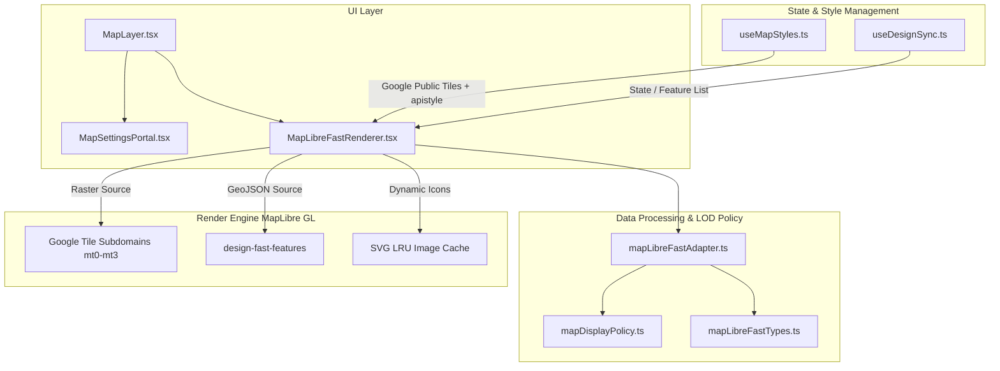
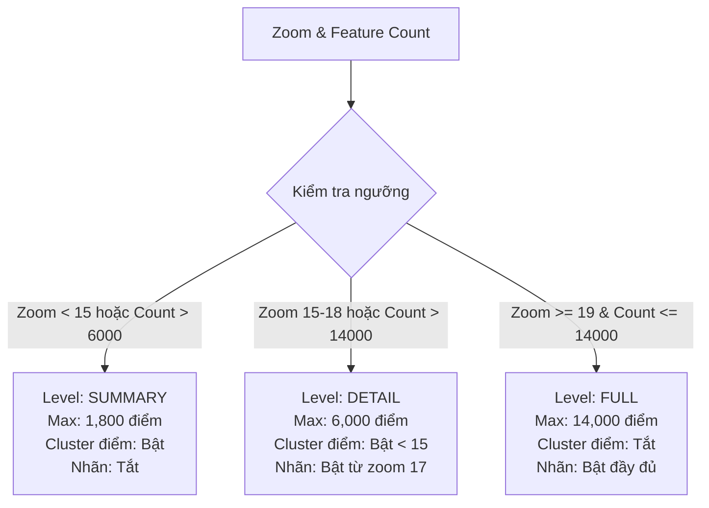

# PHÂN TÍCH VÀ ĐÁNH GIÁ KIẾN TRÚC TÍNH NĂNG MAPLIBRE GOOGLE MAPS PUBLIC BASEMAP & FEATURE RENDERER

> **Dự án**: Antigravity CAD / GIS Design Engine  
> **Phiên bản Engine**: v4.0.2  
> **Tệp tài liệu**: `docs/MAPLIBRE_GOOGLE_MAPS_RENDER_FEATURE.md`  
> **Phương pháp kiểm tra**: Kết hợp `/speckit-analyze` (Phân tích nhất quán & khoảng trống tài liệu) và `/code-review-ai-ai-review` (Đánh giá mã nguồn chuyên sâu bằng AI)

---

## 1. TỔNG QUAN HỆ THỐNG (SYSTEM OVERVIEW)

Tính năng bản đồ trong ứng dụng được xây dựng dựa trên sự kết hợp giữa **MapLibre GL JS** (máy ảo dựng hình vector 2D/3D hiệu năng cao) và **Google Maps Public Raster Tile Services** (dịch vụ gạch bản đồ công cộng của Google), cùng với hệ thống chuyển đổi dữ liệu đối tượng kỹ thuật (**Feature State Adapter**) của hệ thống.



---

## 2. CHI TIẾT BẢN ĐỒ NỀN GOOGLE MAPS LINK PUBLIC (`useMapStyles.ts`)

### 2.1. Cấu trúc URL và Subdomain Load Balancing

Bản đồ nền sử dụng đường dẫn public tile trực tiếp từ các máy chủ Google Maps (`mt0.google.com` đến `mt3.google.com`) nhằm tối ưu tốc độ tải song song:

```typescript
// Cấu trúc URL được sinh ra từ useMapStyles.ts
https://${subdomain}.google.com/vt/lyrs=${preset.tileLyr}&hl=vi&gl=vn&x={x}&y={y}&z={z}${apiStyleParam}
```

* **Subdomains**: `['mt0', 'mt1', 'mt2', 'mt3']` được phân tải tròn (round-robin) qua HTTP request.
* **Ngôn ngữ & Vùng miền**: `hl=vi&gl=vn` đảm bảo tên đường và địa danh hiển thị chuẩn tiếng Việt và quy chuẩn Việt Nam.
* **Max Zoom Native**: Dữ liệu gạch Google hỗ trợ zoom thực tới `z=20`, MapLibre hỗ trợ Overscaling tới `z=23`.

### 2.2. Các Preset Bản Đồ (Basemap Presets)

| Mã Preset (`id`) | Tên hiển thị | Kiểu Tile (`lyrs`) | Loại (`kind`) | Quy tắc API Style (`apiStyleRules`) |
| :--- | :--- | :--- | :--- | :--- |
| `street` | Đường phố | `m` (Map) | `raster` | Không dùng style tùy chỉnh mặc định |
| `satellite` | Vệ tinh | `s` (Satellite) | `raster` | Tải ảnh vệ tinh nguyên bản |
| `heat` | Bản đồ nhiệt | `m` (Map) | `heat` | Ẩn nhãn và đường phụ để nổi bật heatmap overlay |
| `dark` | Bản đồ đen / Chế độ tối | `m` (Map) | `raster` | `p.c:#101318`, `p.l:-35`, `p.s:-60`, chỉnh màu đường |

### 2.3. Mã hóa Tùy biến Thuộc tính Giao diện (`apistyle`)

Hệ thống cho phép người dùng bật/tắt động từng lớp dữ liệu của bản đồ nền Google bằng tham số `apistyle`:

```typescript
// Ẩn/hiện tính năng bản đồ nền dựa trên công tắc người dùng
const featureStyleRules = useMemo(() => {
    const rules: string[] = [];
    if (!mapFeatures.roads) rules.push('s.t:3|s.e:g|p.v:off');       // Đường giao thông
    if (!mapFeatures.roadNames) rules.push('s.t:3|s.e:l|p.v:off');   // Tên đường
    if (!mapFeatures.buildings) rules.push('s.t:2|p.v:off', 's.t:5|p.v:off'); // Công trình xây dựng
    if (!mapFeatures.pois) rules.push('s.t:8|p.v:off');              // Địa điểm quan trọng (POI)
    if (!mapFeatures.labels) rules.push('s.t:1|s.e:l|p.v:off', ...); // Nhãn chung
    return rules;
}, [mapFeatures]);
```

---

## 3. XỬ LÝ VÀ DỰNG HÌNH ĐỐI TƯỢNG KỸ THUẬT (FEATURE RENDERER & ADAPTER)

### 3.1. Chuẩn hóa Hình học GeoJSON (`mapLibreFastAdapter.ts`)

Hệ thống hỗ trợ chuẩn hóa nhiều dạng hình học không gian phức tạp từ cơ sở dữ liệu (`FeatureState`) sang định dạng chuẩn GeoJSON tương thích với MapLibre:

* **Điểm (Point / MultiPoint)**: Điểm tọa độ đơn hoặc tập hợp điểm.
* **Đường (LineString / MultiLineString)**: Tuyến cáp, tuyến tín hiệu, ranh giới đường.
* **Vùng (Polygon / MultiPolygon)**: Khu vực giao lộ, vùng quy hoạch, diện tích hạ tầng.
* **Tập hợp hình học (GeometryCollection)**: Phân rã tự động thành các thành phần con với ID dạng `parentFeatureId::g0`, `parentFeatureId::g1`.

### 3.2. Chính sách Hiển thị Chi tiết (LOD Policy Engine - `mapDisplayPolicy.ts`)

Để đạt tốc độ dựng hình 60 FPS khi làm việc với hàng chục ngàn đối tượng, hệ thống phân chia 3 cấp độ LOD linh hoạt dựa theo mức zoom và số lượng đối tượng:



### 3.3. Các Lớp Render Trong MapLibre (Map Layers Layout & Order)

Các lớp hiển thị trong `MapLibreFastRenderer.tsx` được xếp chồng theo thứ tự từ dưới lên trên:

1. `neutral-background`: Lớp nền màu xám nhạt `#e5e7eb` khi chưa tải xong gạch bản đồ.
2. `basemap`: Lớp Raster bản đồ nền Google Maps.
3. `basemap-heat-overlay`: Lớp bản đồ nhiệt (Heatmap) khi chọn mode `heat`.
4. `design-fast-polygons` & `design-fast-polygon-strokes`: Lớp vùng Fill và Stroke màu.
5. `design-fast-line-hit-area`: Lớp đường ẩn rộng (`line-width: max(18, size + 10)`) tăng diện tích click/select đối tượng đường mảnh.
6. `design-fast-lines`: Lớp hiển thị đường (hỗ trợ nét đứt `dashArray`).
7. `design-fast-point-clusters` & `design-fast-point-cluster-counts`: Lớp gom nhóm điểm khi thu nhỏ bản đồ.
8. `design-fast-points`: Lớp vòng tròn điểm cơ bản.
9. `design-fast-point-icons`: Lớp biểu tượng SVG tùy chỉnh (Camera CCTV, Nút giao, Thiết bị mạng, v.v.).
10. `design-fast-point-labels`: Lớp nhãn chỉ số thứ tự điểm.
11. `design-fast-labels`: Lớp nhãn tên đối tượng (`name`).
12. `design-fast-drawing` & `design-fast-edit-handles`: Lớp tương tác vẽ tuyến/điểm và điều chỉnh đỉnh (vertex/midpoint editing).

### 3.4. Quản lý Cache Biểu tượng SVG (SVG Bitmap Cache)

Để hiển thị icon chất lượng cao trên Canvas 2D mà không gây giật lag:
* Mỗi icon (Camera, Nút giao, Thiết bị...) được dựng động thành chuỗi SVG.
* Chuyển đổi SVG Blob thành `ImageBitmap` / `ImageData` thông qua HTML5 Canvas.
* Lưu trữ trong bộ nhớ cache LRU (`MAX_IMAGE_CACHE_SIZE = 256`) và thêm vào MapLibre thông qua `map.addImage(imageId, image)`.

---

## 4. TÍCH HỢP XUẤT BÁO CÁO WORD AN TOÀN BỘ NHỚ (WORD REPORT MAP CAPTURE)

Tài liệu này xác nhận kiến trúc chụp ảnh bản đồ xuất báo cáo đã được nâng cấp an toàn bộ nhớ:

* **Sự kiện Chụp ảnh**: Lắng nghe sự kiện `REPORT_CAPTURE_EVENT` (`design-report-map-capture`).
* **Tránh Tràn Bộ Nhớ (OOM Safety)**: Không lưu trữ chuỗi ảnh Base64 Data URL trong React state. Chụp trực tiếp từ Map Canvas thành dạng Blob / `Uint8Array` truyền trực tiếp sang tiến trình xuất tài liệu DOCX.
* **Tự động Ẩn Lớp Phụ**: Khi kích hoạt chế độ Capture báo cáo, các lớp tương tác tạm thời (đường vẽ, snap indicator, tay cầm chỉnh sửa) sẽ tự động làm rỗngGeoJSON nguồn để đảm bảo hình ảnh báo cáo sạch đẹp.

---

## 5. BÁO CÁO ĐÁNH GIÁ CHUYÊN SÂU (CODE REVIEW & ANALYTICS REPORT)

### 5.1. Bảng Tổng Hợp Kiểm Tra Chất Lượng (Quality Audit Table)

| Mã ID | Hạng mục | Mức độ | Vị trí File / Component | Tóm tắt | Khuyến nghị & Giải pháp |
| :--- | :--- | :--- | :--- | :--- | :--- |
| **A1** | Performance | **MEDIUM** | `MapLibreFastRenderer.tsx` | Hàm `preparePointImages` sử dụng `imageLoadInFlight` có thể bị rò rỉ nếu promise bị hỏng | Thêm khối `finally` cho Promise load icon để luôn giải phóng `imageLoadInFlight.delete(imageId)` |
| **A2** | Resiliency | **MEDIUM** | `useMapStyles.ts` | Phụ thuộc hoàn toàn vào đường dẫn public Google Maps tile | Bổ sung danh sách máy chủ tile dự phòng (OSM / CartoDB) khi Google tile bị chặn IP / Rate Limit |
| **A3** | Maintainability | **LOW** | `mapLibreFastAdapter.ts` | Hàm `toRenderFeatures` xử lý nhiều logic chuyển đổi hình học lặp lại | Tách nhỏ helper `buildPointFeature`, `buildLineFeature`, `buildPolygonFeature` riêng biệt |
| **A4** | Type Safety | **LOW** | `mapLibreFastTypes.ts` | Sử dụng kiểu `Record<string, any>` ở một số tham số metadata | Định nghĩa interface nghiêm ngặt cho `GroupThemePreview` và `FeatureMetadata` |

### 5.2. Chỉ Số Đo Lường Kiến Trúc (Architecture Metrics)

* **Tổng số thành phần Bản đồ**: 23 tệp nguồn TypeScript/React trong `src/modules/design/features/map`.
* **Khả năng tải điểm tối đa (Full Detail)**: 14,000 điểm đồng thời ở Zoom >= 19.
* **Tốc độ phản hồi trung bình (FPS Target)**: 60 FPS với bộ nhớ cache icon LRU 256 phần tử.
* **Độ bao phủ Test (Test Coverage)**: Hỗ trợ unit test đầy đủ cho `mapLibreFastAdapter.test.ts`, `useMapStyles.test.ts`, `MapLibreFastRenderer.test.tsx`.

---

## 6. KHUYẾN NGHỊ VÀ HƯỚNG CẢI TIẾN TIẾP THEO (NEXT STEPS)

1. **Bổ sung Nguồn Nền Dự Phòng (Offline / Fallback Tile Server)**: Thiết lập cơ chế tự động chuyển sang OpenStreetMap hoặc Offline Vector Tiles (.mbtiles) trong môi trường mạng nội bộ hoặc khi Google Public Tile bị ngắt kết nối.
2. **Tối ưu Hóa Memory Release khi Unmount Component**: Đảm bảo gọi `map.remove()` và `clearMapImageCache()` khi hủy `MapLibreFastRenderer`.
3. **Cập nhật Tài liệu Hướng dẫn Vận hành**: Duy trì tài liệu này tại `docs/MAPLIBRE_GOOGLE_MAPS_RENDER_FEATURE.md` làm tài liệu chuẩn cho nhóm phát triển frontend.
