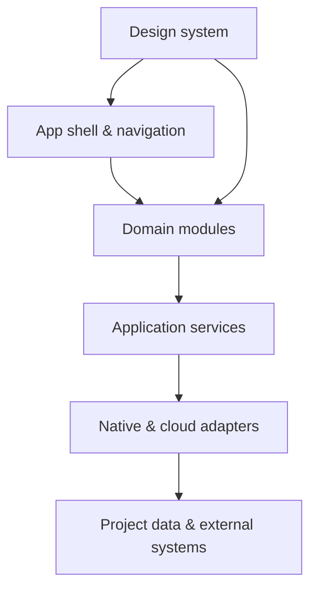

# KẾ HOẠCH CHUẨN HÓA RUST CAD & GIS NETWORK THÀNH PRODUCT

**Sản phẩm:** RUST CAD & GIS Network Product  
**Phiên bản tài liệu:** 1.2  
**Ngày lập:** 02/08/2026  
**Nguồn phân tích:** `FRONTEND_CODE_LAYOUT.md`, `UI_UX_DOCUMENTATION.md`, `PRODUCT_PLAN_REVIEW.md`

---

## 0. Quyết định đã chốt (v1.2)

Toàn bộ 11 quyết định chiến lược (D1–D11) đã được Product Owner / Tech Lead thống nhất và khóa lại qua các phiên làm việc /grill-me. Tất cả nội dung trong tài liệu này đã được chuẩn hóa đồng bộ theo các quyết định này.

| # | Quyết định | Nội dung | Hệ quả áp dụng trong tài liệu này |
|---|---|---|---|
| D1 | Nền tảng | **Windows-only cho V1.** Không đầu tư abstraction cho macOS/Linux. | Mục 4.3 (không cần adapter đa OS), Pha 4 (build/release chỉ nhắm `.msi`) |
| D2 | Kiến trúc dữ liệu | **Local-first, không cloud sync.** Toàn bộ code Firebase (auth + sync) bị audit và gỡ bỏ, thay bằng auth local (SQLite + OS credential store). Cloud sync (nếu cần) thiết kế lại từ đầu ở P2, không tái sử dụng code cũ. | Mục 2.1–2.2, 4.4–4.6, 9 (P0/P1), backlog mới |
| D3 | Định dạng project | **`.pmp` là canonical project package duy nhất.** Không dùng attachment tham chiếu ngoài — toàn bộ dữ liệu dự án (manifest, feature catalog, site photo, attachment) được **đóng gói bên trong một file `.pmp` duy nhất** (dạng archive có checksum nội bộ), đồng bộ/lưu trữ/chia sẻ như một file thống nhất. | Mục 4.5 (viết lại mô hình attachment) |
| D4 | Phạm vi tính năng | **Loại bỏ Google Street View API khỏi V1.** Không đạt tiêu chí Keep (phụ thuộc external API có chi phí/quota, không nằm trên chuỗi giá trị chính, chưa có owner ngân sách). | Mục 2.1 (bỏ khỏi tech stack giữ lại), mục 9 backlog (thêm task gỡ bỏ) |
| D5 | Sequencing Pha 1 | Domain model → module boundary → atomic save (không làm song song). | Mục 8, Pha 1 |
| D6 | Tiêu chí Keep/Defer/Remove | Bổ sung tiêu chí định lượng (tần suất dùng, vị trí trong chuỗi giá trị, chi phí bảo trì, rủi ro khi xóa). | Mục 2.2, mục 9 |
| D7 | Wedge Market (V1) | **Ưu tiên viễn thông (Telecom Optical Fiber Network).** Tập trung tối ưu hóa các module cáp quang, tuyến cáp, ODF, splitter, bóc tách BOM và báo cáo chuyên ngành viễn thông cho V1. | Mục 1, 3.1, 4.2 (tập trung mạng viễn thông) |
| D8 | Chuyển đổi dữ liệu cũ | **Tự động chuyển đổi (Auto-migrate & Backup).** Mở tệp `.pmp` cũ sẽ tự động đóng gói các attachment ngoài vào file `.pmp` mới và tạo bản sao lưu `.pmp.bak`. | Mục 4.5, Pha 1 (Migration spec & tests) |
| D9 | Mô hình cấp phép & Auth | **Cấp phép theo thiết bị (Node-locked Key) + Local Auth.** License key mã hóa gắn với Hardware ID (lưu trong OS Credential Store), quản lý user local qua SQLite + Argon2id. | Mục 4.4, 4.6, Pha 1 (Auth local) |
| D10 | Telemetry & Privacy | **Opt-in & Sanitized Diagnostics.** Mặc định tắt thu thập. Chỉ gửi stack trace đã scrub + OS/App version khi người dùng Opt-in hoặc xác nhận crash. Tuyệt đối KHÔNG gửi tọa độ, tên dự án, dữ liệu thiết kế. | Mục 7.2, 11 (Telemetry spec) |
| D11 | Pilot & Datasets | **5–10 kỹ sư thiết kế tuyến cáp quang viễn thông** thử nghiệm trên 3 bộ dữ liệu chuẩn: S (1.000 phần tử), M (25.000 phần tử), L (100.000 phần tử + site photos đính kèm). | Mục 6.2, Pha 4 (Pilot release) |

Chi tiết thiết kế cho D1–D11 nằm trong các tài liệu chuyên đề (`PRODUCT_PLAN_REVIEW.md`, `ARCHITECTURE_BOUNDARIES.md`, `PROJECT_FORMAT_AND_MIGRATION_SPEC.md`). Tài liệu này là kế hoạch tổng thể thống nhất.

---

## 1. Mục tiêu

Chuyển hệ thống hiện tại từ một tập hợp module kỹ thuật CAD/GIS thành **desktop product có thể phát hành, vận hành, hỗ trợ và mở rộng ổn định**, với bốn kết quả:

1. Người dùng mục tiêu và luồng công việc cốt lõi được xác định rõ.
2. Kiến trúc có ranh giới domain, dữ liệu và phụ thuộc có thể kiểm soát.
3. Chất lượng, hiệu năng, bảo mật và khả năng phục hồi được đo bằng tiêu chí nghiệm thu.
4. Quy trình phát hành, cập nhật, quan sát lỗi và hỗ trợ khách hàng hoạt động lặp lại được.

### Phạm vi product V1

Product V1 tập trung vào một chuỗi giá trị thống nhất:

> Tạo/mở dự án → quản lý dữ liệu → thiết kế CAD/GIS → quản lý topology và thi công → kiểm tra dữ liệu → bóc tách khối lượng → xuất hồ sơ/báo cáo.

Các chức năng không trực tiếp phục vụ chuỗi này chỉ được đưa vào V1 khi có người dùng, use case và tiêu chí thành công rõ ràng.

---

## 2. Đánh giá hiện trạng

### 2.1. Nền tảng tốt có thể giữ lại

| Năng lực | Hiện trạng | Hướng xử lý |
|---|---|---|
| Desktop shell | Tauri v2, tích hợp Rust/IPC | Giữ, bổ sung contract IPC, capability và update policy |
| Frontend | React 19, TypeScript, Vite | Giữ, chuẩn hóa dependency direction và error boundaries |
| Domain UI | Đã tách `design`, `implement`, `analytics` | Chuyển thành bounded contexts có public API rõ ràng |
| Bản đồ | MapLibre, Turf.js, fast renderer | Giữ, thêm performance budget và benchmark thực tế |
| State | Zustand theo nhóm chức năng | Giữ cho client state; tách domain data và persisted state |
| Design system | Token, theme, kích thước chrome, z-index | Tách thành package/layer độc lập, bổ sung component states và kiểm thử |
| Dữ liệu lớn | Virtual table/grid | Chuẩn hóa ngưỡng tải và benchmark dataset |
| Xuất báo cáo | Word, Excel, PDF, ảnh | Đưa vào job pipeline có progress, retry, cancel và kiểm tra đầu ra |
| i18n/a11y | Có quy ước Việt–Anh và accessibility | Biến quy ước thành automated checks và acceptance criteria |

### 2.2. Khoảng trống ngăn hệ thống trở thành product

| Mức | Khoảng trống | Rủi ro |
|---|---|---|
| P0 | Chưa có product scope, persona, JTBD và luồng chuẩn | Phát triển nhiều chức năng nhưng không tối ưu được giá trị chính |
| P0 | Chưa có canonical domain model và schema versioning | Dữ liệu CAD, GIS, topology, thi công dễ lệch nghĩa hoặc mất tương thích |
| P0 | Ranh giới module chưa chặt; `home` biết mọi app, `implement/stores` điều phối rộng | Coupling tăng, sửa một domain gây lỗi domain khác |
| P0 | Chưa mô tả transaction, autosave, recovery, migration và backup | Nguy cơ mất dữ liệu dự án người dùng |
| P0 | Chưa có security model cho IPC, file, token và quyền | Desktop app có thể mở bề mặt tấn công rộng |
| P0 | Các tuyên bố như 60 FPS, tải tức thì chưa gắn dataset và benchmark | Không thể nghiệm thu hoặc ngăn regression |
| P1 | Chưa có E2E test, visual regression, contract test và test dữ liệu lớn | Chất lượng phát hành phụ thuộc kiểm thử thủ công |
| P1 | Chưa có crash reporting, telemetry, health diagnostics | Không biết lỗi thực tế và khó hỗ trợ khách hàng |
| P1 | Chưa có release channels, code signing, auto-update, rollback | Không thể phát hành desktop an toàn và lặp lại |
| P1 | Design system mới chủ yếu là quy ước CSS | Dễ phân mảnh UI khi số module tăng |
| P2 | Analytics chưa được phân loại product analytics hay GIS analytics | Khó quản trị dữ liệu và quyền riêng tư |
| ~~P0~~ **Đã chốt (D2, D4)** | Code có phụ thuộc Firebase (auth/sync) và Google Street View API không nằm trong chuỗi giá trị chính, không rõ owner chi phí | Đã quyết định: audit và gỡ bỏ Firebase, thay bằng auth local; loại bỏ Street View khỏi V1 — xem mục 0 và mục 9 |

### 2.3. Các điểm cần chỉnh ngay trong tài liệu hiện tại

- Thay cụm **“Single State Store”** bằng **“domain-scoped stores với luồng dữ liệu một chiều”** vì hệ thống đang có nhiều Zustand stores.
- Không để `src/modules/implement/stores` trở thành nơi điều phối toàn ứng dụng; store phải thuộc domain hoặc app-shell.
- `contract` không nên là một feature ngang hàng với `design`; đây là lớp contract/domain model dùng chung có kiểm soát.
- `design/index.css` đang vừa thuộc domain thiết kế vừa là design system toàn sản phẩm; cần tách trách nhiệm.
- Các con số hiệu năng phải ghi rõ thiết bị chuẩn, dataset, percentile và cách đo.
- Quy tắc “100% i18n” và accessibility cần được kiểm tra tự động, không chỉ ghi trong tài liệu.
- Tech stack ở `FRONTEND_CODE_LAYOUT.md` liệt kê Firebase và Google Street View API — cả hai đã bị loại khỏi phạm vi V1 (D2, D4); tài liệu tech stack cần cập nhật lại để không còn nhắc tới hai phụ thuộc này như một phần kiến trúc hiện hành.
- Mô hình attachment "relative identity + checksum, không phụ thuộc đường dẫn tuyệt đối" ở bản v1.0 đã được thay bằng mô hình đóng gói single-file `.pmp` (D3) — xem mục 4.5.

---

## 3. Định nghĩa product

### 3.1. Người dùng mục tiêu

| Persona | Công việc chính | Giá trị product phải tạo ra |
|---|---|---|
| Kỹ sư thiết kế | Vẽ, chỉnh sửa, kiểm tra tuyến/điểm và thuộc tính | Thao tác nhanh, chính xác, không mất dữ liệu |
| Kỹ sư hiện trường/thi công | Cập nhật hiện trạng, ảnh, khối lượng, tiến độ | Đồng bộ rõ ràng, dùng được khi kết nối yếu/offline |
| Quản lý dự án | Theo dõi phạm vi, tiến độ, vật tư và hồ sơ | Một nguồn dữ liệu đáng tin cậy, báo cáo truy vết được |
| Quản trị hệ thống | Tài khoản, vai trò, cấu hình, chẩn đoán | Kiểm soát quyền, triển khai và hỗ trợ dễ dàng |

### 3.2. North Star và KPI

**North Star:** Tỷ lệ dự án hoàn thành chuỗi “thiết kế → kiểm tra → xuất hồ sơ” mà không cần sửa dữ liệu ngoài phần mềm.

| Nhóm | Chỉ số V1 đề xuất |
|---|---|
| Activation | ≥ 80% người dùng thử tạo/mở dự án và hoàn tất thao tác chỉnh sửa đầu tiên |
| Task success | ≥ 90% hoàn thành 5 luồng cốt lõi trong usability test |
| Reliability | Crash-free sessions ≥ 99,5%; không có lỗi mất dữ liệu P0 |
| Performance | Mở workspace có thể thao tác ≤ 3 giây trên cấu hình chuẩn; tương tác thường p95 ≤ 100 ms |
| Export | ≥ 99% job xuất hợp lệ; lỗi có thông báo, log và retry |
| Quality | 0 lỗi P0/P1 mở tại Release Candidate; rollback được kiểm chứng |
| Adoption | WAU/MAU và retention theo nhóm persona; chỉ thu thập khi có consent/policy |

Ngưỡng cuối cùng phải được baseline bằng dữ liệu thực tế ở Pha 0, không coi các giá trị đề xuất là cam kết trước khi đo.

---

## 4. Kiến trúc product đích

### 4.1. Phân lớp



| Lớp | Trách nhiệm | Không được làm |
|---|---|---|
| App shell | Bootstrap, routing/workspaces, command registry, global errors | Chứa nghiệp vụ CAD/GIS/thi công |
| Domain modules | Use case và UI theo domain | Import private internals của domain khác |
| Application services | Project, persistence, sync, export, auth, search | Phụ thuộc trực tiếp UI framework |
| Native/cloud adapters | Tauri IPC, SQLite/file, API, telemetry | Trả dữ liệu không qua schema/contract |
| Design system | Token, primitives, patterns, icon, accessibility | Chứa logic nghiệp vụ |

### 4.2. Bounded contexts đề xuất

- `project`: vòng đời dự án, metadata, recent projects, template, migration.
- `design`: CAD geometry, selection, edit command, undo/redo.
- `map`: basemap, viewport, layer composition, coordinate system.
- `network`: topology, cáp, ODF, splitter, kết nối và validation.
- `fieldwork`: thi công, tiến độ, site photo, trạng thái nghiệm thu.
- `inventory`: vật tư, định mức, BOM.
- `reporting`: snapshot, bảng biểu, template, export job.
- `identity-admin`: user, role, permission, audit.
- `analytics`: GIS/business dashboard; tách khỏi product telemetry.

Mỗi context phải có `public.ts` hoặc public API tương đương; lint rule cấm deep import xuyên domain.

### 4.3. Cấu trúc thư mục đích

```text
src/
├── app/                 # bootstrap, shell, routes/workspaces, providers
├── domains/             # bounded contexts; UI + use cases + domain state
├── platform/            # persistence, sync, export, auth, telemetry, IPC clients
├── design-system/       # tokens, primitives, patterns, icons
├── shared/              # utilities thuần, không chứa nghiệp vụ
└── contracts/           # versioned schemas/events/IPC DTOs
src-tauri/
├── commands/            # thin IPC command handlers
├── application/         # Rust use cases
├── domain/              # native domain logic
├── infrastructure/      # SQLite, filesystem, network, OS integrations
└── migrations/          # schema/project migrations
```

Không thực hiện big-bang rewrite. Chuyển dần từng vertical slice và đặt adapter tương thích trong giai đoạn chuyển tiếp.

### 4.4. Chuẩn state và dữ liệu

- **UI state:** local React state hoặc domain Zustand store.
- **Domain/session state:** store theo domain; selector hẹp; action có tên theo nghiệp vụ.
- **Persisted project data:** repository/service, không đọc ghi trực tiếp từ component/store.
- **Remote/sync state:** **không triển khai ở V1** (theo D2 — local-first, không cloud sync). Thiết kế `idle/syncing/conflict/error/offline` giữ lại làm tham chiếu cho P2 nếu cloud sync được xây lại, nhưng không có code tương ứng trong V1.
- **Derived data:** selector/memoized query; không lưu trùng nếu có thể tính lại.
- **Schema:** versioned, validated tại import, IPC và persistence boundary.
- **Mutation:** command-based để audit, undo/redo, autosave và recovery dùng chung semantics.

### 4.5. Mô hình project file và an toàn dữ liệu (cập nhật theo D3)

**`.pmp` là canonical project package duy nhất.** Đây là một file archive (dạng container, tương tự cách `.docx`/`.pptx` đóng gói nhiều thành phần trong một file zip), chứa:

- `manifest.json`: `formatVersion`, `productVersion`, `projectId`, hệ tọa độ, feature catalogs, migration history.
- `attachments/`: toàn bộ site photo, ảnh, tệp đính kèm được **đóng gói bên trong** `.pmp`, không tham chiếu đường dẫn ngoài file.
- `checksums.json`: checksum cho từng entry nội bộ (manifest + từng attachment), cộng với checksum tổng của toàn bộ package.

Không còn khái niệm "attachment ở ngoài, project file chỉ trỏ tới" — người dùng chia sẻ/sao lưu/đồng bộ **một file `.pmp` duy nhất** là đủ để có toàn bộ dữ liệu dự án, đúng theo quyết định D3.

Quy tắc bắt buộc:

1. Ghi file theo cơ chế atomic write: ghi toàn bộ package vào temp file → fsync/validate checksum tổng → atomic rename thay thế `.pmp` gốc. Không ghi đè trực tiếp lên `.pmp` đang mở.
2. Autosave có journal riêng (**ngoài** file `.pmp`, vì `.pmp` chỉ nên bị ghi khi có bản hoàn chỉnh mới); sau crash phải phát hiện journal chưa commit và đề nghị phục hồi trước khi ghi `.pmp`.
3. Migration một chiều phải tạo bản backup `.pmp` trước khi ghi, và có dry-run/validation trên bản sao.
4. Vì attachment nằm trong cùng file với dữ liệu thiết kế, **kích thước `.pmp` cần có ngưỡng cảnh báo** (ví dụ project L với nhiều site photo dung lượng lớn) — bổ sung benchmark riêng cho "mở/ghi `.pmp` dung lượng lớn" vào performance budget (mục 6.2), không chỉ tính theo số feature.
5. Mọi import (GeoJSON/DXF/KML) phải có preview, validation report và lựa chọn xử lý lỗi trước khi được đóng gói vào `.pmp`.
6. Có test mở dữ liệu từ tối thiểu hai phiên bản product trước, bao gồm test đọc `.pmp` bị cắt ngắn/hỏng một phần (corrupt archive) — rủi ro mới phát sinh từ mô hình single-file so với mô hình attachment rời trước đây.

### 4.6. IPC và security baseline

- Tauri commands theo allowlist; payload được validate ở cả TypeScript và Rust.
- Principle of least privilege cho filesystem, dialog, network và shell capability.
- Token/secret lưu bằng OS credential store; không lưu trong Zustand/localStorage/log.
- Path canonicalization và kiểm tra loại/size file trước khi import.
- Audit log cho thay đổi quyền, xóa dữ liệu, migration và export quan trọng.
- Dependency/SBOM scan, secret scan, code signing và kiểm tra checksum bản cập nhật.
- Threat model riêng cho project file độc hại, traversal, archive bomb, IPC abuse và sync conflict.

---

## 5. Chuẩn hóa UI/UX thành product design system

### 5.1. Design system contract

Tách `design-system` khỏi domain `design` và chuẩn hóa bốn tầng:

1. **Foundation:** color, typography, spacing, density, elevation, motion, z-index.
2. **Primitives:** Button, Input, Select, Dialog, Tooltip, Tabs, Menu, Table primitives.
3. **Patterns:** Property Grid, Ribbon Group, Data Grid, Tree, Command Palette, Export Progress.
4. **Product templates:** CAD workspace, project browser, admin, analytics dashboard.

Mỗi component phải có variants, states, keyboard behavior, ARIA contract, loading/empty/error/disabled state và visual examples.

### 5.2. Luồng UX bắt buộc chuẩn hóa

| Luồng | Tiêu chí UX tối thiểu |
|---|---|
| First run | Chọn ngôn ngữ, kiểm tra hệ thống, tạo/mở project, recent files |
| Open/import | Progress, cancel, validation summary, lỗi có hướng xử lý |
| Edit | Selection rõ, autosave status, undo/redo nhất quán, cảnh báo destructive action |
| Offline/sync | Trạng thái kết nối, dữ liệu chờ đồng bộ, conflict resolution |
| Export | Chọn phạm vi/template, estimate, progress, retry, mở thư mục kết quả |
| Recovery | Nhận biết crash/autosave, preview phiên phục hồi, không ghi đè âm thầm |
| Empty/error | Hướng dẫn hành động tiếp theo, mã lỗi có thể gửi hỗ trợ |

### 5.3. Accessibility và keyboard

- Mục tiêu WCAG 2.2 AA cho phần UI desktop áp dụng được.
- Keyboard map tập trung; phát hiện shortcut conflict; command registry là nguồn duy nhất.
- Focus order và focus restoration được test cho dialog, ribbon, dock và canvas controls.
- Không dùng màu là tín hiệu duy nhất; contrast được kiểm tra cho cả dark/light.
- Tôn trọng `prefers-reduced-motion`; low-power mode không thay thế reduced motion.

---

## 6. Quality gates và Definition of Done

### 6.1. Test pyramid

| Tầng | Phạm vi | Gate |
|---|---|---|
| Unit | Geometry, selectors, converters, validation | Bắt buộc cho logic domain mới/sửa |
| Component | Design system và domain UI | Keyboard, a11y, states, theme |
| Contract | TS ↔ Rust IPC, schema, import/export | Không có breaking change không version |
| Integration | Repository, migration, autosave, sync | Dùng fixture project thực tế |
| E2E | 5–8 critical journeys | Chạy trên Windows build gần production |
| Visual | Workspace, dialogs, tables, theme | Baseline có review khi thay đổi |
| Performance | Open, render, edit, export, memory | So với budget và chặn regression |

### 6.2. Performance budget ban đầu

Thiết lập ba dataset chuẩn: **S** (1.000 features), **M** (25.000), **L** (100.000 + attachments). Cố định cấu hình máy chuẩn và cách đo.

| Hành vi | Budget đề xuất |
|---|---|
| App shell sẵn sàng | p95 ≤ 2 giây |
| Project M có thể tương tác | p95 ≤ 3 giây |
| Pan/zoom dataset M | p95 frame ≥ 45 FPS; không freeze > 200 ms |
| Chọn/sửa thuộc tính thường | p95 phản hồi UI ≤ 100 ms |
| Memory sau 30 phút workflow chuẩn | Không tăng liên tục; ngưỡng tuyệt đối chốt sau baseline |
| Export/report | Có progress; không khóa UI; không OOM với dataset L |

Mục tiêu “<1 ms” chỉ dùng cho tác vụ CPU cụ thể đã benchmark, không dùng cho cảm nhận hiển thị toàn màn hình.

### 6.3. Definition of Done cho mọi feature

- Có liên kết tới persona/JTBD và acceptance criteria.
- Có thiết kế loading, empty, error, offline và permission-denied nếu áp dụng.
- Không vi phạm dependency boundaries hoặc deep import.
- Có test phù hợp và không làm giảm performance budget.
- Văn bản Việt/Anh đầy đủ; keyboard/a11y được xác nhận.
- Có log/metric cần thiết nhưng không lộ dữ liệu nhạy cảm.
- Tài liệu người dùng, release note và migration note được cập nhật.
- Product owner, engineering và QA cùng chấp nhận trên bản build release candidate.

---

## 7. Vận hành product và phát hành

### 7.1. Release model

- Kênh `internal` → `beta` → `stable`.
- Semantic versioning cho product; schema/project format có version độc lập.
- CI tạo artifact tái lập, ký số, SBOM, checksum và release notes.
- Auto-update có staged rollout, pause và rollback.
- Chính sách hỗ trợ phiên bản: tối thiểu current stable và previous stable.

### 7.2. Observability và supportability

- Crash reporting có product version, OS, stack trace đã scrub và correlation ID.
- Structured log với mức độ, module, operation; có “Export diagnostic bundle”.
- Telemetry phải phân loại: essential diagnostics, product analytics, domain analytics.
- Có consent, retention, redaction và khả năng tắt phù hợp chính sách khách hàng.
- Dashboard release health: adoption, crash-free, export failure, startup p95, migration failure.

### 7.3. Product governance

| Nhịp | Hoạt động | Kết quả |
|---|---|---|
| Hàng tuần | Product triage | Ưu tiên discovery, bug, debt và feature |
| Mỗi sprint | Demo theo user journey | Chấp nhận theo outcome, không theo số màn hình |
| Mỗi release | Go/No-Go review | Quality gates, rollback, support readiness |
| Hàng tháng | Product metrics review | Quyết định tiếp tục, sửa hoặc dừng initiative |
| Hàng quý | Architecture/security review | Debt register, threat model, platform roadmap |

---

## 8. Roadmap triển khai

Thời lượng dưới đây là khung tham chiếu cho một nhóm liên chức năng; cần hiệu chỉnh sau Pha 0 theo nhân lực và code audit thực tế.

### Pha 0 — Product baseline và đóng phạm vi (Tuần 1–2)

**Mục tiêu:** Biết chính xác product phục vụ ai, luồng nào và baseline hiện tại ra sao.

- Chốt 4 persona, 8–12 JTBD và 5–8 critical journeys.
- Lập inventory feature/module; đánh dấu Keep / Improve / Merge / Defer / Remove.
- Vẽ dependency graph thực tế; thống kê deep import, circular dependency và global state.
- Tạo datasets S/M/L và benchmark startup/render/edit/export/memory.
- Kiểm kê project format, SQLite schema, attachment, IPC và quyền Tauri.
- **Kiểm kê phạm vi sử dụng Firebase thực tế** trong `implement/features/auth` và `useDesignSync.ts` — xác nhận đây chỉ là auth hay còn dùng để đồng bộ dữ liệu dự án giữa nhiều máy, làm đầu vào bắt buộc cho việc gỡ bỏ ở Pha 1 (D2).
- Lập risk register, ADR index và product KPI baseline.

**Exit gate:** Product scope V1 được ký duyệt; có baseline đo được; danh sách P0 data-loss/security rõ ràng; phạm vi sử dụng Firebase đã được xác nhận bằng số liệu, không phải suy đoán.

### Pha 1 — Nền móng product và an toàn dữ liệu (Tuần 3–6)

**Mục tiêu:** Có kiến trúc đích, project lifecycle và cơ chế không mất dữ liệu.

Thứ tự thực hiện bắt buộc theo D5 (không làm song song, vì các bước sau phụ thuộc kết quả bước trước):

1. Định nghĩa canonical domain model và versioned IPC/schema contracts; tạo `app`, `platform`, `contracts`, `design-system` boundaries.
2. Module boundary enforcement: lint chặn deep import xuyên domain, xác nhận mỗi context có `public.ts`.
3. Xây Project Service: create/open/save/close/recent/backup/recovery/migration — dựa trên domain model và boundary đã có ở bước 1–2.
4. Chuẩn hóa atomic save, autosave journal, và **đóng gói `.pmp` single-file** (manifest + attachments trong cùng một file, theo D3 — không còn attachment tham chiếu ngoài).
5. **Audit code Firebase** (`implement/features/auth`, `useDesignSync.ts`) để xác định chính xác phạm vi sử dụng (chỉ auth, hay cả đồng bộ dữ liệu dự án), sau đó **gỡ bỏ Firebase** và thay bằng auth local (SQLite + Argon2id + OS credential store) theo D2.
6. **Gỡ bỏ Google Street View API** khỏi codebase (D4) — xác nhận không còn UI/luồng nào phụ thuộc vào tính năng này trước khi xóa.
7. Bổ sung error taxonomy, global error boundary và diagnostic ID.
8. Threat model và hardening Tauri capabilities, secrets, path/file validation — thu hẹp theo mô hình local-first (không còn bề mặt tấn công từ cloud/Firebase).

**Exit gate:** Crash/recovery và migration tests đạt (bao gồm test mở `.pmp` hỏng/cắt ngắn); không còn component ghi file/DB trực tiếp; auth local hoạt động thay thế hoàn toàn Firebase; không còn tham chiếu Firebase/Street View trong codebase; threat P0 đã xử lý.

### Pha 2 — Chuẩn hóa UX và vertical slice cốt lõi (Tuần 7–10)

**Mục tiêu:** Một hành trình end-to-end hoạt động theo chuẩn product.

- Tách design system và xây component catalog.
- Command registry thống nhất shortcut, menu, ribbon và command line.
- Chuẩn hóa first run, project browser, workspace states, import và export flow.
- Chuyển vertical slice: thiết kế/chỉnh sửa → validate → BOM → báo cáo.
- Bổ sung offline/sync status và conflict UX nếu cloud sync nằm trong V1.
- Usability test với tối thiểu 5 người mỗi persona chính hoặc đến khi lỗi lớn bão hòa.

**Exit gate:** ≥ 90% task success trên luồng thử nghiệm; không có lỗi usability P0; dark/light và Việt/Anh đạt gate.

### Pha 3 — Quality automation và performance (Tuần 11–14)

**Mục tiêu:** Regression được phát hiện trước khi đến người dùng.

- Thiết lập unit/component/contract/integration/E2E/visual test gates.
- Benchmark chạy trong CI hoặc nightly trên máy kiểm soát.
- Tối ưu lazy loading, worker/native compute, selector và map source updates dựa trên profile.
- Kiểm thử soak, memory, project L, import file lỗi và export attachment lớn.
- Hoàn thiện a11y automation + keyboard test matrix.

**Exit gate:** Critical E2E xanh; performance budget đạt; không memory leak tăng tuyến tính; 0 bug P0/P1 mở.

### Pha 4 — Beta có quan sát được (Tuần 15–17)

**Mục tiêu:** Kiểm chứng product trong môi trường người dùng thật với phạm vi kiểm soát.

- Build pipeline, ký số, installer, internal/beta channels và staged update.
- Crash reporting, release health, structured logs và diagnostic bundle.
- Onboarding, tài liệu nhanh, sample project, in-app feedback và support runbook.
- Pilot với 5–20 người dùng/2–3 dự án đại diện.
- Triage hàng ngày cho lỗi beta; đo activation, task success, crash-free, export success.

**Exit gate:** Hai tuần pilot không có data-loss; crash-free ≥ 99,5%; migration và rollback được diễn tập.

### Pha 5 — Stable launch và vòng lặp product (Tuần 18+)

**Mục tiêu:** Phát hành stable có khả năng hỗ trợ và cải tiến liên tục.

- Go/No-Go theo checklist; staged rollout 10% → 30% → 100%.
- Theo dõi 24/48/72 giờ; có tiêu chí pause/rollback rõ ràng.
- Tổng kết adoption, retention, failure funnel và support tickets.
- Chốt roadmap quý tiếp theo theo outcome và dữ liệu, không chỉ theo feature request.

**Exit gate:** Stable rollout hoàn tất; release retrospective và prioritized product backlog được công bố.

---

## 9. Backlog ưu tiên 90 ngày

### P0 — Bắt buộc trước beta

Thứ tự dưới đây phản ánh sequencing bắt buộc theo D5 (mục 1–4 làm tuần tự, không song song):

1. Product scope, persona, critical journeys và success metrics.
2. Canonical domain model + project manifest + schema/IPC versioning.
3. Module boundary enforcement; loại bỏ persistence trực tiếp từ UI.
4. Atomic save, autosave, crash recovery, backup và migration tests — bao gồm **đóng gói `.pmp` single-file** (manifest + attachments trong cùng một file, theo D3).
5. **Audit và gỡ bỏ Firebase** (`implement/features/auth`, `useDesignSync.ts`); thay bằng auth local (SQLite + Argon2id + OS credential store) theo D2. *(Hạng mục mới, phát sinh từ quyết định D2 — không có trong backlog v1.0.)*
6. **Gỡ bỏ Google Street View API** khỏi codebase và UI theo D4. *(Hạng mục mới, phát sinh từ quyết định D4.)*
7. Security baseline cho Tauri, file import, secret và update — thu hẹp phạm vi theo mô hình local-first, không còn cần threat model cho cloud/Firebase.
8. Dataset benchmarks và performance budgets — bao gồm benchmark mở/ghi `.pmp` dung lượng lớn (nhiều attachment) theo D3.
9. Critical E2E cho create/open/edit/save/reopen/export/recovery, bao gồm test đọc `.pmp` hỏng/cắt ngắn.
10. Signed installer, release channels, update/rollback — chỉ nhắm nền tảng Windows (`.msi`) theo D1.
11. Crash reporting, diagnostic bundle và support runbook.

### P1 — Cần cho product chất lượng cao

1. Design system độc lập và component catalog.
2. Command registry và shortcut governance.
3. Import validation/preview; export job engine.
4. ~~Offline/sync/conflict state machine~~ — **Loại khỏi P1 theo D2** (không có cloud sync ở V1). Giữ lại làm ghi chú thiết kế tham chiếu cho P2 nếu cloud sync được xây lại từ đầu, không phải công việc cần làm ở giai đoạn này.
5. Visual regression, accessibility và localization automation — bổ sung test DPI scaling/multi-monitor.
6. Project templates, sample data và onboarding.
7. Product analytics có privacy policy/consent.

### P2 — Sau khi stable có dữ liệu sử dụng

1. Plugin/extension architecture.
2. Feature flags và tenant policy nâng cao.
3. Collaboration/realtime nếu được chứng minh bởi workflow.
4. **Cloud sync** (thiết kế lại từ đầu, không tái sử dụng code Firebase cũ) — chỉ triển khai nếu có bằng chứng nhu cầu thực tế từ dữ liệu sử dụng V1.
5. Marketplace/template ecosystem.
6. Advanced analytics và recommendations.
7. **Đánh giá lại Google Street View** (hoặc giải pháp bản đồ vệ tinh/street-level tương đương) nếu có use case rõ ràng và ngân sách API được xác định — không mặc định đưa lại vào roadmap chỉ vì đã từng có trong code cũ.

---

## 10. Phân công trách nhiệm đề xuất

| Workstream | Accountable | Responsible/Consulted |
|---|---|---|
| Product scope & KPI | Product Owner | UX, Tech Lead, domain experts |
| Architecture & contracts | Tech Lead | Frontend, Rust/backend, data |
| Project data safety | Rust/Data Lead | QA, security, frontend |
| Design system & journeys | UX Lead | Frontend, accessibility, users |
| Quality & performance | QA Lead | All engineers, DevOps |
| Security & release | Security/DevOps Lead | Tech Lead, support |
| Beta & support | Product Owner | QA, support, pilot users |

Nếu nhóm nhỏ, một người có thể giữ nhiều vai trò nhưng không được bỏ trống trách nhiệm và exit gate.

---

## 11. Bộ artifact cần tạo

1. `PRODUCT_VISION_AND_SCOPE.md`
2. `PERSONAS_JTBD_AND_CRITICAL_JOURNEYS.md`
3. `DOMAIN_MODEL_AND_GLOSSARY.md`
4. `ARCHITECTURE_BOUNDARIES.md` + ADR index
5. `PROJECT_FORMAT_AND_MIGRATION_SPEC.md`
6. `IPC_AND_SECURITY_CONTRACT.md`
7. `DESIGN_SYSTEM_SPEC.md` + component catalog
8. `QUALITY_STRATEGY.md` + test matrix
9. `PERFORMANCE_BUDGETS.md` + benchmark datasets/results
10. `RELEASE_AND_ROLLBACK_RUNBOOK.md`
11. `OBSERVABILITY_AND_PRIVACY_SPEC.md`
12. `BETA_PILOT_PLAN.md`

Mỗi artifact cần có owner, trạng thái, ngày review gần nhất và liên kết đến các decision/issue triển khai.

---

## 12. Trạng thái các quyết định chiến lược (v1.2)

Toàn bộ **11 quyết định chiến lược (D1–D11)** đã được Product Owner và Tech Lead phê duyệt chính thức qua phiên phỏng vấn `/grill-me` (02/08/2026). Hiện tại **không còn quyết định mở nào còn treo**.

1. **D1 (Nền tảng):** Windows-only cho V1 (nhắm gói cài đặt `.msi`).
2. **D2 (Kiến trúc dữ liệu):** Local-first 100%, gỡ bỏ toàn bộ code Firebase auth & sync.
3. **D3 (Định dạng project):** Single-file `.pmp` package duy nhất (archive đóng gói manifest + attachments + checksums).
4. **D4 (Phạm vi tính năng):** Loại bỏ hoàn toàn Google Street View API khỏi V1.
5. **D5 (Sequencing Pha 1):** Domain model → module boundary → atomic save (không làm song song).
6. **D6 (Tiêu chí Keep/Defer/Remove):** Áp dụng tiêu chí định lượng cho mọi module/tính năng.
7. **D7 (Wedge Market V1):** Chuyên sâu mạng cáp quang viễn thông (Telecom Optical Fiber Network).
8. **D8 (Chuyển đổi dữ liệu):** Tự động chuyển đổi file `.pmp` legacy sang format single-file mới kèm tệp sao lưu `.pmp.bak`.
9. **D9 (Mô hình cấp phép & Auth):** Node-locked License Key (lưu OS Credential Store) + Local Auth (SQLite + Argon2id).
10. **D10 (Telemetry & Privacy):** Opt-in & Sanitized Diagnostics (mặc định tắt, chỉ gửi crash log đã scrub khi người dùngOpt-in).
11. **D11 (Pilot & Datasets):** 5–10 kỹ sư thiết kế tuyến cáp quang viễn thông thử nghiệm trên 3 bộ dataset chuẩn S, M, L.

Tất cả các quyết định này đã được ghi nhận thành ADR và tích hợp trực tiếp vào roadmap cũng như backlog ưu tiên 90 ngày của sản phẩm.

---

## 13. Tiêu chí product-ready tổng thể

Sản phẩm chỉ được coi là sẵn sàng stable khi đồng thời thỏa mãn:

- Chuỗi giá trị V1 hoàn tất end-to-end trên dữ liệu thật.
- Dữ liệu có version, migration, backup và recovery đã kiểm thử.
- Module boundaries và IPC contracts được tự động kiểm soát.
- Critical journeys đạt usability, accessibility và localization gates.
- Performance budget đạt trên cấu hình/dataset công bố.
- Không còn bug P0/P1; crash-free và export success đạt KPI beta.
- Installer được ký; update và rollback đã diễn tập.
- Có log, diagnostics, runbook, owner và kênh hỗ trợ.
- Có privacy/security review và release Go/No-Go chính thức.

---

## 14. Hành động khởi động trong 10 ngày làm việc

| Ngày | Hành động | Đầu ra |
|---|---|---|
| 1 | Workshop vision, wedge market, persona | Product one-pager |
| 2 | Journey mapping và scope cut | Critical journeys + out-of-scope |
| 3–4 | Code/data/IPC dependency audit | Architecture baseline + risks |
| 5 | Project format và data-loss workshop | Draft format/recovery spec |
| 6 | UX heuristic review + component inventory | UX debt/design system map |
| 7 | Dựng datasets và benchmark harness | Baseline performance report |
| 8 | Threat modeling và release audit | Security/release gap list |
| 9 | Xếp backlog theo P0/P1/P2, dependency | 90-day delivery board |
| 10 | Review owner, exit gates và lịch beta | Approved execution charter |

Sau 10 ngày, nhóm phải có đủ dữ liệu để cam kết phạm vi và mốc beta có căn cứ; nếu chưa có baseline hoặc project safety spec, không nên bắt đầu mở rộng feature.
