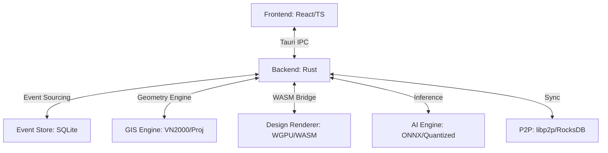

# PROJECT OVERVIEW - RUST-BANDO (2026-05-06)

Tài liệu này cung cấp cái nhìn toàn diện về dự án **Project Manager (RUST-Bando)**, một ứng dụng Tauri/Rust chuyên dụng cho quản lý dự án GIS và thiết kế hạ tầng kỹ thuật.

---

## 📂 1. Cấu trúc thư mục (Code Structure)

Dự án được tổ chức theo mô hình **Monorepo** với sự phân tách rõ rệt giữa Frontend và Backend.

### 🏠 Root Directory
- `src/`: Mã nguồn Frontend (React + Vite).
- `src-tauri/`: Mã nguồn Backend (Rust + Tauri).
- `crates/`: Các thư viện Rust nội bộ (Internal Crates) để module hóa logic.
- `design_renderer/`: Module Rust biên dịch sang WASM để xử lý render đồ họa hiệu năng cao.
- `graphify-out/`: Kết quả phân tích Knowledge Graph của dự án.
- `BAK/`: Thư mục lưu trữ code cũ hoặc các bản sao lưu trong quá trình refactor.

### 🎨 Frontend (`/src`)
- `modules/`: Chứa các module chức năng chính (Design, Tool, GIS, P2P).
- `shared/`: Các thành phần UI dùng chung, hooks, và utilities.
- `vite-env.d.ts`: Định nghĩa kiểu cho môi trường Vite.

### 🦀 Backend (`/src-tauri/src`)
- `main.rs`: Entry point của ứng dụng, nơi đăng ký các Tauri commands.
- `lib.rs`: Thư viện lõi, xuất bản các module để tool binary sử dụng.
- `core/`:
  - `storage/`: Quản lý lưu trữ (SQLite, Event Store, Bincode).
  - `actor/`: Triển khai mô hình Actor (AiActor, EventBusActor).
  - `plugin/`: Các plugin Tauri tùy chỉnh.
- `domain/`: Logic nghiệp vụ (Design, Contract, Resource).
- `bin/`: Các công cụ CLI đi kèm (download_models, ai_benchmark).

---

## 📊 2. Knowledge Graph (Mối quan hệ mã nguồn)

Dựa trên phân tích từ công cụ `graphify`, dự án được chia thành các cộng đồng logic (Communities) chính:

### 🔍 Các cộng đồng quan trọng:
1. **WASM/JS Interop**: Cầu nối hiệu năng cao giữa Renderer (Rust WASM) và UI (JavaScript). Đây là phần phức tạp nhất với hàng ngàn kết nối.
2. **GIS Engine & Mapping**: Xử lý tọa độ VN2000, topology validation, và hiển thị bản đồ Leaflet.
3. **Database Storage & Persistence**: Hệ thống Event Sourcing V2, sử dụng SQLite làm container (.pmp) chứa cả dữ liệu quan hệ và BLOBs.
4. **AI Inference Pipeline**: Tích hợp các model ONNX (Qwen 2.5, YOLO, OCR) thông qua `ort` crate, hỗ trợ tăng tốc phần cứng (CUDA/DirectML).
5. **P2P Networking**: Đồng bộ dữ liệu phi tập trung sử dụng `libp2p`.

### 🔗 Sơ đồ quan hệ cấp cao:

---

## 🛠️ 3. Chức năng từng loại Code

| Loại Code | Công nghệ | Chức năng chính |
| :--- | :--- | :--- |
| **Frontend UI** | React 19, Tailwind CSS | Giao diện điều khiển, Ribbon bar, Project Explorer, Property Panel. |
| **Tauri Commands** | Rust | Handler nhận yêu cầu từ UI, thực thi logic nặng và trả kết quả (IPC). |
| **Domain Logic** | Rust | Tính toán khoảng cách DORI, PPM, xử lý nghiệp vụ thiết kế camera. |
| **Storage Layer** | SQLite + Bincode | Lưu trữ sự kiện (AppEvent), metadata dự án, và file đính kèm. |
| **WASM Renderer** | Rust + WGPU | Render hàng chục ngàn đối tượng vector trên bản đồ với tốc độ 60fps. |
| **AI Actors** | Rust + ONNX | Nhận diện biển số, chuẩn hóa metadata, trợ lý AI hỗ trợ thiết kế. |

---

## ⚠️ 4. Lịch sử lỗi và Giải pháp (Error History)

Dự án đã trải qua nhiều giai đoạn debug quan trọng:

### 1. Lỗi khóa Database (Database Locking)
- **Triệu chứng**: "Database is locked" khi mở/đóng dự án hoặc đồng bộ liên tục.
- **Giải pháp**: Kích hoạt chế độ **WAL (Write-Ahead Logging)**, tăng `busy_timeout` lên 30s và sử dụng `spawn_blocking` để tránh nghẽn UI thread.

### 2. Lỗi bộ nhớ AI (Memory Overhead)
- **Triệu chứng**: Crash trên máy RAM 2GB khi nạp model Phi-3 (2.3GB).
- **Giải pháp**: Chuyển sang model **Qwen 2.5-0.5B** (~500MB), triển khai cơ chế **Lazy Loading** (chỉ nạp khi cần) và nút **Release RAM** thủ công.

### 3. Lỗi Build & Linker (Windows Environment)
- **Triệu chứng**: Lỗi link `libclang`, `nasm` hoặc xung đột runtime C (`LNK2038`).
- **Giải pháp**: Cấu hình `.cargo/config.toml` ép buộc link dynamic CRT (`MD`), sử dụng `AWS_LC_SYS_NO_ASM` để bỏ qua assembly trên MSVC.

### 4. Lỗi hiệu năng Renderer (Large Projects)
- **Triệu chứng**: Lag khi dự án có >10.000 features.
- **Giải pháp**: Triển khai **Pooled Hydration** (nạp song song), **Zoom-level Culling** (ẩn bớt chi tiết khi zoom xa) và **Optimistic Updates** ở Frontend.

### 5. Lỗi Migration V1 -> V2
- **Triệu chứng**: Mất metadata hoặc sai schema khi chuyển đổi từ database cũ sang monolithic .pmp.
- **Giải pháp**: Xây dựng `V1ToV2Migrator` với validation chặt chẽ, sử dụng `#[serde(flatten)]` để tương thích ngược.

---

> [!NOTE]
> Tài liệu này được cập nhật tự động bởi Antigravity Orchestrator dựa trên trạng thái codebase hiện tại.
