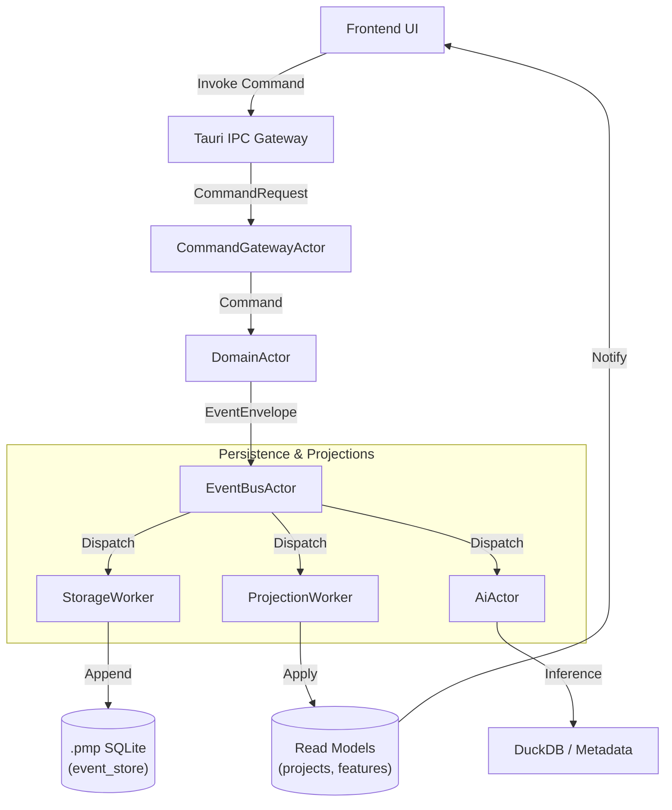
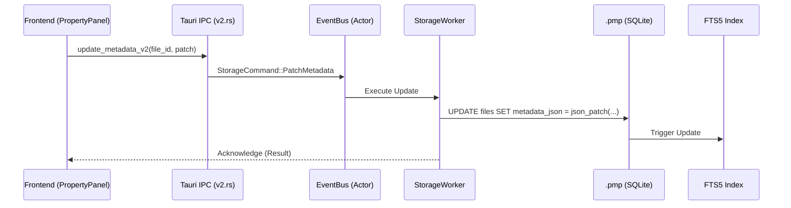
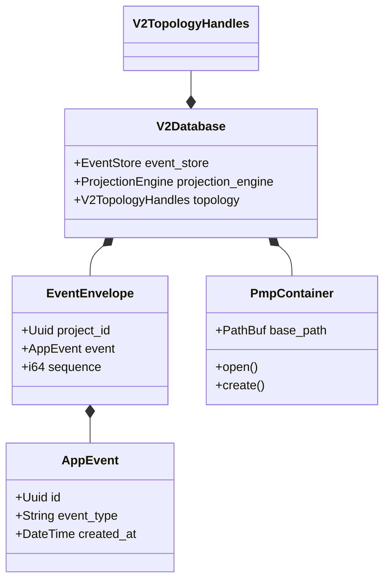

# Tài liệu Chi tiết Dự án (Project Documentation) - V2 Architecture

Tài liệu này là nguồn sự thật duy nhất (SSOT) cho cấu trúc mã nguồn, kiến trúc hệ thống Actor, logic nghiệp vụ GIS/AI và các luồng dữ liệu của dự án Antigravity RUST (Bando).

---

## 1. Cấu trúc Thư mục & Phân lớp (Code Hierarchy)

Hệ thống được thiết kế theo mô hình **Domain-Driven Design (DDD)** kết hợp **Modular Monolith**.

### 1.1. Cấu trúc Thư mục chính
- **`src-tauri/`**: Backend (Rust)
    - **`crates/`**: Các module lõi tách biệt.
        - `app_domain/`: Model & Interfaces.
        - `gis_engine/`: Xử lý hình học chuyên sâu.
        - `module_gis/`: DORI, Camera, VN2000.
        - `shared_kernel/`: EventEnvelope, ZeroCopy utilities.
    - **`src/domain/implement/`**: Triển khai logic V2.
        - `commands/`: `v2.rs` (IPC handlers), `v2_bridge.rs` (Compatibility).
        - `modules/v2/pipeline/`: `eventbus.rs` (Dispatcher), `worker_storage.rs` (Writer).
        - `modules/v2/storage/`: `connection.rs`, `schema.rs` (SQLite V2).
        - `modules/v2/projections/`: `engine.rs` (Read models), `ingestion.rs`.
- **`src/`**: Frontend (React + TypeScript)
    - **`modules/design/`**: Core Design logic.
        - `components/core/`: `CADPanels/`, `PropertyPanel/` (Chỉnh sửa Metadata).
        - `components/ui/`: `TopToolbar.tsx`, `Ribbon.tsx`, `StatusBar.tsx`.
        - `features/map/`: MapLayer, MapContext.

### 1.2. Sơ đồ cây chi tiết (Backend)
```text
src-tauri/
├── crates/
│   ├── app_domain/src/         # pmp_v2.rs, interfaces.rs
│   ├── gis_engine/src/         # lib.rs (Topology logic)
│   └── shared_kernel/src/      # lib.rs (Event models)
├── src/
│   ├── main.rs                 # Tauri setup & Command registration
│   └── domain/
│       ├── implement/
│       │   ├── commands/       # v2.rs, v2_bridge.rs, ai.rs
│       │   └── modules/v2/
│       │       ├── pipeline/   # eventbus.rs, worker_storage.rs
│       │       ├── projections/# engine.rs, utils.rs
│       │       └── storage/    # schema.rs, connection.rs
│       └── models/v2/          # mod.rs (Event definitions)
```

---

## 2. Hệ thống Actor & Luồng Dữ liệu (Actor System Topology)

Dự án sử dụng mô hình **Actor** để đảm bảo tính bất đồng bộ, tránh Race Condition khi ghi dữ liệu và cập nhật Read Model.

### 2.1. Sơ đồ Luồng Sự kiện (Event Flow)



### 2.2. Trách nhiệm các Actor
- **`CommandGatewayActor`**: Tiếp nhận yêu cầu từ UI, thực hiện validation cơ bản.
- **`DomainActor`**: "Trái tim" của hệ thống, chứa logic nghiệp vụ, Aggregate Root, quyết định tạo ra Event nào.
- **`EventBusActor`**: Điều phối viên (Dispatcher), đảm bảo Event được gửi đến đúng các Worker.
- **`StorageWorker`**: Chịu trách nhiệm duy nhất về việc ghi vào file `.pmp`. Đảm bảo tính ACID.
- **`ProjectionWorker`**: Replay các event để cập nhật bảng tra cứu nhanh.

### 2.3. Luồng chỉnh sửa Metadata & Persistence (.pmp)

Khi người dùng chỉnh sửa thuộc tính (Property Panel) ở Frontend:



**Đặc điểm kỹ thuật:**
- **Persistence**: Toàn bộ dữ liệu (Events, Projections, Metadata) nằm trong duy nhất 1 file `.pmp` (SQLite 3).
- **Metadata**: Lưu dưới dạng `JSON` trong cột `metadata_json`. Cho phép schema linh hoạt (Schemaless).
- **Indexing**: Sử dụng `FTS5` trigger để index tự động ngay khi metadata thay đổi, hỗ trợ tìm kiếm toàn cục (`search_v2`).

---

## 3. Logic Nghiệp vụ Chuyên sâu (Core Logic)

### 3.1. Chuyển đổi Tọa độ VN2000
Hệ thống hỗ trợ chuyển đổi chính xác giữa VN2000 (TM) và WGS84 (EPSG:4326).
- **Tham số Ellipsoid WGS84**: `a = 6378137.0`, `f = 1/298.257223563`.
- **Tham số VN2000**: Múi chiếu 3 độ, kinh tuyến trục (CM) mặc định `105.0`, hệ số tỷ lệ `k0 = 0.9999`, hằng số cộng `fe = 500000.0`.
- **Vị trí Code**: [`projections/utils.rs`](file:///d:/RUST/src-tauri/src/domain/implement/modules/v2/projections/utils.rs)

### 3.2. Tính toán Camera DORI & PPM
Dành cho thiết kế hệ thống giám sát:
- **PPM (Pixel Per Meter)**: 
  $$PPM = \frac{ResolutionWidth}{2 \times SlantRange \times \tan(HFOV/2)}$$
- **Vùng DORI**:
    - **Identify (250 ppm)**: Nhận diện khuôn mặt.
    - **Recognize (125 ppm)**: Nhận diện người quen.
    - **Observe (63 ppm)**: Quan sát chi tiết trang phục.
    - **Detect (25 ppm)**: Phát hiện có người.
- **Vị trí Code**: [`module_gis/src/lib.rs`](file:///d:/RUST/src-tauri/crates/module_gis/src/lib.rs)

---

## 4. Ánh xạ Command UI & Logic (IPC Mapping)

| Tauri Command | Chức năng chính | Thành phần xử lý chính |
| :--- | :--- | :--- |
| `create_project_v2` | Tạo mới dự án monolithic `.pmp` | `StorageWorker`, `ManifestIO` |
| `invoke_design_event_batch` | Ghi hàng loạt sự kiện thiết kế (Batch) | `DomainActor`, `EventBus` |
| `search_v2` | Tìm kiếm thực thực thể toàn cục (Universal Search) | `SearchEngine` (FTS5) |
| `get_stats_v2` | Thống kê số lượng Task, Feature, File | `DuckDBManager` |
| `validate_topology` | Kiểm tra chồng lấn, vi phạm không gian | `GisEngine` (GEOS) |
| `normalize_metadata` | Dùng AI để chuẩn hóa thông tin hợp đồng | `AiActor` (ONNX/Burn) |

---

## 5. Knowledge Graph Summary



---

## 6. Các lỗi thường gặp & Cách khắc phục (Troubleshooting & Lessons Learned)

| Vấn đề | Nguyên nhân | Cách khắc phục |
| :--- | :--- | :--- |
| **Command not found** | Quên đăng ký command trong `tauri::generate_handler!` | Kiểm tra `main.rs` hoặc `lib.rs` xem đã có tên command chưa. |
| **Rust Ownership (E0382)** | Borrow of moved value trong vòng lặp Event | Sử dụng `.clone()` hoặc reference `&` khi pass event vào actor channel. |
| **IPC Parameter Mismatch** | CamelCase ở TS nhưng snake_case ở Rust | Sử dụng `#[serde(rename_all = "camelCase")]` hoặc chuẩn hóa về snake_case. |
| **Database Locked** | Nhiều thread cùng ghi vào SQLite mà không qua Actor | Luôn đẩy lệnh ghi qua `StorageWorker` để tuần tự hóa (Sequential Write). |
| **UI Hang / Lag** | Chờ đợi IO đồng bộ trên Main Thread | Chuyển sang Async commands và sử dụng `oneshot` channel để nhận kết quả. |
| **Missing libclang** | Thiếu môi trường biên dịch cho `bindgen` (DuckDB/GEOS) | Cài đặt LLVM và set `LIBCLANG_PATH` trong biến môi trường Windows. |

---
*Tài liệu được cập nhật tự động bởi Antigravity Orchestrator - 2026.*
### 8. Lỗi Command Not Found (Legacy Bridging)
**Triệu chứng:** Frontend gọi `get_task_dependencies` nhưng backend chỉ có `get_task_dependencies_v2`.
**Nguyên nhân:** Quá trình migration chưa cập nhật hết các call site ở frontend.
**Cách khắc phục:**
1. Đăng ký alias command trong `lib.rs`.
2. Implement stub function trả về `[]` hoặc `{}` trong `v2_bridge.rs` cho các command cũ.
3. Đồng bộ parameter naming (projectId vs project_id) dùng `#[tauri::command]` argument mapping hoặc `serde(rename_all)`.
