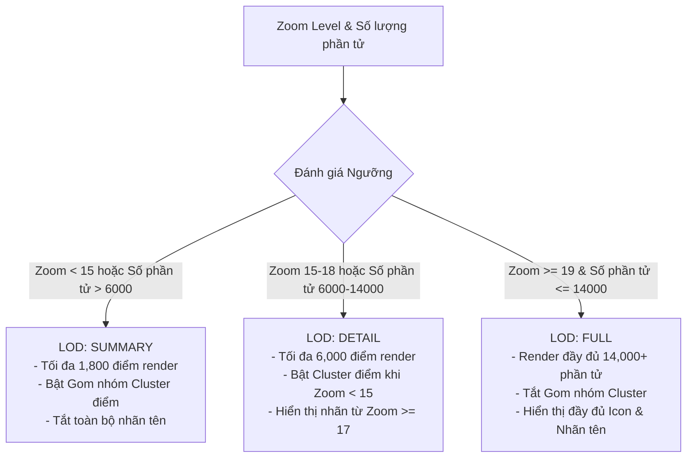
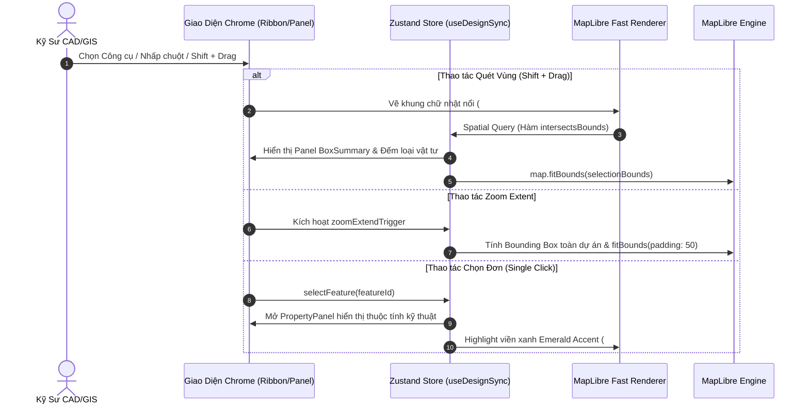

# TÀI LIỆU TỔNG HỢP CHI TIẾT GIAO DIỆN & TÍNH NĂNG BẢN ĐỒ
**Dự án:** RUST CAD & GIS Network Product (V1.2.0)  
**Tệp tài liệu:** `docs/UI_MAP_FEATURES_SUMMARY.md`  
**Ngày cập nhật:** 02/08/2026  

---

## 1. Tổng Quan Giao Diện Phần Mềm (Software UI & Layout Architecture)

Phần mềm RUST CAD & GIS Network được thiết kế theo chuẩn **High-Density Technical Desktop Workspace** (Không gian làm việc kỹ thuật độ mật độ cao), chuyên biệt cho kỹ sư trắc địa, kỹ sư hạ tầng viễn thông và nhà quản lý bản đồ.

### 1.1. Triết Lý Thiết Kế Trải Nghiệm Người Dùng (UI/UX Principles)

1. **Tối Ưu Diện Tích Bản Đồ (Maximum Canvas Area):** Các thanh công cụ Chrome được nén gọn chính xác từng pixel, nhường tối đa không gian hiển thị cho bản đồ MapLibre GL và sơ đồ mạng Topology.
2. **Hệ Thống Dual Theme Native:** Hỗ trợ chế độ **CAD Dark Mode** (Chủ đạo, chống mỏi mắt) và **CAD Light Mode** (Độ tương phản cao cho môi trường ngoài trời).
3. **Kích Thước Cố Định (Strict Chrome Dimensions):** Không bị co giãn layout bất thường nhờ quy định cứng về chiều cao pixel của các vùng điều khiển.
4. **Quy Trình Ưu Tiên Phím Tắt (Keyboard-First Workflow):** Hỗ trợ toàn bộ phím tắt CAD tiêu chuẩn (`Ctrl+S`, `Ctrl+Z`, `Escape`, `Delete`, `Shift + Drag`).

### 1.2. Khung Bố Cục Chrome & Kích Thước Pixel Cố Định

Toàn bộ ứng dụng được chia thành các khu vực cố định theo chiều dọc và chiều ngang:

```text
+-----------------------------------------------------------------------+  h-10 (40px)
| TitleBar (Tên dự án, Trạng thái Save, Switch Theme, Đa ngôn ngữ, Win) |
+-----------------------------------------------------------------------+  h-9  (36px)
| Ribbon Tab Rail (Home | Topology | Tools | Reports)                    |
+-----------------------------------------------------------------------+  h-[80px]
| Ribbon Action Band (Bộ công cụ Vẽ, Sơ đồ cáp, Đo đạc, Bóc tách BOM)   |
+-----------------------------------------------------------------------+
|  Left Dock  |                                          | Right Dock   |
|  Panel      |          CAD Canvas Workspace            | Property     |
|  (Cây Lớp / |          (MapLibre GL Engine)            | Panel        |
|   Tệp tin)  |                                          | (Thuộc tính) |
|  (w-64/80)  |                                          | (w-80)       |
+-----------------------------------------------------------------------+  h-8  (32px)
| Command Line (Dòng nhập lệnh CAD & Gợi ý tham số)                     |
+-----------------------------------------------------------------------+  h-[22px]
| Status Bar (Tọa độ X,Y,Z | Hệ VN2000 | Tỷ lệ Scale | FPS | Kết nối)    |
+-----------------------------------------------------------------------+
```

| Thành phần Giao diện | Mã Class / Kích thước | Vai trò Chức năng |
| :--- | :--- | :--- |
| **TitleBar** | `h-10` (40px) | Thanh tiêu đề ứng dụng, quản lý file, nút điều khiển window |
| **Ribbon Tab Rail** | `h-9` (36px) | Thanh chuyển tab chức năng dạng Ribbon (AutoCAD style) |
| **Ribbon Action Band** | `h-[80px]` | Băng chứa các nhóm nút công cụ tương tác |
| **Left Dock (Side Panel)** | `w-64` / `w-80` (256-320px) | Cây thư mục dự án, danh sách Lớp (Layers) & Nhóm đối tượng |
| **Right Dock (Property Panel)**| `w-80` (320px) | Bảng thuộc tính kỹ thuật chi tiết của phần tử đang chọn |
| **Command Line** | `h-8` (32px) | Dòng lệnh CAD nhập lệnh trực tiếp |
| **Status Bar** | `h-[22px]` | Thanh trạng thái tọa độ GPS/VN2000, kết nối đệm, FPS |

---

### 1.3. Hệ Thống Dual Theme System & CSS Tokens

Tất cả màu sắc được chuẩn hóa qua CSS Variables (`--cad-*`) và Tailwind CSS v4 `@theme`:

| Token Utility | Dark Mode (`#0F1115`) | Light Mode (`#F8FAFC`) | Ngữ cảnh Sử dụng |
| :--- | :--- | :--- | :--- |
| `bg-cad-header` | `#101217` | `#F1F5F9` | Thanh TitleBar, Ribbon Rail |
| `bg-cad-bg` | `#0F1115` | `#F8FAFC` | Nền móng canvas bản đồ |
| `bg-cad-surface` | `#171B21` | `#FFFFFF` | Nền Sidebar, Property Panel |
| `bg-cad-elevated` | `#20252D` | `#F1F5F9` | Card nổi, Modal, Dòng active |
| `border-cad-border` | `#2B313B` | `#CBD5E1` | Viền ngăn cách ô và bảng |
| `bg-cad-accent` | `#10B981` (Emerald) | `#059669` (Emerald đậm) | Màu nhấn Primary Action |
| `text-cad-text-primary` | `#E5E7EB` | `#0F172A` | Văn bản chính, chỉ số kỹ thuật |
| `text-cad-text-secondary` | `#9CA3AF` | `#334155` | Nhãn trường dữ liệu (Labels) |

---

### 1.4. Thang Phân Lớp Z-Index Hierarchy

Để đảm bảo các hộp thoại và palette không bị bản đồ MapLibre GL che lấp, z-index của UI Chrome bắt đầu từ `1100`:

* **`z-cad-map-control` (`1100`)**: Nút công cụ ghim trên bản đồ (Zoom, Reset Extent, Map Style Selector).
* **`z-cad-panel` (`2000`)**: Các Sidebar cố định bên trái/phải.
* **`z-cad-floating` (`2200`)**: Các Palette công cụ nổi kéo thả tự do.
* **`z-cad-dropdown` (`3000`)**: Menu ngữ cảnh nhấp chuột phải, Dropdown chọn preset.
* **`z-cad-overlay` (`4000`)**: Màn tối mờ đằng sau Modal (Scrim).
* **`z-cad-modal` (`4100`)**: Hộp thoại Modal hệ thống (`ThemeModal`, `ExportModal`).
* **`z-cad-toast` (`5000`)**: Thông báo nổi dạng Toast.
* **`z-cad-tooltip` (`5500`)**: Chú thích nhanh khi rê chuột vào công cụ.

---

## 2. Chi Tiết Các Tính Năng Trên Giao Diện (UI Feature Modules)

### 2.1. Thanh Tiêu Đề (TitleBar - `TitleBar.tsx`)
- **Tên Dự Án & Trạng Thái Lưu:** Hiển thị tên dự án hiện tại kèm trạng thái đệm (`Saved`, `Unsaved Changes`, `Syncing...`).
- **Nút Thao Tác Nhanh:** 
  - `Save (Ctrl+S)` & `Force Save`: Lưu tức thì dữ liệu vào cơ sở dữ liệu SQLite bản địa và Cloud.
  - `Theme Switcher`: Mở modal hoặc chuyển nhanh giữa CAD Dark / Light Mode.
  - `Language Switcher`: Chuyển đổi i18n tức thì giữa **Tiếng Việt** (`vi`) và **Tiếng Anh** (`en`).
- **Window Controls (Tauri Desktop Native):** Nút Thu nhỏ (Minimize), Phóng to/Khôi phục (Maximize/Restore), Đóng ứng dụng (Close).

---

### 2.2. Thanh Công Cụ Ribbon (Ribbon Bar - `Ribbon.tsx`)

Duyệt công cụ theo các Tab chuyên môn:

1. **Tab Home / Thiết Kế Bản Đồ:**
   - **Nhóm Nút Vẽ (Drawing Tools):** Vẽ Điểm node (Trạm/Cột/Măng xông), Vẽ Tuyến cáp Polyline, Vẽ Vùng Polygon/Ranh giới Thửa đất.
   - **Nhóm Snap & Chỉnh Sửa:** Bật/tắt dính điểm (Snap to Vertex/Midpoint), Chế độ di chuyển đối tượng, Chế độ chỉnh sửa đỉnh Polyline.
2. **Tab Topology & Mạng Cáp Quang:**
   - **Chức năng Sơ Đồ Đấu Nối (React Flow Topology Graph):** Mở sơ đồ kết nối cáp giữa các măng xông, ODF, Splitter và từng sợi quang.
   - **Quản lý Vật Tư Mạng:** Thêm/sửa tủ cáp, măng xông, splitter, số lượng sợi cáp quang (`Fiber Polylines`).
3. **Tab Đo Đạc & Phân Tích (Tools & Measurement):**
   - **Công Cụ Đo (`MapLibreMeasurementTool.tsx`):** Đo chiều dài đoạn tuyến (mét/km), đo tổng diện tích vùng Polygon ($m^2$/ha).
   - **Công Cụ Vùng Quan Sát FOV/DORI (`FOVLayer.tsx`, `DORIOverlay.tsx`):** Tính toán mô phỏng vùng phủ sóng camera giám sát theo tiêu chuẩn DORI (Detection, Observation, Recognition, Identification).
   - **Tích Hợp Street View (`StreetViewControl.tsx`):** Kéo thả Pegman xem hình ảnh thực địa Google Street View theo tọa độ GPS.
4. **Tab Bóc Tách & Xuất Báo Cáo (Reports & Export):**
   - **Panel Bóc Tách Khối Lượng (`BOMSummaryPanel.tsx`):** Tổng hợp thời gian thực số lượng vật tư cáp, măng xông, cột, tủ theo loại.
   - **Bảng Phân Tích Dữ Liệu (`AnalysisTable.tsx`):** Bảng cuộn ảo hiển thị chi tiết hàng chục ngàn hàng dữ liệu thuộc tính.
   - **Bộ Xuất Báo Cáo:** Xuất tài liệu Word `.docx` tự động kèm hình ảnh bản đồ sạch đệm an toàn bộ nhớ (`MapCaptureHandler.tsx`), xuất dữ liệu GeoJSON, DXF, Excel.

---

### 2.3. Bảng Thuộc Tính (Property Panel - `PropertyPanel.tsx`)
- **Hiển Thị Thông Tin Nén 2 Cột:** Nhãn thuộc tính bên trái (`text-cad-text-secondary`), giá trị bên phải chuẩn font `font-mono`.
- **Chỉnh Sửa Trực Tiếp (Inline Editing):** Cho phép sửa tên đối tượng, mã vật tư, chiều dài thiết kế, độ suy hao cáp, số lượng sợi.
- **Thuộc Tính Hình Học (Geometry Metadata):** Tọa độ GPS (WGS84 Lng/Lat), Tọa độ VN2000 (X, Y, Z), Bounding Box (`bbox`).
- **Trình Quản Lý Ảnh Đính Kèm (`ImageEditorModal.tsx`):** Xem, chỉnh sửa, chú thích trực tiếp trên ảnh chụp thực địa của đối tượng.

---

### 2.4. Panel Quản Lý Lớp & Cây Dự Án (Left Dock - `CADPanels`)
- **Cấu Trúc Cây Phân Cấp:** Dự án -> Vùng không gian (Regions) -> Lớp bản đồ (Layers) -> Nhóm đối tượng (Feature Groups) -> Đối tượng chi tiết.
- **Công Tắc Tương Tác:**
  - `is_visible`: Bật/tắt hiển thị tức thì trên bản đồ.
  - `is_locked`: Khóa không cho phép chỉnh sửa/xóa nhầm đối tượng.
  - `color_picker`: Đổi màu sắc nét đại diện của lớp/nhóm.

---

### 2.5. Thanh Nhập Lệnh & Thanh Trạng Thái (Command Line & Status Bar)
- **Command Line (`CommandLine.tsx`):** Dòng nhập lệnh CAD hỗ trợ các cú pháp quen thuộc (`PL`, `LINE`, `POINT`, `ZOOM`, `UNSELECT`), hiển thị gợi ý lệnh tự động.
- **Status Bar (`StatusBar.tsx`):**
  - Tọa độ con trỏ chuột thời gian thực: `X: 106.682145 | Y: 10.762145 | Z: 0.00m`.
  - Tọa độ quy đổi hệ **VN2000 Kinematics** theo kinh tuyến trục địa phương.
  - Tỷ lệ hiển thị (Scale Ratio), Mức Zoom (`z=18.5`), Chỉ số FPS và Trạng thái bộ nhớ đệm image cache.

---

## 3. Chế Độ Hiển Thị Của Các Đối Tượng Trên Bản Đồ (Map Display Modes)

### 3.1. Các Loại Nền Bản Đồ (Basemap Presets)

Nền bản đồ được tải từ Google Maps Public Raster Tile Services qua 4 subdomains (`mt0` - `mt3`) nhằm phân tải HTTP:

| Preset ID | Tên Preset | Kiểu Gạch (`lyrs`) | Đặc điểm Hiển thị |
| :--- | :--- | :--- | :--- |
| `street` | Đường phố | `m` | Bản đồ giao thông chuẩn Google Maps Tiếng Việt |
| `satellite` | Vệ tinh | `s` | Ảnh vệ tinh độ phân giải cao |
| `dark` | Chế độ Tối CAD | `m` + `apistyle` | Tối ưu hóa màu nền tối `#101318`, giảm sáng đường sá để nổi bật tuyến cáp |
| `heat` | Bản đồ nhiệt | `m` | Ẩn nhãn đường phụ để hiển thị lớp bản đồ nhiệt GIS |

---

### 3.2. Chế Độ Dựng Hình Đối Tượng Kỹ Thuật (Feature Renderer)

Hệ thống sử dụng **MapLibre GL JS** dựng hình vector theo 3 dạng hình học chuẩn:

1. **Đối Tượng Điểm (Point / Marker / Intersection):**
   - Đại diện cho Cột điện, Tủ cáp, ODF, Măng xông, Camera CCTV.
   - Sử dụng **SVG Dynamic LRU Image Cache (256 items)**: Chuyển đổi SVG Icon thành `ImageBitmap` qua HTML5 Canvas và nạp vào MapLibre thông qua `map.addImage()`.
2. **Đối Tượng Đường (LineString / Polyline / Cable):**
   - Đại diện cho Tuyến cáp quang, Tuyến cống bể, Đường ranh giới.
   - Hỗ trợ kiểu nét đứt (`dashArray`), phân màu theo số sợi cáp.
   - **Lớp Hit-Area Ẩn (`design-fast-line-hit-area`):** Tạo đường ẩn rộng 18px bên dưới đường cáp mảnh để người dùng nhấp chọn dễ dàng.
3. **Đối Tượng Vùng (Polygon):**
   - Đại diện cho Thửa đất, Khu nhà trạm, Vùng quy hoạch. Hiển thị mảng màu mờ (Fill) kèm đường viền nét rõ (Stroke).

---

### 3.3. Cơ Chế Phân Cấp Chi Tiết Theo Zoom Level (LOD Policy Engine - `mapDisplayPolicy.ts`)

Để duy trì tốc độ **60 FPS** khi hiển thị hàng chục ngàn đối tượng, hệ thống tự động áp dụng 3 cấp độ chi tiết (Level of Detail):



---

### 3.4. Trạng Thái Hiển Thị Đối Tượng (Object Render States)

- **Trạng thái Mặc Định (Normal):** Hiển thị theo màu sắc và icon quy định của Nhóm/Lớp.
- **Trạng thái Di Chuột (Hover):** Đường viền phát sáng nhẹ, con trỏ chuột đổi thành dạng `pointer`.
- **Trạng thái Đang Chọn (Selected):** 
  - Phần tử được bao bởi vòng sáng viền xanh Emerald Accent (`#10B981`).
  - Đường Polyline hiển thị các tay cầm (Editing Handles) tại các đỉnh (vertex) và trung điểm (midpoint).
- **Trạng thái Đang Vẽ / Dẫn Hướng (Draft / Snap Indicator):** Nét đứt màu xanh dương kèm vòng tròn snap điểm nối từ thuật toán Turf.js.

---

## 4. Các Phương Thức Chọn Đối Tượng Trên Bản Đồ (Selection Methods)

Hệ thống hỗ trợ 4 phương thức chọn đối tượng linh hoạt:

### 4.1. Chọn Đơn Chi Tiết (Single Click Selection)
- **Thao tác:** Nhấp chuột trái trực tiếp lên biểu tượng điểm, đoạn tuyến cáp hoặc vùng Polygon.
- **Cơ chế:** Lớp `design-fast-line-hit-area` giúp bắt chính xác các tuyến cáp mảnh 1px-2px mà không yêu cầu người dùng phải nhấp chính xác tuyệt đối.
- **Kết quả:** Bảng thuộc tính bên phải (`Property Panel`) lập tức tải toàn bộ dữ liệu chi tiết của phần tử đó.

---

### 4.2. Quét Vùng Chọn Trực Quan (Box Selection / Shift + Drag - `MapLibreBoxSelection.tsx`)
- **Thao tác:** Giữ phím `Shift` + Kéo giữ chuột trái để quét tạo khung chữ nhật trên bản đồ.
- **Hiệu ứng Giao diện:** Khung quét hiển thị đường viền nét đứt xanh lam `#06b6d4` kèm nền mờ trong suốt `rgba(6, 182, 212, 0.15)`.
- **Thuật Toán Kiểm Tra Không Gian (Spatial Intersection Query):**
  1. Chuyển đổi tọa độ pixel vùng quét trên màn hình thành tọa độ địa lý `[West, South, East, North]`.
  2. Lặp qua tất cả đối tượng visible trong `state.features`.
  3. Với Điểm: Kiểm tra `bounds.contains(latlng)`.
  4. Với Tuyến cáp / Polygon: Kiểm tra va chạm khung hình học (`intersectsBounds`).
- **Giao Diện Thống Kê (`BoxSummary.tsx`):**
  - Tự động bật Panel "Selection Summary".
  - **Card Tổng Số Lượng:** Thống kê tổng số phần tử đã quét trúng.
  - **Phân Loại Theo Icon/Loại Vật Tư:** Đếm số lượng theo Cột, Măng xông, Cáp 24FO, Cáp 48FO...
  - **Sao Chép Sang Excel (Copy to TSV):** Cho phép nhấp nút copy toàn bộ danh sách dữ liệu ra định dạng Tab-Separated Values để dán trực tiếp vào Microsoft Excel.

---

### 4.3. Chọn Theo Cấu Trúc Cây Dự Án (Filter Selection by Layer / Group / Region)
- **Thao tác:** Nhấp đúp hoặc nhấp chuột phải chọn `Select All Features` trên một Layer, Feature Group hoặc Region ở Cây Lớp bên trái.
- **Kết quả:** Chọn toàn bộ phần tử thuộc danh mục đó và đồng bộ lên cửa sổ thông tin.

---

### 4.4. Hủy Chọn Dữ Liệu (Clear Selection)
- Nhấp chuột trái vào vùng trống không có đối tượng trên bản đồ.
- Hoặc nhấn phím `Escape` trên bàn phím.

---

## 5. Chế Độ Zoom & Điều Hướng Bản Đồ (Map Zooming & Navigation)

### 5.1. Các Thao Tác Zoom Cơ Bản (Basic Zooming Mechanisms)

1. **Cuộn Chuột (Scroll Wheel Zoom):** Zoom mượt theo vị trí con trỏ chuột. Hỗ trợ phóng to thực tế từ `z=0` tới `z=20` (Google Tiles Native) và overscaling tới `z=23` (MapLibre GL Vector Engine).
2. **Nút Phóng To / Thu Nhỏ (+ / -):** Cố định trên MapToolbar điều khiển zoom theo nấc chuẩn.
3. **Chạm Đa Điểm (Pinch-to-Zoom):** Hỗ trợ thao tác thu phóng trên màn hình cảm ứng thiết bị di động / máy tính bảng thi công thực địa.
4. **Phóng To Theo Vùng Khung Quét (Box Zoom):** Khi nhả chuột sau thao tác `Shift + Drag`, bản đồ tự động thực hiện `map.fitBounds(bounds, { padding: 40 })` đưa vùng vừa quét vào trung tâm màn hình.

---

### 5.2. Zoom Tự Động Toàn Bộ Dự Án (Zoom to Extent / Fit All - `ZoomExtendControl.tsx`)

- **Chức năng:** Đưa toàn bộ các phần tử đang hiển thị trong dự án vào gọn trong khung nhìn bản đồ.
- **Kích hoạt:** Khi vừa nạp dự án mới hoặc khi nhấp nút **Zoom Extent** trên thanh công cụ.
- **Thuật Toán Xử Lý Nhanh Single-Pass:**
  1. Duyệt một lượt qua danh sách `visibleFeatures`.
  2. Bỏ qua các đối tượng nằm trong Lớp/Nhóm đang bị ẩn (`is_visible === false`).
  3. Trích xuất tọa độ hợp lệ qua hàm `isValidLatLng(lat, lng)`.
  4. Tính toán Bounding Box tổng quát `[minLng, minLat, maxLng, maxLat]`.
  5. Gọi hàm `map.fitBounds(bounds, { padding: 50, maxZoom: 18 })`.

---

### 5.3. Zoom Tới Đối Tượng / Danh Mục Cụ Thể (ZoomTo Handler - `ZoomToHandler.tsx`)

Hệ thống hỗ trợ chuyển vùng nhìn thông minh dựa theo kiểu thực thể mục tiêu (`zoomToTrigger`):

| Loại Thực Thể (`type`) | Hành Vi Zoom & Thuật Toán Tọa Độ | Mức Zoom Tối Đa (`maxZoom`) |
| :--- | :--- | :--- |
| **Feature (Điểm)** | `map.flyTo({ center: [lng, lat], zoom: 20 })` - Bay mượt trực tiếp tới vị trí điểm | `zoom: 20` |
| **Feature (Tuyến/Polygon)** | Tính Bounding Box riêng đối tượng và gọi `map.fitBounds(bounds, { padding: 50 })` | `maxZoom: 20` |
| **Layer / Group / Region** | Gom tất cả Bounding Box của các đối tượng con thuộc danh mục đó và gọi `map.fitBounds()` | `maxZoom: 18` |
| **Location (Tọa độ/Địa chỉ)**| Bay trực tiếp tới tọa độ tìm kiếm được `map.flyTo({ center: [lng, lat], zoom: 18 })` | `zoom: 18` |

---

## 6. Sơ Đồ Tổng Kết Luồng Tương Tác Bản Đồ (Map Interaction Workflow)



---

## 7. Kết Luận

Tài liệu này tổng hợp toàn bộ giao diện phần mềm, các tính năng trên giao diện, cùng các chế độ hiển thị đối tượng, phương thức chọn và cơ chế zoom trên bản đồ của hệ thống **RUST CAD & GIS Network Product (V1.2.0)**. Việc tuân thủ cấu trúc giao diện nén mật độ cao và các cơ chế LOD/Spatial Query đảm bảo ứng dụng luôn vận hành mượt mà 60 FPS trên các bộ bản vẽ viễn thông và địa chính phức tạp.
