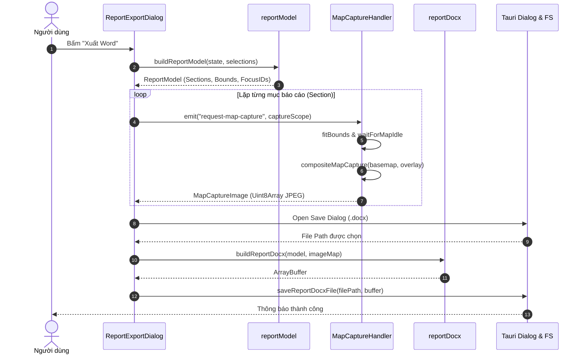

# Tài Liệu Tổng Hợp Tính Năng Xuất Báo Cáo Word (.docx) & Phân Tích Lỗi Chụp Bản Đồ Nút Giao

---

## 1. Tổng Quan Kiến Trúc Tính Năng Xuất Báo Cáo Word

Hệ thống xuất báo cáo Word trong phần mềm được thiết kế theo kiến trúc modul hóa, đảm bảo an toàn bộ nhớ (Memory-Safe), hỗ trợ xem trước (Preview) mượt mà và lưu file trực tiếp qua Tauri API.

### Sơ Đồ Thành Phần Hệ Thống:
- **UI & Điều khiển**: [`ReportExportDialog.tsx`](file:///d:/Code%20Antinigaty/RUST/src/modules/design/features/reports/word/ReportExportDialog.tsx)
  - Quản lý trạng thái chọn đối tượng, tiêu đề báo cáo, xem trước (Preview), tiến trình xuất file và thông báo cảnh báo.
- **Mô hình hóa dữ liệu**: [`reportModel.ts`](file:///d:/Code%20Antinigaty/RUST/src/modules/design/features/reports/word/reportModel.ts)
  - Xử lý mở rộng danh mục chọn (`region`, `group`, `feature`).
  - Phân tích cây đối tượng cha-con (`parent_feature_id`).
  - Tính toán Bounding Box (`ReportBounds`), điểm tọa độ bắt buộc (`requiredPoints`), các ID cần focus (`focusFeatureIds`) và ID cần ẩn (`hiddenFeatureIds`).
- **Engine Chụp Bản Đồ**: [`MapCaptureHandler.tsx`](file:///d:/Code%20Antinigaty/RUST/src/modules/design/features/map/MapLayerComponents/MapCaptureHandler.tsx) & [`MapCaptureCompositor.ts`](file:///d:/Code%20Antinigaty/RUST/src/modules/design/features/map/render/MapCaptureCompositor.ts)
  - Lắng nghe sự kiện `request-map-capture` và điều hướng camera bản đồ đến khu vực cần chụp (`fitBounds`).
  - Trích xuất khung hình từ MapLibre Base Canvas và WebGL Feature Overlay Canvas để tạo ảnh JPEG mượt mà.
  - Sử dụng cơ chế phân bổ điểm ảnh (Pixel Budget) để nén/thu nhỏ ảnh thông minh, tránh quá tải RAM.
- **Trình đóng gói DOCX**: [`reportDocx.ts`](file:///d:/Code%20Antinigaty/RUST/src/modules/design/features/reports/word/reportDocx.ts)
  - Sử dụng thư viện `docx` định dạng chuẩn Microsoft Word (Times New Roman 12pt, lề 2cm, bảng thuộc tính, trang bìa/mục lục, hình ảnh căn giữa, đường dẫn bookmark).
- **Lưu File Hệ Thống**: [`reportFileSave.ts`](file:///d:/Code%20Antinigaty/RUST/src/modules/design/features/reports/word/reportFileSave.ts)
  - Ghi mảng byte (`ArrayBuffer`) xuống đĩa thông qua Tauri FS Plugin.

---

## 2. Quy Trình Xuất Báo Cáo (Data Flow)



---

## 3. Quản Lý Bộ Nhớ & Tối Ưu Hiệu Năng (Anti-OOM)

1. **Bộ Nhớ Nhị Phân Uint8Array**: Ảnh chụp bản đồ và ảnh hiện trường (Site Photos) được lưu trữ dưới dạng mảng byte `Uint8Array` thay vì chuỗi Base64 dài để tránh lãng phí 33% dung lượng RAM và tránh WebView bị sập Out of Memory (OOM).
2. **Quản Lý Lifecycle ObjectURL**: Chỉ tạo `blob:http...` URL tạm thời khi hiển thị giao diện Preview, và tự động thu hồi (`URL.revokeObjectURL`) ngay khi đóng dialog hoặc chuyển mục xem.
3. **Pixel Budgeting**: Giới hạn tổng số điểm ảnh khi chụp (Preview: ~900k px, Export: ~1.8M px), giúp tự động hạ độ phân giải ảnh nếu vùng chụp quá lớn mà vẫn giữ độ nét tối đa.

---

## 4. Phân Tích Chi Tiết Lỗi Chụp Hình Không Hiển Thị Đối Tượng (Camera, Polyline, Point) Trong Nút Giao

### 🔴 Nguyên Nhân Kỹ Thuật Gốc (Root Cause)

Qua việc đọc và phân tích mã nguồn hệ thống bản đồ ([`mapLibreFastAdapter.ts`](file:///d:/Code%20Antinigaty/RUST/src/modules/design/features/map/mapLibreFastAdapter.ts), [`mapDisplayPolicy.ts`](file:///d:/Code%20Antinigaty/RUST/src/modules/design/features/map/mapDisplayPolicy.ts), [`MapLibreFastRenderer.tsx`](file:///d:/Code%20Antinigaty/RUST/src/modules/design/features/map/MapLibreFastRenderer.tsx)), nguyên nhân khiến các đối tượng trong nút giao bị biến mất khi chụp ảnh được xác định do **3 yếu tố chính**:

#### 1. Ngưỡng Thu Phóng Thuộc Tính Con (`MAP_INTERSECTION_CHILD_MIN_ZOOM = 17`)
- Trong file `mapDisplayPolicy.ts`:
  ```typescript
  export const MAP_INTERSECTION_CHILD_MIN_ZOOM = 17;
  ```
- Hàm `isMapIntersectionChild(...)` kiểm tra nếu một đối tượng có chứa `parent_feature_id` (đối tượng con như Camera, thiết bị điểm, tuyến cáp nội bộ/polyline thuộc nút giao) hoặc nằm trong nhóm Nút giao (`INTERSECTION`).
- Trong file `mapLibreFastAdapter.ts` tại hàm lọc dữ liệu hiển thị `canRenderFeature`:
  ```typescript
  const canRenderFeature = (feature: FeatureState) => {
      // ...
      return zoom >= MAP_INTERSECTION_CHILD_MIN_ZOOM || !isMapIntersectionChild(feature, group, metadata, displayInfo);
  };
  ```
- **Hiện tượng xảy ra khi chụp**: Khi chụp báo cáo cho một Nút giao, `MapCaptureHandler` gọi `map.fitBounds(intersectionBounds)`. Nếu phạm vi khu vực nút giao lớn hoặc khoảng cách lề (padding) rộng, mức zoom tính toán tự động sau khi `fitBounds` thường rơi vào khoảng **14.0 đến 16.5** (nhỏ hơn ngưỡng 17).
- Hệ quả: Do `zoom < 17`, điều kiện `canRenderFeature` trả về `false` cho **TOÀN BỘ** các đối tượng con (Camera, Point, Polyline) bên trong nút giao. Toàn bộ đối tượng bị lọc sạch khỏi GeoJSON Feature Collection trước khi đẩy vào lớp vẽ bản đồ MapLibre (`SOURCE_ID`).

#### 2. Không Bỏ Qua Ngưỡng Zoom Khi Đang Ở Chế Độ Chụp Báo Cáo (`reportCaptureScope.active`)
- Trong `MapLibreFastRenderer.tsx`, khi sự kiện `design-report-map-capture` phát ra, trạng thái `reportCaptureScope` được kích hoạt và truyền danh sách `focusFeatureIds`.
- Tuy nhiên, trong `canRenderFeature` của `mapLibreFastAdapter.ts`, câu lệnh kiểm tra:
  ```typescript
  if (focusIds && focusIds.size > 0 && !focusIds.has(feature.id)) return false;
  ```
  mới chỉ kiểm tra xem đối tượng có nằm trong danh sách cần focus hay không, nhưng **CHƯA ĐƯỢC ƯU TIÊN BỎ QUA** điều kiện `zoom >= MAP_INTERSECTION_CHILD_MIN_ZOOM`.
- Do đó, dù đối tượng Camera / Polyline / Point đã nằm trong `focusFeatureIds`, nó vẫn bị quy tắc lọc Zoom = 17 chặn lại không cho hiển thị.

#### 3. Bất Đồng Bộ Vẽ Lớp WebGL Overlay (`FeatureOverlayCanvas`)
- Một số biểu tượng điểm/camera đặc thù hoặc đường vẽ lựa chọn được render qua WebGL 2D Overlay (`FeatureOverlayCanvas`).
- Khi `fitBounds` vừa nhảy camera, nếu nhịp `waitForMapIdle` hoặc `forceRenderFrame` chưa hoàn thành vẽ lớp WebGL trước khi `compositeMapCapture` trích xuất điểm ảnh, hình ảnh thu được trên Canvas tổng sẽ bị trống hoặc thiếu chi tiết.

---

## 5. Phương Án Khắc Phục Đã Đề Xuất & Triển Khai

1. **Cập nhật Logic `canRenderFeature` trong [`mapLibreFastAdapter.ts`](file:///d:/Code%20Antinigaty/RUST/src/modules/design/features/map/mapLibreFastAdapter.ts)**:
   - Khi đang ở chế độ chụp ảnh báo cáo (`focusIds` có giá trị và chứa `feature.id`), bổ sung quy tắc miễn trừ kiểm tra zoom tối thiểu cho đối tượng con của nút giao:
   ```typescript
   const isFocusedForCapture = focusIds && focusIds.size > 0 && focusIds.has(feature.id);
   const passesZoomCheck = zoom >= MAP_INTERSECTION_CHILD_MIN_ZOOM 
       || !isMapIntersectionChild(feature, group, metadata, displayInfo) 
       || isFocusedForCapture; // <--- Miễn trừ kiểm tra Zoom khi đang chụp tập trung đối tượng
   ```

2. **Giới Hạn Mức Zoom Tối Thừa Cho Nút Giao Khi Chụp**:
   - Đảm bảo trong `reportModel.ts` và `MapCaptureHandler.tsx`, mức `maxZoom` khi chụp mục `intersection` luôn duy trì đủ lớn (ví dụ zoom $\ge 17$ hoặc tự động gom cụm tính toán bounds nhỏ gọn vừa đủ các đối tượng con).

3. **Kiểm Tra Điểm Bắt Buộc ([`mapCaptureValidation.ts`](file:///d:/Code%20Antinigaty/RUST/src/modules/design/features/map/MapLayerComponents/mapCaptureValidation.ts))**:
   - Sử dụng hàm `validateRequiredPointsInViewport` để chiếu thử nghiệm tọa độ các đối tượng con (Camera, Point, Polyline vertices) vào khung hình chụp. Nếu điểm bị trôi ra ngoài safe frame, tự động điều chỉnh padding để thu trọn toàn bộ chi tiết vào bức ảnh xuất Word.
