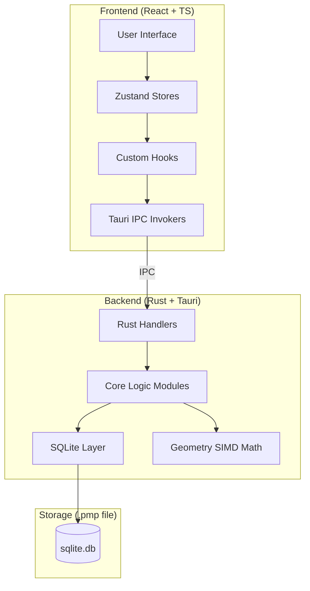
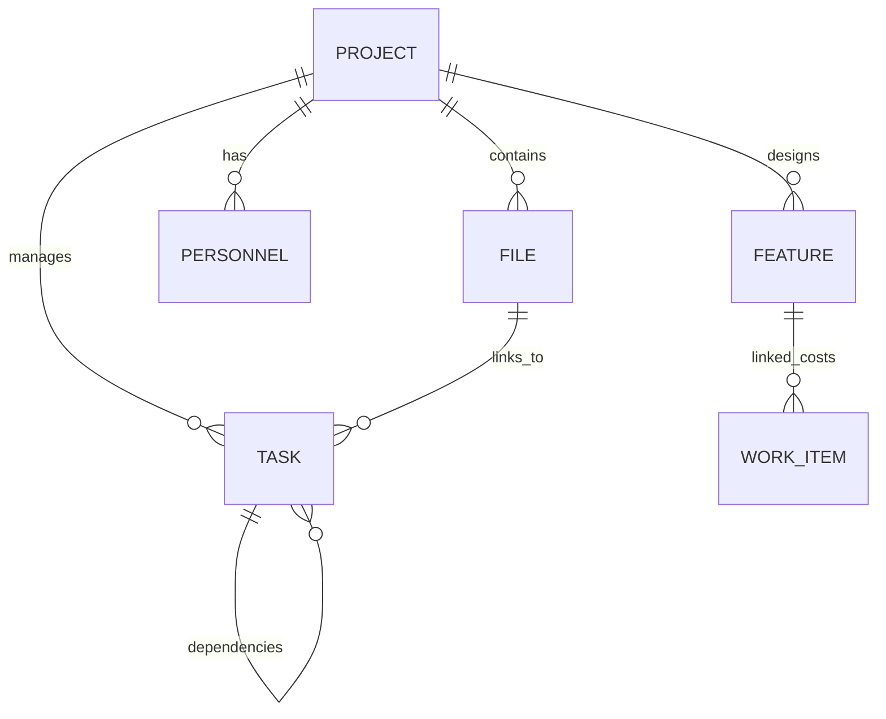

# PROJECT ARCHITECTURE DEEP DIVE - PROJECT MANAGER V4

> **Phiên bản**: 4.0.0 (Hybrid Edition)  
> **Ngày cập nhật**: 15/04/2026  
> **Trạng thái**: Production / Refactoring v2-ready  

---

## 1. Tổng quan hệ thống (System Vision)

Project Manager V4 là một ứng dụng desktop xây dựng trên nền tảng **Tauri**, kết hợp giữa sức mạnh hệ thống của **Rust** và sự linh hoạt UI của **React (TypeScript)**. 

### 1.1 Triết lý thiết kế
- **Modular Domain Driven**: Chia hệ thống thành các khối độc lập: DESIGN, IMPLEMENT, CONTRACT.
- **Offline First**: Dữ liệu lưu trữ cục bộ dưới định dạng `.pmp` (SQLite).
- **Event-Driven (Hybrid)**: Sử dụng Event Log cho các thay đổi về thiết kế GIS (DESIGN) và CRUD trực tiếp cho dữ liệu quản trị (IMPLEMENT).
- **Single Source of Truth**: Mọi dữ liệu đều hội tụ về file SQLite duy nhất của dự án.

### 1.2 Mô hình kiến trúc cấp cao


---

## 2. Cấu trúc thư mục chi tiết (Directory Map)

Dự án tuân thủ cấu trúc thư mục song song giữa Frontend và Backend, giúp dễ dàng quản lý và mở rộng.

### 2.1 Tổng thể
| Thư mục | Chức năng chính |
|---------|-----------------|
| `src/` | Chứa mã nguồn Frontend (React, TS, Vite). |
| `src-tauri/` | Chứa mã nguồn Backend (Rust, Tauri configuration). |
| `Resources/` | Chứa tài nguyên tĩnh, icons, và các template. |
| `docs/` | Tài liệu đặc tả và hướng dẫn kiến trúc. |

### 2.2 Frontend (`src/`)
```text
src/
├── CONTRACT/       # Định nghĩa các Model, Interface, API schemas chung.
├── DESIGN/         # Hệ thống Bản đồ (Map), GIS, Visualization.
│   ├── features/   # Các tính năng bản đồ: Layer, Point, Polyline, Tooltips.
│   └── stores/     # Quản lý state của Design Map.
├── IMPLEMENT/      # Core Business Logic (Quản lý dự án).
│   ├── features/   # Project management, File explorer, Analytics, Inventory.
│   ├── stores/     # Zustand stores cho Tasks, Files, Projects.
│   └── hooks/      # Business logic reusable hooks.
├── HOME/           # Giao diện chính (Landing, Dashboard).
├── TOOL/           # Các tiện ích (Logger, i18n, UI Components).
└── i18n/           # Đa ngôn ngữ (Vietnamese, English).
```

### 2.3 Backend (`src-tauri/src/`)
```text
src-tauri/src/
├── CONTRACT/       # Rust Structs tương ứng với database models.
├── DESIGN/         # Logic GIS, tính toán hình học, SIMD math.
│   ├── geometry/   # Các phép toán Topology, Snapping, Math.
│   └── design_events/ # Hệ thống xử lý sự kiện thiết kế.
├── IMPLEMENT/      # Logic xử lý nghiệp vụ.
│   ├── commands/   # Tauri Handlers (IPC endpoints).
│   ├── db/         # SQLite schema, migrations, write-queue.
│   └── modules/    # Các module con: Sync, Project Manager, OCR.
├── TOOL/           # Tiện ích chung cho Backend.
├── lib.rs          # Core entry point (Setup Tauri app).
└── main.rs         # Binary entry point.
```

---

## 3. Kiến trúc Dữ liệu (Database Schema)

Hệ thống sử dụng SQLite làm bộ lưu trữ cốt lõi bên trong file `.pmp`.

### 3.1 Các bảng hệ thống chính
- **projects**: Lưu thông tin dự án (ID, Name, Contract info, Metadata).
- **files**: Quản lý file hệ thống, mapping đường dẫn tuyệt đối/tương đối.
- **tasks**: Theo dõi tiến độ công việc, liên kết với Personnel và Files.
- **design_events**: Bảng lưu vết thay đổi GIS (SOT cho Design).
- **features**: Bảng Read-model cho GIS features.
- **content_types/fields/items**: Hệ thống CMS linh hoạt cho phép user tự định nghĩa trường dữ liệu.

### 3.2 Sơ đồ quan hệ thực thể (ERD)


---

## 4. Kiến trúc Logic các Module

### 4.1 Module DESIGN (GIS Engine)
- **Geometry Operations**: Sử dụng SIMD (Single Instruction Multiple Data) để tối ưu hóa việc tính toán khoảng cách và snapping cho hàng triệu điểm trên map.
- **Event Sourcing**: Thay vì lưu trạng thái snapshot, mọi thao tác vẽ/sửa trên map được lưu thành `AppEvent`. Điều này cho phép Undo/Redo và Sync đa thiết bị cực kỳ tin cậy.

### 4.2 Module IMPLEMENT (Business Suite)
- **Project Manager**: Quản lý cây thư mục ảo và mapping trực tiếp với folder thật trên ổ đĩa.
- **Sync Engine (v2-ready)**: Cơ chế đồng bộ sử dụng `global_seq` để theo dõi các thay đổi và Resolve Conflict theo nguyên tắc "Last write wins with logical order".
- **Write Queue**: Để tránh "Database is locked", module DB sử dụng một queue và `Immediate Transaction` để đảm bảo ghi dữ liệu an toàn ngay cả khi UI update liên tục.

### 4.3 Module CONTRACT (Data Contract)
- Đóng vai trò là "Cầu nối" (Bridge) giữa Rust và TypeScript.
- Đảm bảo tính toàn vẹn của dữ liệu thông qua Serializer/Deserializer (Serde).

---

## 5. Luồng dữ liệu (Data Flow)

1. **User Action**: Click "Sửa Task" trên UI.
2. **Frontend State**: Zustand update optimistic state -> UI phản hồi ngay lập tức.
3. **IPC Call**: `invoke('update_task', { id, name, ... })` gửi sang Rust.
4. **Rust Command**: Handler nhận yêu cầu, đưa vào **Write Queue**.
5. **DB Layer**: Mở `Immediate Transaction`, ghi vào SQLite, sau đó commit.
6. **Backend Event**: Rust bắn event `sync-status` hoặc `db-update` về cho tất cả Window.
7. **Frontend Sync**: Component liên quan nhận signal, re-fetch hoặc apply delta update.

---

## 6. Ghi chú về bảo mật và Hiệu quả
- **WAL Mode**: SQLite chạy ở chế độ Write-Ahead Logging để hỗ trợ đọc/ghi đồng thời tốt nhất trên Windows.
- **Memory Management**: Các tập dữ liệu lớn (như Feature list) được xử lý dưới dạng Stream hoặc Paginated để không làm tràn RAM.
- **Sensitive Data**: Các secrets (nếu có) được lấy từ `.env` và không bao giờ commit vào mã nguồn.

---
**Antigravity Orchestrator - Đã kiểm tra tính toàn vẹn kiến trúc v4.0.2.**
