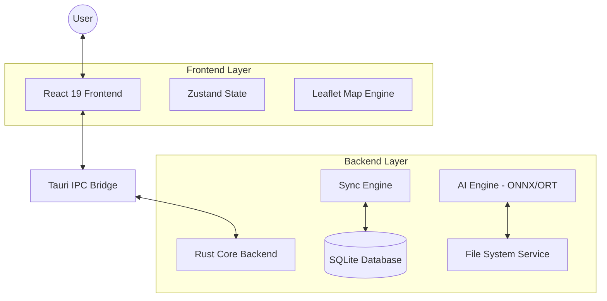

# System Architecture Overview

## Mục tiêu hệ thống
Hệ thống Quản lý Dự án Ngoại tuyến (Offline Project Manager) là một ứng dụng desktop hiệu năng cao, hỗ trợ quản lý dữ liệu kỹ thuật, bản đồ GIS và tích hợp trí tuệ nhân tạo (AI) để phân tích hình ảnh/tài liệu.

## Kiến trúc Tổng quan (High-Level)

## Các Thành phần Chính

### 1. Frontend (React 19)
- **State Management**: Sử dụng Zustand để quản lý trạng thái đồng bộ giữa bản đồ, cây thư mục và bảng thuộc tính.
- **Map Engine**: Leaflet được tích hợp sâu để hiển thị và tương tác với các đối tượng hình học (Point, Polyline, Polygon).
- **Advanced Palette System (Pro Max)**: Hệ thống quản lý layout theo dạng cột (layoutColumns) và xếp chồng (Stacking). Phiên bản "Pro Max" chuẩn hóa giao diện border-only tối giản, tối ưu hóa không gian hiển thị cho các bảng điều khiển.
- **Bootstrap-Shell Architecture**: Tách rời hoàn toàn logic khởi tạo hệ thống (auth, database, config) khỏi giao diện người dùng chính thông qua thành phần `AppBootstrap.tsx`. Điều này đảm bảo ứng dụng chỉ hiển thị dashboard sau khi môi trường đã sẵn sàng, tránh các lỗi render trên môi trường production.
- **Interactive DORI Visualizer**: Hệ thống mô phỏng vùng nhìn camera hỗ trợ biểu đồ mặt cắt dọc tương tác (DORI Chart), hiển thị real-time các thông số PPM, độ cao và khoảng cách ranh giới quan sát.
- **Styling**: Tailwind CSS v4 cung cấp giao diện hiện đại, tối ưu hóa CSS-first.

### 2. Backend (Rust / Tauri v2)
- **Sync Engine**: Cơ chế Event Sourcing lưu trữ mọi thay đổi dưới dạng `design_events` và đồng bộ vào trạng thái hiện tại.
- **AI Engine**: Tích hợp `ort` (ONNX Runtime) để chạy các model YOLO (nhận diện đối tượng), OCR và Embedding ngoại tuyến.
- **Database**: SQLite cung cấp lưu trữ bền vững, được tối ưu hóa thread-safe bằng `Arc<DatabasePool>`. Các thao tác khởi tạo và ghi nặng được offload hoàn toàn sang `spawn_blocking` (Rust) để đảm bảo luồng chính của Tauri không bị treo ("Not Responding") khi xử lý dự án lớn.
- **Map Performance Optimization**:
    - **Pooled Hydration**: Cơ chế nạp dữ liệu hình học song song sử dụng thread pool, giúp khởi động bản đồ cực nhanh ngay cả với hàng chục nghìn thực thể.
    - **Lazy Spatial Index Update**: Tối ưu hóa R-tree bằng cách chỉ cập nhật chỉ mục khi có thay đổi về hình học, bỏ qua các thay đổi metadata (Palette) để tránh xung đột khóa ghi (Lock Contention).
- **General Performance**: Hệ thống sử dụng cơ chế indexing và concurrency model hiện đại để xử lý mượt mà các dự án có hàng chục nghìn thực thể. Sử dụng kỹ thuật **Lazy Module Loading** (dynamic import) cho các API Tauri nặng để tối ưu hóa thời gian khởi động và tránh lỗi đồng bộ Vite.
- **Production Hardening (MSVC/Windows)**: Cấu hình build chuyên biệt (`AWS_LC_SYS_NO_ASM = "1"`) để tối ưu hóa khả năng tương thích với linker Windows/MSVC, đảm bảo quá trình đóng gói MSI và thực thi binary ổn định 100% trên môi trường sản xuất.
- **Eco-Performance Architecture (Low Power Mode)**: Cơ chế tối ưu hóa động cho phần cứng yếu. Sử dụng thuộc tính CSS `will-change`, vô hiệu hóa `backdrop-filter` toàn cục qua class `.low-power-active` và đơn giản hóa các component mô phỏng nặng.
- **Dynamic Code Splitting**: Sử dụng `React.lazy` và `Suspense` để cô lập các module UI nặng (Palettes), giải phóng tài nguyên bộ nhớ (RAM) khi chưa sử dụng đến.
- **Standalone Session Protection (Never Logout)**: Chiến lược bảo mật đặc thù cho các cửa sổ độc lập (như Analysis). Hệ thống tự động nhận diện cửa sổ phụ qua Tauri Label và vô hiệu hóa các luồng redirect/auth overlay tự động, đảm bảo người dùng không bao giờ bị logout đột ngột khi đang thao tác chuyên sâu.

### 3. Data Flow
- Người dùng tương tác trên bản đồ → Sinh sự kiện `DesignEvent` → Gửi qua IPC tới Rust → Lưu vào SQLite → Phát tán sự kiện ngược lại Frontend (nếu cần) để cập nhật trạng thái.
- Với các cửa sổ phụ: Khởi tạo độc lập → Tự động bỏ qua lớp bảo mật Auth (nếu Main đã login) → Kết nối trực tiếp tới DB Core để lấy dữ liệu phân tích.

## Công nghệ sử dụng
- **Ngôn ngữ**: TypeScript, Rust.
- **UI Components**: Lucide-React, Custom Resizable Panels.
- **GIS**: Leaflet, Proj4 (chuyển đổi tọa độ), ToGeoJSON.
- **AI**: Qwen2.5-0.5B (LLM), all-MiniLM-L6-v2 (Embedding), YOLOv8 (Detection), PP-OCRv3 (OCR).
