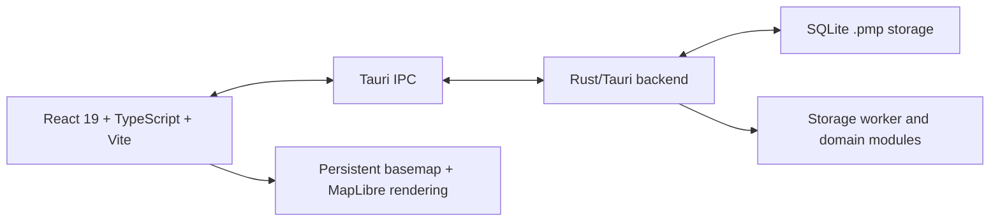

# Architecture Map

Last audited: 2026-08-05

## Runtime Shape

## Frontend

- `src/modules/home/App.tsx` is the app shell.
- `AppBootstrap` gates app startup through auth/loading state.
- `HomeDashboard` and `ProjectDetail` control the project workspace flow.
- `Ribbon`, `TopToolbar`, `StatusBar`, and tab/layout stores define the desktop
  shell.
- `src/core/basemap` is active and currently dirty in the worktree; docs should
  treat basemap behavior as a current priority area.
- `src/modules/design/features/map` contains MapLibre-oriented rendering and map
  feature interaction code.

## Backend

- `src-tauri/Cargo.toml` defines the Rust workspace and active crates:
  `app_domain`, `module_gis`, `module_p2p`, `shared_kernel`, and `gis_engine`.
- `src-tauri/src/domain/implement/modules/v2` is the active implementation
  storage/event pipeline area.
- `StorageWorker` handles project database commands and serialized storage
  operations around `.pmp` files.
- Backend dependencies include SQLite (`rusqlite`, `sqlx`), GIS/geometry
  packages, libp2p, AI-related optional dependencies, and Windows/Tauri runtime
  dependencies.

## Source/Doc Drift

- Older docs frequently describe Leaflet as the primary map engine. Source now
  shows MapLibre-oriented rendering and a persistent basemap host.
- Older overview docs mention root `crates/`, `design_renderer/`, or WASM
  renderer areas that are not visible as top-level active directories in this
  checkout.
- `docs/AGENTS.md` previously said to read root `KNOWNS.md`, but the actual file
  is `docs/KNOWNS.md`.

