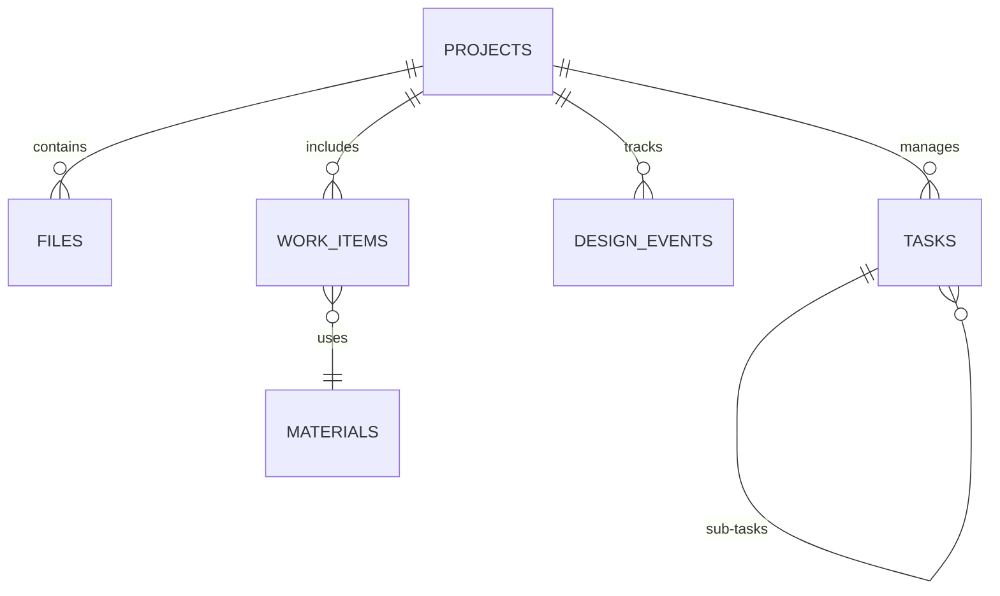

# Database Schema Documentation

## Tổng quan
Dự án sử dụng SQLite làm cơ sở dữ liệu lưu trữ local (file `.pmp`). Kiến trúc được thiết kế theo hướng Event-Sourcing để hỗ trợ đồng bộ hóa và quản lý lịch sử thay đổi.

## Sơ đồ Thực thể (ER)

## Chi tiết các Bảng

### 1. projects
Lưu trữ thông tin gốc của các dự án.
- `id`: INTEGER PRIMARY KEY - ID duy nhất.
- `name`: TEXT - Tên dự án.
- `root_path`: TEXT - Đường dẫn vật lý trên máy tính.
- `status`: TEXT - Trạng thái (active, archived).

### 2. design_events
Bảng lưu trữ track history các thay đổi trên bản đồ.
- `event_id`: TEXT PRIMARY KEY (UUID).
- `event_type`: TEXT - Loại sự kiện (Create, Update, Delete).
- `payload_json`: TEXT - Chứa dữ liệu thực thể GIS (Coordinates, Metadata, Type).
- `timestamp`: DATETIME - Thời điểm phát sinh sự kiện.

### 3. design_snapshots
Bảng lưu trữ ảnh chụp trạng thái hiện tại của project để tối ưu tốc độ load.
- `project_id`: INTEGER PRIMARY KEY - ID dự án.
- `last_event_id`: TEXT - ID của sự kiện cuối cùng được snapshot.
- `state_json`: TEXT - Toàn bộ trạng thái bản đồ (MapState) dạng JSON.
- `updated_at`: DATETIME - Thời điểm lưu snapshot.

### 4. files
Quản lý các tệp tin trong dự án và cache kết quả phân tích.
- `id`: INTEGER PRIMARY KEY.
- `project_id`: INTEGER (FK).
- `path`: TEXT NOT NULL - Đường dẫn tuyệt đối (hoặc tương đối), được chuẩn hóa về `/`.
- `filename`: TEXT - Tên file gốc.
- `extension`: TEXT - Phần mở rộng file.
- `metadata_json`: TEXT - Cache kết quả phân tích AI (ContractMetadata) và các thông tin bổ sung.

### 5. ai_corrections
Bảng lưu trữ các bản sửa lỗi của người dùng để train AI (Learning Loop).
- `id`: INTEGER PRIMARY KEY.
- `file_path`: TEXT.
- `correction_json`: TEXT.
- `timestamp`: DATETIME.

## Lưu ý Kỹ thuật
- **Foreign Keys**: Được cấu hình `ON DELETE CASCADE` để đảm bảo tính toàn vẹn dữ liệu khi xóa dự án.
- **Indexing**: 
  - `design_events`: (event_id, timestamp).
  - `tasks`: (project_id).
  - `files`: (project_id), `path` (UNIQUE COLLATE NOCASE - Phục vụ UPSERT và tìm kiếm nhanh).
- **Serialization**: Phần lớn metadata phức tạp (ContractMetadata, BOM) được lưu dưới dạng JSON trong cột TEXT để đảm bảo tính linh hoạt.
