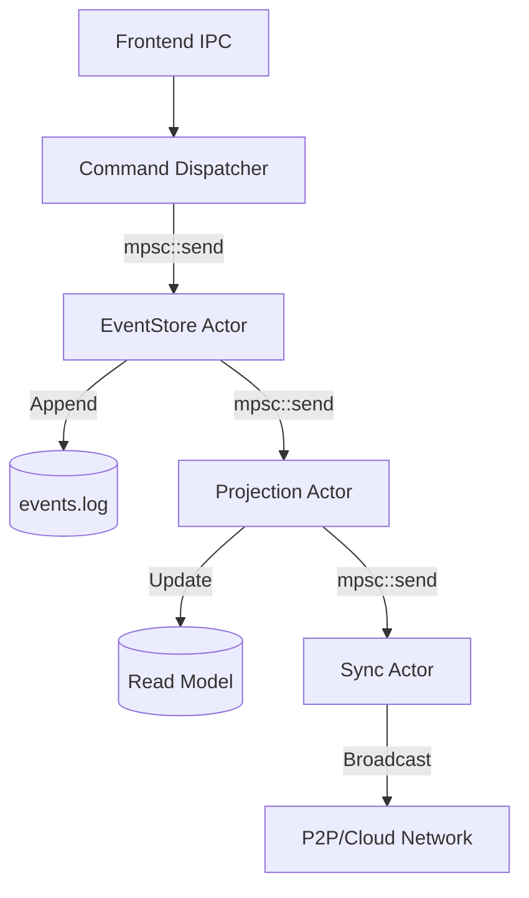

# Module Detail: Core Engines (Actor, AI, Storage)

This document maps the low-level infrastructure engines that power the Bando platform.

## 1. Actor System Topology (Tokio MPSC)

The backend uses an Actor pattern to handle concurrent tasks without locking.



---

## 2. AI Engine Workflow (ONNX)

**Concept**: Local AI inference for object detection (YOLO) and document normalization.

### Engine Implementation: `src-tauri/src/implement/modules/ai/ai_engine.rs`
```rust
pub async fn run_inference(&self, image: Vec<u8>) -> Result<Detections, String> {
    let session = self.get_session("yolov8")?;
    let input_tensor = preprocess(image)?;
    let outputs = session.run(vec![input_tensor])?;
    Ok(postprocess(outputs))
}
```

### AI Model Management:
- **Models**: YOLOv8, OCR (Tesseract/ONNX), Embedding (Phi3-Mini).
- **Storage**: `.models/` directory in AppData.
- **Memory**: `release_ai_memory` command to clear GPU cache.

---

## 3. Storage Architecture (PMP v2 Container)

The `.pmp` file is actually a directory (Container) with a specific structure:

```text
my_project.pmp/
├── manifest.json      # Metadata (Project ID, Versions)
├── events.log         # Write Model (Hash-linked AppEvents)
├── blobs/             # Binary files (images, PDFs)
└── snapshots/
    ├── current.db     # Read Model (SQLite)
    └── analytics.db   # OLAP Model (DuckDB)
```

---

## 4. Key Files
- **Actor Base**: [src-tauri/src/core/actor/mod.rs](file:///d:/RUST/src-tauri/src/core/actor/mod.rs)
- **AI Engine**: [src-tauri/src/domain/implement/modules/ai/ai_engine.rs](file:///d:/RUST/src-tauri/src/domain/implement/modules/ai/ai_engine.rs)
- **Container**: [src-tauri/src/domain/implement/modules/v2/storage/manifest.rs](file:///d:/RUST/src-tauri/src/domain/implement/modules/v2/storage/manifest.rs)
