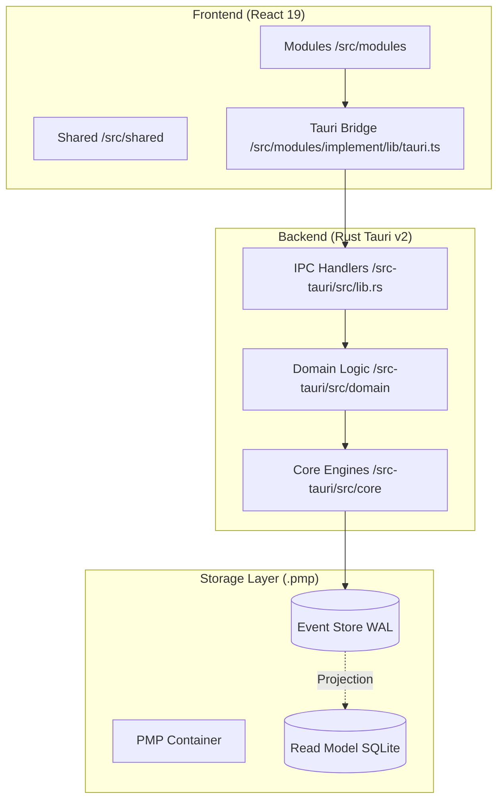

# Bando Deep-Dive Knowledge Graph (Master Hub)

This document maps the entire Bando project from high-level domains down to individual Tauri commands and React hooks.

## 1. System Topology

---

## 2. Module Deep Dives

Click the links below to explore the detailed code-to-logic mapping for each module.

| Module | Description | Detailed Map |
| :--- | :--- | :--- |
| **Design** | GIS, Maps, Layers, DORI Zones | [Design Detail](file:///d:/RUST/docs/graph/MODULE_DESIGN_DETAIL.md) |
| **Implement** | Tasks, Gantt, Project V2, BOM | [Implement Detail](file:///d:/RUST/docs/graph/MODULE_IMPLEMENT_DETAIL.md) |
| **Contract** | Finance, BOQ, Payment flow | [Contract Detail](file:///d:/RUST/docs/graph/MODULE_CONTRACT_DETAIL.md) |
| **Data Models** | IPC Schema, Serialization, Bincode | [Data Model Detail](file:///d:/RUST/docs/graph/MODULE_DATA_MODEL_DETAIL.md) |
| **Core Engine** | Actor System, AI, Storage, Sync | [Core Detail](file:///d:/RUST/docs/graph/CORE_ENGINE_DETAIL.md) |

---

## 3. Global Command Registry (Tauri IPC)

This table maps every Tauri command registered in `lib.rs` to its implementation file.

| Command Name | Implementation File | Purpose |
| :--- | :--- | :--- |
| `dispatch_design_events` | `domain/design/design_events/mod.rs` | Batch process GIS events |
| `get_project_dori_zones` | `domain/design/map.rs` | Calculate camera FOV zones |
| `create_project_v2` | `domain/implement/commands/project_v2_commands.rs` | Initialize new PMP v2 project |
| `search_v2` | `domain/implement/commands/project_v2_commands.rs` | Universal FTS5 search |
| `sync_v2_start` | `domain/implement/modules/v2/sync/commands.rs` | Trigger P2P/Cloud sync |
| `start_ingestion_v2` | `domain/implement/commands/ingestion_v2.rs` | Import and parse documents |

---
*Generated by Antigravity Orchestrator for Bando Project.*
