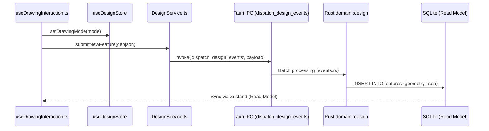

# Module Detail: Design (GIS & Maps)

This document provides a granular mapping of the Design module, connecting UI interactions to the underlying Rust spatial algorithms.

## 1. Interaction Flow: Adding a GIS Feature

When a user draws a point or line on the map:



---

## 2. Code Mapping: Camera DORI Calculation

**Concept**: Calculate Identify, Recognize, Observe, and Detect zones for a camera.

### Frontend Hook: `useCameraSpecs.ts`
```typescript
// Calls get_camera_dori_zones to preview zones in real-time
const zones = await invoke('get_camera_dori_zones', { 
  center, heading, fov, specs 
});
```

### Backend Command: `src-tauri/src/domain/design/map.rs`
```rust
#[tauri::command]
pub fn get_camera_dori_zones(center: Point, heading: f64, fov: f64, mut specs: CameraSpecs) -> Vec<DoriZone> {
    let distances = GisService::calculate_dori_distances(&specs);
    vec![
        DoriZone { level: "Identify".into(), points: GisService::generate_dori_sector(...) },
        // ... Recognize, Observe, Detect
    ]
}
```

### Core Logic: `module_gis/src/service.rs`
```rust
pub fn calculate_dori_distances(specs: &CameraSpecs) -> DoriDistances {
    // PPM = (Res_H * Focal) / (Dist * Sensor_W)
    // Identify: 250 PPM, Recognize: 125 PPM, Observe: 62 PPM, Detect: 25 PPM
    // ...
}
```

---

## 3. Data Structure Mapping

| Domain Object | Rust Struct | Frontend Interface | Database Column |
| :--- | :--- | :--- | :--- |
| Map Feature | `SerializableFeatureState` | `Feature` | `features.geometry_json` |
| DORI Zone | `DoriZone` | `DoriZone` | (Calculated at Runtime) |
| Map Settings | `MapSettings` | `ProjectSettings` | `project_settings.epsg_code` |

---

## 4. Key Files
- **Logic**: [src-tauri/src/domain/design/map.rs](file:///d:/RUST/src-tauri/src/domain/design/map.rs)
- **Events**: [src-tauri/src/domain/design/design_events/mod.rs](file:///d:/RUST/src-tauri/src/domain/design/design_events/mod.rs)
- **UI Hook**: [src/modules/design/hooks/useDrawingInteraction.ts](file:///d:/RUST/src/modules/design/hooks/useDrawingInteraction.ts)
