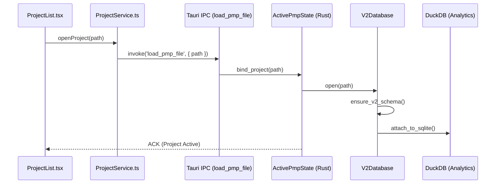

# Module Detail: Implement (Project Manager V2)

This document maps the core project management logic, including the V2 database structure and the Task/Gantt engine.

## 1. Interaction Flow: Opening a Project



---

## 2. Code Mapping: Unified Search (FTS5)

**Concept**: Search for any entity (Task, Feature, Contract) across the entire project.

### Frontend Service: `src/modules/implement/services/SearchService.ts`
```typescript
export async function searchProject(query: string) {
  return await invoke('search_v2', { query, limit: 50 });
}
```

### Backend Command: `src-tauri/src/domain/implement/commands/project_v2_commands.rs`
```rust
#[tauri::command]
pub async fn search_v2(active_pmp: State<'_, ActivePmpState>, request: SearchV2Request) -> Result<SearchV2Response, String> {
    let v2_db = active_pmp.v2_db()?;
    let results = v2_db.search_engine().search(&request.query, filters)?;
    Ok(SearchV2Response { results, ... })
}
```

### SQL Implementation: `src-tauri/src/domain/implement/modules/v2/search.rs`
```sql
-- Virtual Table FTS5
SELECT entity_id, entity_type, name, rank 
FROM entity_index 
WHERE entity_index MATCH ?1 
ORDER BY rank LIMIT ?2;
```

---

## 3. Database Schema Mapping (Read Model)

| Table | Key Columns | Purpose |
| :--- | :--- | :--- |
| `projects` | `id, name, root_path` | Project root metadata |
| `tasks` | `id, name, status, progress` | Task tracking (Gantt) |
| `work_items` | `id, material_id, quantity` | Links Design to Contract |
| `event_store` | `hash, prev_hash, payload` | Write Model (Source of Truth) |

---

## 4. Key Files
- **Commands**: [src-tauri/src/domain/implement/commands/project_v2_commands.rs](file:///d:/RUST/src-tauri/src/domain/implement/commands/project_v2_commands.rs)
- **Active State**: [src-tauri/src/domain/implement/modules/core/active_pmp.rs](file:///d:/RUST/src-tauri/src/domain/implement/modules/core/active_pmp.rs)
- **V2 Database**: [src-tauri/src/domain/implement/modules/v2/mod.rs](file:///d:/RUST/src-tauri/src/domain/implement/modules/v2/mod.rs)
