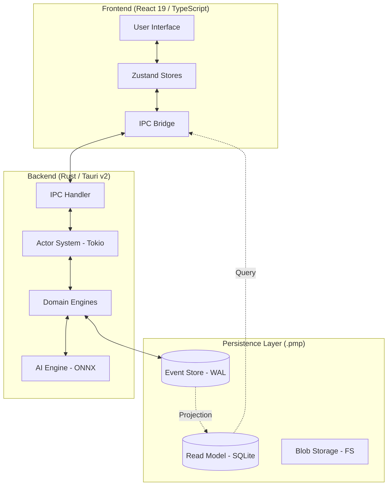
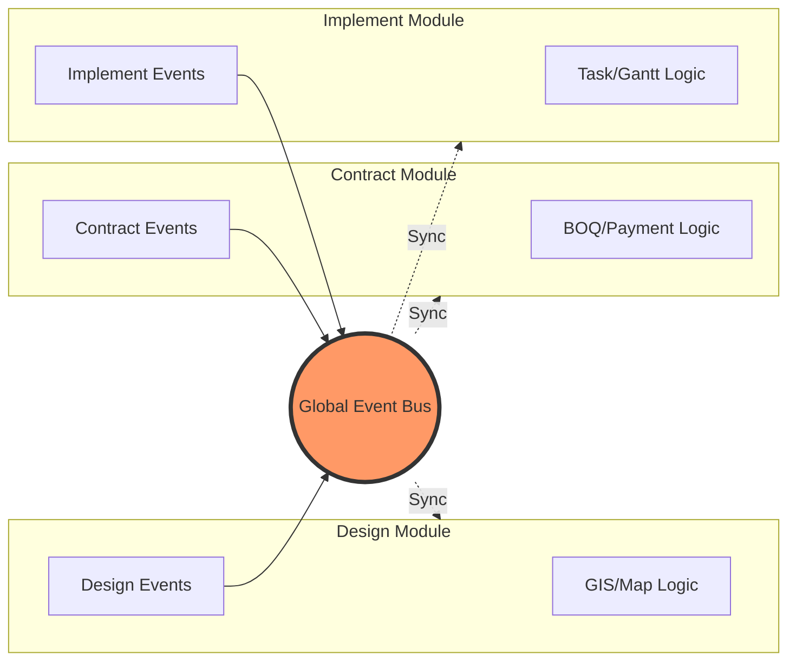
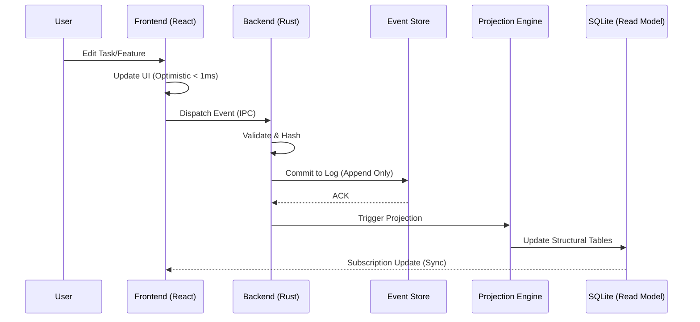

# Project Knowledge Graph - Bando V5.2

This document provides a multi-layered visualization of the Bando project's architecture, data flows, and conceptual relationships.

## 1. High-Level System Architecture (C4 Context & Containers)

The system follows a strictly decoupled architecture using **Event Sourcing** and **CQRS (Command Query Responsibility Segregation)**.

---

## 2. Domain & Module Interaction Map

The project is divided into **Bounded Contexts**. Communication between modules is handled via a global Event Bus.

### Key Modules:
- **Design**: Manages Maps, Layers, Polylines, and DORI zones.
- **Contract**: Handles Materials, Labor costs, and BOQ (Bill of Quantities).
- **Implement**: Orchestrates Tasks, Gantt charts, and progress tracking.
- **Resource**: Manages human and material allocations.

---

## 3. Data Life Cycle (Single-Edit, Multi-Update)

How a single user action propagates through the system.

---

## 4. Technical Stack & Dependencies

- **UI Framework**: React 19, TypeScript, Tailwind CSS v4, Lucide Icons.
- **Backend Runtime**: Rust, Tauri v2, Tokio (Async), Serde (JSON).
- **Database**: SQLite (rusqlite), FTS5 (Search), WAL mode.
- **AI Stack**: ONNX Runtime (ort), YOLO (Object Detection), OCR, Embeddings (Phi3/Qwen).
- **GIS Stack**: Leaflet, MapLibre GL, Proj4, R-Tree (Rust).

---

## 5. Knowledge Legend & Symbols

| Symbol | Description | Technology |
| :--- | :--- | :--- |
| 📦 | Structural Component | Structs / Classes |
| 🔧 | Functional Logic | Functions / Methods |
| 📋 | Data Specification | Enums / Interfaces |
| [( )] | Persistence | SQLite / Event Log |
| (( )) | Communication | Event Bus / IPC |

---

## 6. Related Documentation

- [Master Architecture Guide](file:///d:/RUST/docs/MASTER_GUIDE.md)
- [V5.2 Deep Dive](file:///d:/RUST/docs/Project%20Manager%20V5.2%20-%20K%E1%BA%BF%20ho%E1%BA%A1ch%20Ki%E1%BA%BFn%20tr%C3%BAc%20&%20N%C3%A2ng%20c%E1%BA%A5p%20H%E1%BB%87%20th%E1%BB%91ng%20(V2).md)
- [Code-Level Call Graph (Auto-generated)](file:///d:/RUST/docs/graph/KNOWLEDGE_GRAPH.md)

---
*Generated by Antigravity Orchestrator for Bando Project.*
