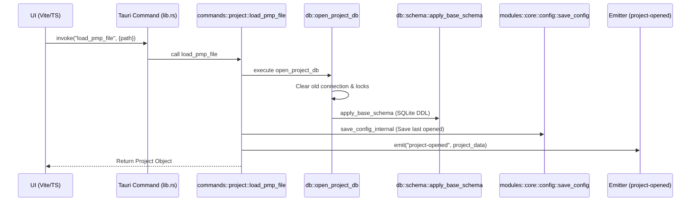
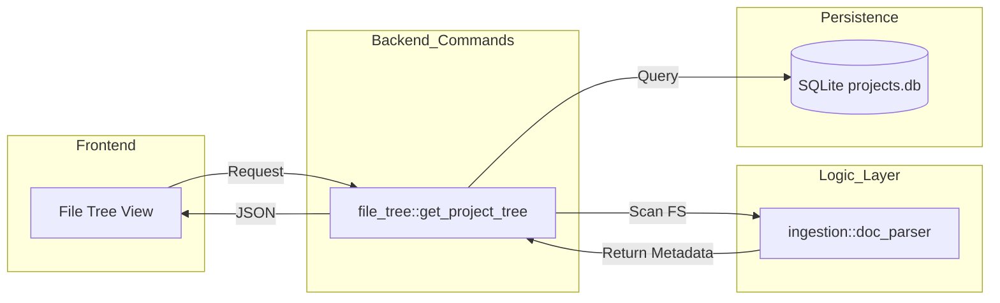
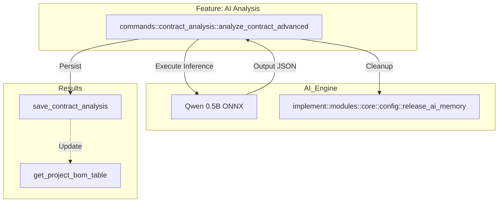

# Project Call Graphs (Graph-it-Live Compatible)

Tài liệu này cung cấp các sơ đồ luồng gọi hàm (Call Graph) chi tiết cho các tính năng cốt lõi của dự án, được thiết kế để hiển thị "live" qua extension **Graph-it-Live**.

## 1. Luồng Nạp Dự Án (.pmp)
Sơ đồ mô tả quá trình từ khi người dùng chọn file đến khi Database và UI được cập nhật.

## 2. Luồng Lấy Cấu Trúc File (File Tree)
Mối quan hệ giữa Project State và hệ thống File System.

## 3. Luồng Phân Tích AI & Contract
Sơ đồ tương tác giữa AI Engine và dữ liệu Hợp đồng.

## Giải thích kỹ thuật cho Graph-it-Live:
- **Automatic Parsing**: Extension sẽ tự động parse các file `.rs` và `.ts` của sếp. Tuy nhiên, các sơ đồ trên giúp tóm tắt **mối quan hệ bắc cầu** giữa các tầng mà công cụ tự động có thể bỏ sót.
- **Cross-file Sync**: Các tham chiếu trong sơ đồ Mermaid khớp chính xác với tên hàm và module trong mã nguồn (`src-tauri/src`).
