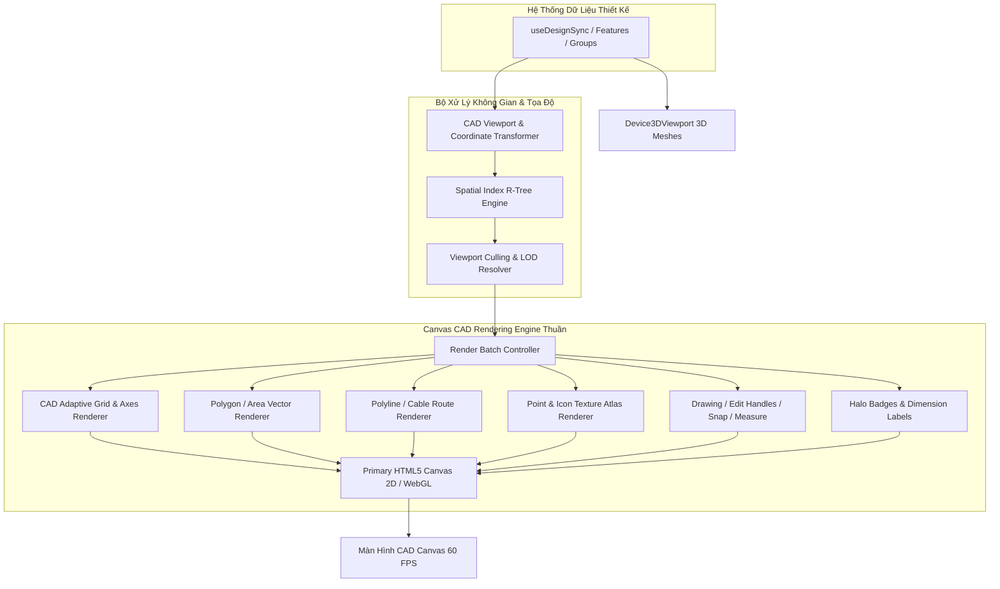

# Đặc Tả Kỹ Thuật (Spec): Canvas CAD Engine Độc Lập — Render Toàn Bộ Features & Sửa Lỗi Point

## 1. Overview (Tổng Quan)

Tài liệu đặc tả kiến trúc và giải pháp kỹ thuật xây dựng **Hệ thống Canvas CAD Engine thuần (Non-Map Independent Engine)**, loại bỏ hoàn toàn sự phụ thuộc vào MapLibre GL và các dịch vụ bản đồ trực tuyến. 
Hệ thống mới chịu trách nhiệm hiển thị, tương tác và render toàn bộ các đối tượng Features trong dự án (Points, Lines, Polygons, DORI/FOV, Overlays, CAD Grid, Đo đạc, Bắt dính snap, Vẽ thiết kế) trên nền tảng đồ họa Canvas 2D / WebGL hiệu năng cao (60 FPS), đồng thời khắc phục triệt để lỗi không hiển thị các loại đối tượng Point (Camera, CCTV, Speed, LPR, Điểm khảo sát, Tủ thiết bị, Nút giao).

---

## 2. Locked Decisions (Các Quyết Định Đã Khóa)

- **D1 (Phạm vi đối tượng Point & Symbol)**: Chuẩn hóa và hiển thị sắc nét toàn bộ đối tượng Point: Camera (CCTV, PTZ, Speed, LPR), Điểm khảo sát (Point, Circle, Survey Point, Node), Tủ thiết bị (Info Cabinet, Light Cabinet, Cáp/Điện), Nút giao (Intersection) trên cả Canvas 2D CAD và 3D Viewport.
- **D2 (Loại bỏ triệt để MapLibre & Map Dependencies)**: Loại bỏ hoàn toàn `maplibre-gl` và các luồng phụ thuộc bản đồ web ra khỏi kiến trúc Canvas chính. Toàn bộ tính năng đồ họa được vẽ trực tiếp qua Canvas 2D / WebGL Engine độc lập.
- **D3 (Cơ chế Tọa độ Kỹ thuật CAD / GIS Không Phụ Thuộc Map)**: 
  - Lưu trữ và xử lý dữ liệu theo hệ tọa độ chuẩn (WGS84 Lat/Lng hoặc Tọa độ phẳng Local Meters / Cartesian X-Y).
  - Tự chủ hoàn toàn bộ chuyển đổi Viewport Projection Matrix (`project`: World → Screen, `unproject`: Screen → World).
  - Hệ thống hỗ trợ lưới tọa độ CAD chuyên dụng (Adaptive CAD Grid, Dynamic Ruler, Coordinate Origin Indicator).
- **D4 (Full Performance Stack)**: Triển khai toàn diện bộ giải pháp tối ưu đồ họa:
  - **Spatial Indexing (R-Tree)** cho toàn bộ features để Viewport Culling tức thì (< 1ms).
  - **Icon Texture Atlas & Sprite Bitmap Cache**: Pre-rasterize toàn bộ SVG Icon sang bitmap buffer, giải quyết triệt để lỗi CSS variables (`var(--cad-obj-*)`).
  - **Render Batching**: Nhóm lệnh vẽ theo lớp (Fill → Stroke → Symbol/Icon → Text Badge) hạn chế tối đa context switching.
  - **HiDPI / Retina DPR Auto-scaling** và **rAF Render Loop** chỉ vẽ lại khi có Dirty Flag (Pan, Zoom, State change).

---

## 3. Requirements (Yêu Cầu Chi Tiết)

### 3.1. Functional Requirements (Yêu Cầu Chức Năng)

#### A. Kiến Trúc Canvas CAD Engine Thuần (Non-Map CAD Viewport)
- **FR-1 (Camera & Viewport Controller)**:
  - Tự quản lý trạng thái Camera: `center: [x, y]`, `zoom: number`, `scale: number`, `rotation: number`, `width: number`, `height: number`.
  - Hỗ trợ đầy đủ thao tác: Pan (kéo chuột trái/chuột giữa/Space+Drag), Smooth Zoom (cuộn chuột quanh tâm con trỏ), Zoom Extend (fit toàn bộ đối tượng lên màn hình), Zoom To Feature.
  - Hiển thị Lưới CAD thông minh (Adaptive Grid) tự động chia bước lưới (1m, 5m, 10m, 50m, 100m,...) theo tỉ lệ zoom kèm thước đo tọa độ.

#### B. Sửa Lỗi & Render Toàn Bộ Đối Tượng Point / Symbol
- **FR-2 (Chuẩn hóa nhận diện Point Subtypes)**:
  - Xử lý tương thích mọi giá trị `geom_type` (`Point`, `POINT`, `point`, `cctv`, `camera`, `speed`, `lpr`, `ptz`, `intersection`, `cabinet`, `info_cabinet`, `light_cabinet`, `node`, `pole`, `splice`, `odf`, `splitter`).
  - Phân giải đúng icon từ `metadata.icon`, `metadata.type`, `properties.icon`, `f.name` qua `MAP_ICON_MANIFEST` và `featureSymbolStyle.ts`.
- **FR-3 (Vẽ Biểu Tượng & Phụ Trợ)**:
  - Vẽ chính xác Icon (CCTV, PTZ, Speed, LPR, Intersection, Info Cabinet, Light Cabinet, Survey Point).
  - Vẽ Badge số thứ tự (Index Label) với font rõ ràng, viền tương phản cao (halo stroke).
  - Vẽ hướng xoay ống kính/thiết bị (Rotation Indicator) và FOV/DORI Coverage Zone.
  - Hiệu ứng Focus/Selection Glow và Hover viền sáng.

#### C. Render Toàn Bộ Các Đối Tượng Feature Khác (Non-Point Features)
- **FR-4 (Lines & Cables)**:
  - Vẽ các tuyến cáp quang (Fiber Cable), đường tín hiệu (Signal Line), đường hiện trạng với màu sắc, bề rộng nét vẽ (size/weight), kiểu nét (solid, dashed `dashArray`).
  - Tối ưu hóa render đường cong/đa giác nhiều đỉnh bằng thuật toán lọc điểm phân giải (Simplify / Sub-pixel decimation khi zoom xa).
- **FR-5 (Polygons & Zones)**:
  - Vẽ các vùng quy hoạch, diện tích bao bọc, khu vực nút giao với màu nền trong suốt (fill opacity) và đường viền (stroke).
- **FR-6 (Annotation & Labeling)**:
  - Hiển thị tên đối tượng, độ dài đoạn tuyến (dimension line), thông số kỹ thuật trực tiếp trên Canvas với cơ chế chống chồng lấn nhãn (Collision-avoiding Text).

#### D. Lớp Tương Tác Thiết Kế (Interactive CAD Overlays)
- **FR-7 (Drawing & Editing Tool)**:
  - Công cụ đặt điểm 1-click (Camera, Điểm khảo sát, Tủ thiết bị, Nút giao).
  - Công cụ vẽ Polyline tuyến cáp liên tục với chỉ báo độ dài và góc bẻ thời gian thực.
  - Hiển thị và tương tác các đỉnh (Vertex Handles), điểm giữa cạnh (Midpoint Handles) để chỉnh sửa hình học.
- **FR-8 (Smart Snap System)**:
  - Tự động bắt dính điểm mút (End Snap), điểm nút (Node Snap), điểm trên cạnh (Edge Snap) kèm icon chỉ báo bắt dính.
- **FR-9 (Measurement & Box Selection)**:
  - Công cụ đo khoảng cách (Tape Measure / Ruler) hiển thị kích thước trực quan.
  - Marquee Box Selection để chọn hàng loạt đối tượng trong khung kéo chuột.

#### E. Đồng Bộ 3D Viewport
- **FR-10 (3D Device Meshes Sync)**:
  - Chuẩn hóa đầu vào cho `Device3DViewport` trong `CADCanvas.tsx`, đảm bảo 100% thiết bị Point được chuyển đổi tọa độ `latLngToMeters` và hiển thị mô hình 3D tương ứng.

---

### 3.2. Non-Functional Requirements (Yêu Cầu Phi Chức Năng)

- **NFR-1 (Hiệu năng 60 FPS)**: Render mượt mà ở mức 60 FPS khi pan/zoom ngay cả khi dự án có 20.000+ features nhờ Spatial Indexing và Viewport Culling.
- **NFR-2 (Zero MapLibre Bundle Size)**: Loại bỏ các gói bundle nặng của MapLibre khỏi trang thiết kế, giảm dung lượng bộ nhớ RAM và thời gian khởi động Canvas xuống dưới 100ms.
- **NFR-3 (Độ ổn định & Không giật hình)**: Không còn hiện tượng nhấp nháy (flicker) do việc destroy/re-create layer. Sử dụng Double Buffering / Offscreen Canvas Rendering.
- **NFR-4 (Tự động thích ứng màn hình)**: Tự động scale theo Device Pixel Ratio (`window.devicePixelRatio`), hình ảnh và vector luôn sắc nét tuyệt đối trên màn hình 2K/4K/Retina.

---

## 4. Acceptance Criteria (Tiêu Chí Nghiệm Thu)

- [ ] **AC-1**: Khi mở tab Thiết kế CAD, Canvas khởi động ngay lập tức dưới 100ms mà không cần tải bất kỳ tài nguyên mạng hay thư viện MapLibre nào.
- [ ] **AC-2**: Toàn bộ các đối tượng Point (CCTV, PTZ, Speed, LPR, Điểm khảo sát, Tủ thiết bị, Nút giao) hiển thị đầy đủ 100%, đúng biểu tượng, đúng góc xoay và màu sắc chuẩn.
- [ ] **AC-3**: Toàn bộ các đối tượng Line (tuyến cáp, tín hiệu) và Polygon (vùng) hiển thị chính xác, sắc nét, đúng style và kích thước nét.
- [ ] **AC-4**: Các tính năng tương tác (Pan, Zoom, Lưới CAD, Box Selection, Đo khoảng cách, Vẽ điểm, Vẽ tuyến có Snap) hoạt động trơn tru 60 FPS trên Canvas độc lập.
- [ ] **AC-5**: Chọn đối tượng từ danh sách hoặc click trên Canvas đồng bộ lập tức với `PropertyPanel` (hiển thị đầy đủ thông tin, đổi màu/icon cập nhật tức thời).
- [ ] **AC-6**: Chuyển đổi sang chế độ 3D Viewport hiển thị đúng và đủ toàn bộ các thiết bị Point tương ứng.

---

## 5. Scenarios (Kịch Bản Kiểm Thử)

### Scenario 1: Mở dự án có đầy đủ các loại Feature trên CAD Canvas
- **Given**: Dự án chứa camera CCTV, camera LPR, camera tốc độ, nút giao, tuyến cáp quang và các vùng khảo sát.
- **When**: Người dùng mở màn hình CADCanvas.
- **Then**: Tất cả đối tượng được vẽ sắc nét trên nền lưới kỹ thuật CAD, các biểu tượng camera hiển thị đầy đủ icon đặc thù và số thứ tự, tuyến cáp thể hiện đúng màu nhóm và độ dày nét vẽ.

### Scenario 2: Thao tác thiết kế và vẽ tuyến cáp với Smart Snap
- **Given**: Người dùng chọn công cụ vẽ Polyline từ Ribbon Bar.
- **When**: Di chuột gần camera hoặc tủ cáp và click vẽ.
- **Then**: Điểm bắt dính (Snap Indicator) tự động hút vào tâm thiết bị, hiển thị preview đường nối và độ dài thời gian thực, lưu lại tuyến cáp chính xác khi ấn Enter/kết thúc.

### Scenario 3: Hiệu năng Pan / Zoom trên tập dữ liệu lớn
- **Given**: Dự án chứa hơn 15.000 điểm và tuyến cáp.
- **When**: Người dùng zoom liên tục hoặc kéo pan nhanh toàn bộ bản vẽ.
- **Then**: Thuật toán Viewport Culling chỉ gửi các đối tượng trong khung nhìn vào pipeline vẽ, FPS luôn giữ ổn định ở mức 60 FPS, không có hiện tượng drop frame hay lag chuột.

---

## 6. Technical Architecture (Kiến Trúc Kỹ Thuật)

### Chi Tiết Triển Khai:
1. **Module `CADViewportController`**:
   - Quản lý ma trận tọa độ `(worldX, worldY) ↔ (canvasX, canvasY)`.
   - Tính toán Bounding Box của Viewport hiện tại `[minX, minY, maxX, maxY]` để cấp cho R-Tree.
2. **Module `CADGridRenderer`**:
   - Vẽ lưới ô vuông kỹ thuật thích ứng (Adaptive Grid Lines) với màu dịu mắt, vạch chia khoảng cách và gốc tọa độ.
3. **Module `IconAtlasManager`**:
   - Cache các canvas bitmap của toàn bộ icon trong `MAP_ICON_MANIFEST` và `MapIcons.tsx` với màu thực đã resolve.
4. **Module `CADFeatureRenderer`**:
   - Thực thi các hàm vẽ tối ưu: `drawPolygons()`, `drawLines()`, `drawPoints()`, `drawLabels()`, `drawOverlays()`.
5. **Module `CADInteractionHandler`**:
   - Quản lý trỏ chuột, tính toán khoảng cách hit-test (< 8px), snap point, kéo đỉnh, chọn khung marquee.
